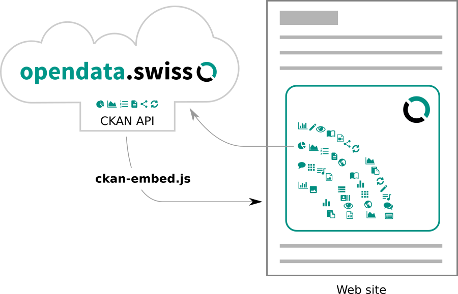
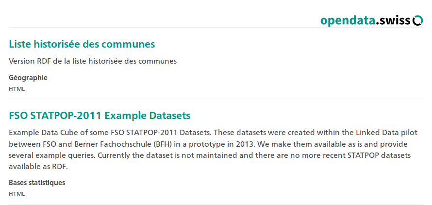
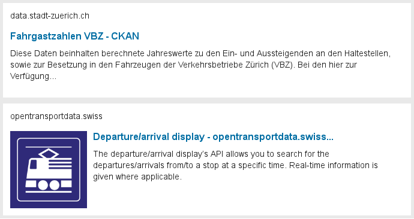

.. container:: custom-breadcrumbs

   - :fa:`home` :doc:`Handbuch <../../../index>` :fa:`chevron-right`
   - :doc:`Bibliothek <../bibliothek>` :fa:`chevron-right`
   - Embedding Datasets

********************************
Tipps zum Einbetten von Datasets
********************************

.. container:: Intro

    Auf dieser Seite erhalten Sie Tipps, wie Sie Datasets von opendata.swiss
    auf anderen Websites einbetten können. Bitte beachten Sie, dass der Text
    derzeit nur in Englisch verfügbar ist.

A range of technical options are described here for embedding
content from the CKAN open data platform on third party websites.
Some data publishers may like to present datasets they have published at
*opendata.swiss* on their own website. Several of the publishing
institutions even have data portals on which they may like to feature
any datasets which they maintain on the central catalog, even integrating
this with other information on the website.

Why embed data from the portal instead of copy-pasting or just linking?

- In order that datasets are well presented, their descriptions accurate and up-to-date.
- To show a dynamic selection from the catalog, based on a tag or search query,
  or even to show all datasets belonging to an organization.

We describe several options here - from linking to resources
from the catalog, to embedding parts of the functionality from the
portal on other websites. Our current recommendation at this
time is to use the
:ref:`ckan-embed widget <embed-widget>`, which can be configured here.

.. raw:: html

    <iframe src="../../../_static/examples/embed/embed.html" width="100%" height="420" style="border:0px;overflow:hidden" scrolling="no"></iframe>

    

.. _embed-widget:

Widget
======

Similar to the rich media widgets from Twitter and other websites, a script can be
added to pages which loads remote content using JavaScript. It is possible to
provide users with a code snippet that could be configured according to their needs.
This provides a richer experience for users, but requires some technical knowledge of
HTML, CSS and JavaScript.

The `ckan.js <https://github.com/okfn/ckan.js>`__
project from Open Knowledge is a JavaScript library that can be used
to connect to CKAN from within the browser. In order to overcome Cross-origin
resource sharing (CORS) restrictions, a backend service would ideally be
hosted on the same machine as the scripts. This could just be a proxy to the data portal.

   Architecture diagram

We have developed a `JavaScript widget <https://github.com/opendata-swiss/ckan-embed>`__
based on ``ckan.js`` which displays the same information about datasets as the
standard search. It uses the `CKAN API <http://docs.ckan.org/en/latest/api/>`__ to
run search queries, and renders the result into the Web page. Our solution is
similar to the
`CKAN Data Viewer <http://docs.ckan.org/en/latest/maintaining/data-viewer.html>`__,
a feature that already has resource embedding built in, and the ability to
white-list sites where this may be deployed using a ``resource proxy`` configuration option.

Note that due to lack of CORS support, we provided an option to use JSONP to mitigate cross-site scripting restrictions. [JSONP is not recommended](https://en.wikipedia.org/wiki/JSONP#Security_concerns) in current best practices in Web development, and we advise that - if possible - developers should put in place a proxy service, as described [further down](#middleware).

Here is an example of how a search result from *opendata.swiss* appears in this widget:

   Example search result as seen in a widget

This is made by adding the following code to the page, for example to query
the portal for «statistik» as a search term:

.. code-block:: html

    

      Loading datasets ...
    

    

You may wish to link to the portal itself in the loading message, in case there
are issues with connectivity or JavaScript in the browser.

It is also possible to use filter queries to limit results to a specific
facets - such as
group (``groups:energy``, for example),
tags (``tags:energie``) or
organization (``organization:schweizerische-nationalbibliothek-nb``).
For example, this code fetches the top 3 datasets published by the National
Library, linking to the german-language portal (``lang:'de'``):

.. code-block:: javascript

    ck.datasets('#opendata-swiss', 'https://opendata.swiss/', {
      fq:       'organization:schweizerische-nationalbibliothek-nb',
      lang:     'de',
      rows:     3
    });

In order to customize the presentation of the widget, you can use a custom template,
for example like this code which fetches the most recently updated datasets:

.. code-block:: javascript

    ck.datasets('#ckanEmbed', 'https://opendata.swiss/de/', {
      fq:       '    ',
      template: _.template(
          '
' +
          '<a href="<%= ds.url %>"><h4 style="display:inline"><%= ds.title %></h4></a>' +
          '<small class="ckan-fmt"> (<%= ds.formats.toUpperCase() %>)</small>' +
          '
<%= dso.publishers[0].label %>
' +
          '
'
        ),
      rows: 5
    });

Summary
-------
we recommend the use of our JavaScript widget for embedding
*opendata.swiss* datasets and search results. Full source code
and deployment instructions are available on
the `ckan-embed project page <https://github.com/opendata-swiss/ckan-embed>`__).

Cards
=====

It is possible to link directly to datasets and search results on *opendata.swiss*. For example:

- Link to a dataset:
  ``https://opendata.swiss/en/dataset/verbreitung-der-steinbockkolonien``
- Link to a category (or group) page:
  ``https://opendata.swiss/en/group/agriculture``
- Link to a datasets with one of the same tags:
  ``https://opendata.swiss/en/dataset?keywords_en=ibex``
- Link to datasets from a specific organization:
  ``https://opendata.swiss/en/organization/schweizerische-nationalbibliothek-nb``
- Link to a search result page:
  ``https://opendata.swiss/en/dataset?q=ibex``

Standards like the `Open Graph protocol <http://ogp.me>`__
and `oEmbed <http://oembed.com>`__
improve the way search engines and other machine 'users' access the platform,
and also make it easy to bring in rich content from different sites through
standard interfaces. Simply by pasting in the URL to a dataset on a platform
with support for the protocol (like Discourse or Wordpress), visitors of your
site see a "card" with the title and description and possibly an image of the page.
If you see a plain link, then embedding is not supported or working - but visitors can still navigate to the target page.

Here is an example of how a dataset renders through Open Graph support from two
CKAN portals when the links are posted in a Discourse forum:

   Example from OpenGraph

This option would not allow search and other interactivity, but could
provide a basis for it (further discussion in the next option). Initially,
it would make it easy for content owners to use their own existing platforms
to present the datasets in a nice way just by linking to the individual datasets.

There are various open-source packages and libraries you can use as a developer
to add support for reading Open Graph metadata in your Web project. Here are
some examples: `pelican-open_graph <https://github.com/whiskyechobravo/pelican-open_graph>`__
`opengraph by erikriver <https://github.com/erikriver/opengraph>`__,
`Drupal <https://www.drupal.org/project/oembed>`__,
`JavaScript/Node.js <https://www.npmjs.com/package/open-graph>`__,
and a middleware API at `Opengraph.io <https://www.opengraph.io/documentation/>`__.

Furthermore, category and search result pages could also be
tagged using the same mechanisms, so third party websites get a
summary view into the datasets simply by linking to the appropriate URL.
For more in-depth discussion of metadata support see:
`Make consistent all forms of RDF output from CKAN #1890 <https://github.com/ckan/ckan/issues/1890>`__.

Summary: it is already possible to link directly to search pages and
resources on *opendata.swiss*, however rich metadata in the page
header is not yet supported. In a future release, pasting links from the
portal into a Web platform that supports Web metadata protocols will
enable a richer sharing experience. Until such time as Open Graph
support is enabled on *opendata.swiss*, we recommend you to use the :ref:`Widget option <embed-widget>`.

Frames
======

Using HTML IFRAMEs or EMBEDs, subsets or links from the portal
can be placed directly into the page. It is actually essentially
the same as if the user opens a link in a new tab, except the other
web page is shown within a block on the current page, and scrolls along with the content.

However, this method is **not recommended** due to challenges from an
accessibility and usability perspective:

- The portal has its own page branding and navigation which, when stuck
  inside of an frame, will have the unintended consequence of confusing the
  user about what is actually being presented.
- It is difficult to navigate with the keyboard into an IFRAME and visitors
  who rely on text-to-speech will be impeded, and will not meet full
  `accessibility requirements <http://www.accessibility-checklist.ch/>`__.
- Due to the security measures of the browser, no communication can happen
  between the sites. It is possible to track users of the IFRAME through
  advanced web analytics, but only on the destination site - the host site
  will get no data on user behavior.

A possible compromise solution to the first two issues would
be create an "embed view" template through a CKAN plugin which
renders the requested page with alternative branding that is more
conducive to usage in frames and reformatted content.

As a workaround in case our recommended option is not possible to implement,
the IFRAME source could be used with an anchor that makes the view skip
directly to content. For example, a search result
(with ``#field-order-by`` anchor) or to a dataset page
(``#content`` anchor) would be embedded with code like this:

.. code-block::

    <iframe
        width="100%" height="600" frameborder="0"
        style="border:0;margin:0;padding:0"
        src="https://opendata.swiss/en/dataset?q=RDF&res_format=HTML&sort=score+desc%2C+metadata_modified+desc#field-order-by">
    </iframe>

Summary:
--------
we do **NOT RECOMMEND** or support the use of IFRAMES, for reasons of
poor accessibility and usability. However, if installing
:ref:`JavaScript Widget <embed-widget>`
is not possible, we have shown a basic workaround above.

Middleware
==========

For the :ref:`JavaScript widget <embed-widget>` solution described above,
it would be helpful to monitor the API calls of the proxying server
to specific calls for security and performance. An intermediate
service backend that uses something like the Python
`ckanapi client <https://github.com/ckan/ckanapi>`__ could be used
to facilitate this, or a load balancing server.

Open Graph support (as discussed in the Cards section) would make
it possible to use a compatible client-side library
(e.g.: `Oembetter <https://github.com/punkave/oembetter>`__).
Furthermore, soon on the *opendata.swiss* roadmap there will be
support for requesting DCAT-AP compatible RDF for any dataset.
While this does not mean that the data itself is linked, it would
also allow a more generic solution to displaying the metadata.

Note that performance issues could potentially be compounded by availability
and connectivity of the proxying server, so hosting this widget needs to be
done with care. One straightforward option would be to add this functionality
to CKAN itself, but there also may be reasons why platform owners may wish
to separate the «sharing» service from core functionality.

Further options
===============

We investigated the possibility of supporting publishers of 'static sites',
such as this handbook. The deployment of rich content could be extended with
dynamic crawling and updating of content during the publication process
without reliance on cross-site requests in the browser. This would however
require technical effort for the specific publishing platforms, and come
with the synchronicitiy issues of the Cards option - i.e. the embedded
information will only be as recent as the latest publication. Such an
approach is described in the `govpack package <https://www.npmjs.com/package/govpack>`__.

Access to regular exports from the portal's underlying database - in
other words, federated or raw data access - would enable content
providers to run their own mini-sites synchronised to the central port.
It is currently not clear how prominently portal federation will feature on
CKAN's roadmap, while third party extensions like
`ckanext-odn-ic2pc-sync <https://github.com/OpenDataNode/ckanext-odn-ic2pc-sync>`__
promise this kind of functionality. For a more high level discussion of the
advantages of hosting federated platforms for data discovery, see
`Zhang Haojie et al., 2015 <https://www.researchgate.net/publication/283356205_Data-as-a-Service_A_Cloud-Based_Federated_Platform_to_Facilitate_Discovery_of_Private_Sector_Datasets>`__.

Access to the metadata of the portal itself would be a sound option for the most
technical users of the open data platform. They would however most likely
need to host CKAN, or at least be familiar with its schema, to make use of such data.
A compromise option, such as static snapshots of the API, could be another strategy
to pursue in the future.

In the meantime, we recommend that *opendata.swiss* content is embedded
externally using the :ref:`JavaScript Widget <embed-widget>`.
