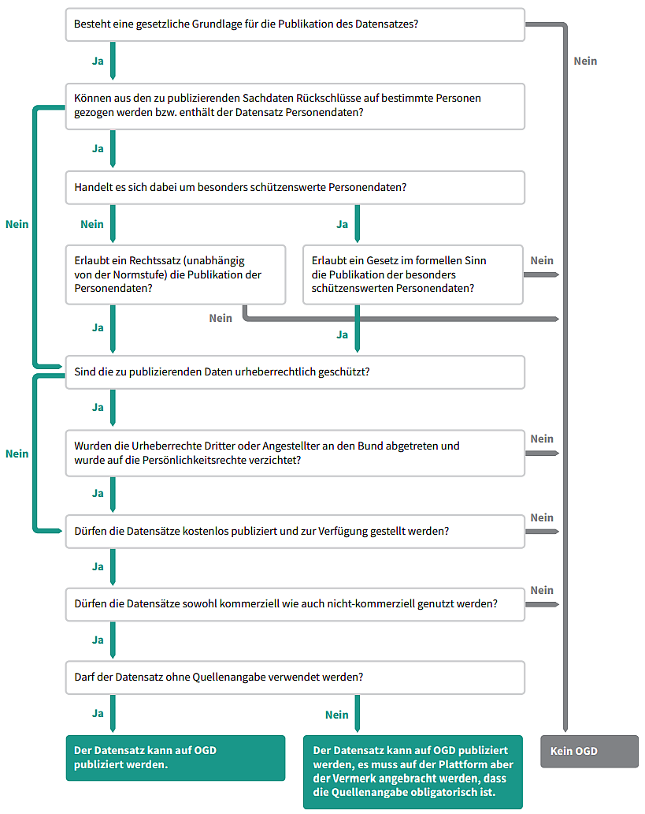

.. container:: custom-breadcrumbs

   - :fa:`home` :doc:`Handbuch <../../../index>` :fa:`chevron-right`
   - :doc:`Bibliothek <../bibliothek>` :fa:`chevron-right`
   - OGD-Richtlinien

***************
OGD-Richtlinien
***************

Richtlinien für die Veröffentlichung von Open Government Data («OGD-Richtlinien»)
=================================================================================

Die OGD-Strategie 2019-2023, welche Ende 2018 vom Bundesrat genehmigt worden ist, führt das Prinzip
«Open Data by Default» ein: Ab 2020 publizieren alle Bundesstellen ihre Daten als Open Government
Data (OGD). Die vorliegenden «OGD-Richtlinien» dienen als Orientierung für die Einheiten der
Bundesverwaltung bei der Umsetzung dieses Prinzips.

Über die Bundesverwaltung hinaus dienen die OGD-Richtlinien als Orientierung für Kantone,
Gemeinden, staatsnahe Betriebe sowie für weitere Organisationen, die Daten von öffentlichem
Interesse publizieren.

Der Aktualisierungsbedarf der vorliegenden Richtlinien wird jährlich von der Geschäftsstelle Open
Government Data überprüft und definiert. Datennutzende und -publizierende sind eingeladen,
`ihre Vorschläge der Geschäftsstelle Open Government Data zu melden <mailto:opendata@bfs.admin.ch>`__.

1. “Open Data by Default”
--------------------------
Die Verwaltungseinheiten stellen ihre Daten, die sie im Rahmen der Erfüllung ihrer gesetzlichen
Aufgaben erheben, erstellen und verwalten und die elektronisch gespeichert und in Sammlungen
strukturiert vorliegen, als «Open Data» im Internet zur Verfügung. Die vorliegende «OGD-Richtlinien»
dienen dabei als Orientierung.

Staatsnahe Betriebe oder Dritte (einschliesslich Private, die staatliche Aufgaben wahrnehmen),
sind ebenfalls eingeladen, ihre Daten gemäss diesen Richtlinien als Open Data zur veröffentlichen.

2. Vorliegen von Schutzbestimmungen
------------------------------------

Folgende Daten werden nicht als Open (Government) Data öffentlich zugänglich gemacht:

- Daten, die gestützt auf andere Erlasse nicht oder nur zu restriktiveren Bedingungen
  veröffentlicht werden, insbesondere wenn sie einer spezialgesetzlichen Schutzbestimmung
  unterstehen wie Datenschutz, Urheberrechte, Statistikgeheimnis, Steuergeheimnis,
  Informationsschutz, Gebühren und amtliche Register;
- Daten, deren Aufbereitung für die Zurverfügungstellung als OGD bedeutende zusätzliche
  sachliche, personelle oder technische Mittel erfordert.

Sie können eine Frage nicht klar beantworten? Werfen Sie einen Blick
in unsere `Arbeitshilfe für Behörden zur Publikation von Daten als OGD <https://www.bfs.admin.ch/bfs/de/home/dienstleistungen/ogd/dokumentation.assetdetail.11147071.html>`__.

3. Übersicht der Daten
-------------------------------

Jede Verwaltungseinheit führt einen Katalog, der grundlegende Angaben über die von der Organisation
bewirtschafteten Daten ausweist und somit eine Übersicht über die von ihr verwalteten Daten
(«Dateninventar») gibt. Wo möglich sollen diese Informationen in bereits vorhandenen Katalogen
gesammelt und darauf verwiesen werden (z.B. «Sammlung der Geobasisdaten des Bundesrecht»).

Dieser Katalog wird mindestens 1-mal jährlich aktualisiert. Das Dateninventar enthält zwingend
folgende Angaben:

- **Titel**: Titel des Datasets

- **Beschreibung**: Kurze Beschreibung des Inhalts des Datasets

- **Data-Owner**: Name der Einheit oder der Bundesorgane, die für die Bereitstellung der Daten bezüglich Qualität, Zugriff und Schutz gemäss der rechtlichen Grundlagen und den Vorgaben ihrer Verwaltungsstelle verantwortlich ist

- **Kategorie**: Kategorie des Datasets, gemäss Kategorien opendata.swiss, siehe

  :download:`SKOS-RDF <../../../_static/vocabulary/theme.rdf>`

- **Angaben zur Offenheit des Datasets**. Mögliche Werte:

  + Open: Die Daten dürfen frei wiederverwendet werden

  + Restricted: Die Daten dürfen nur unter spezifischen Nutzungsbedingungen (wie beispielsweise Datenschutzverträge) wiederverwendet werden

  + Closed: Die Daten dürfen nicht wiederverwendet werden

Die Sammlung der Informationen soll aufgrund von eCH-0200
«DCAT-Anwendungsprofil für Datenportale in der Schweiz» gestaltet werden,
so dass die Interoperabilität der gesammelten Metadaten sichergestellt bleibt.

4. Referenzieren auf opendata.swiss
-------------------------------------
Die von der Verwaltungseinheit definierten Data-Owner sind dafür zuständig, dass jene
Datasets auf dem zentralen Katalog der schweizerischen OGD (opendata.swiss) referenziert
werden, welche als «Open» eingestuft sind. Dafür können sie weitere
Einheiten oder Organisationen delegieren (z.B. «Data-Stewards»).

Metadaten aus bestehenden Portalen (z. B. Geoinformation, Umwelt, kantonale Portale) werden
möglichst automatisiert übernommen («Harvesting»).

Das Referenzieren auf weiteren Webseiten oder Portalen ist erlaubt.

5. Kontaktperson oder -stelle
--------------------------------

Für jedes publizierte Dataset wird eine für Nutzer-Anfragen zuständige Person oder Stelle
bestimmt und via Metadaten (Attribute: Name resp. Bezeichnung der Stelle und
E-Mail-Adresse) veröffentlicht.

6. Einheitliche und offene Nutzungsbedingungen
------------------------------------------------

Auf die Daten müssen die standardisierte Nutzungsbedingungen von opendata.swiss
angewendet werden (https://opendata.swiss/de/terms-of-use).

Als einzig mögliche Einschränkungen gelten:

- Die Pflicht zur Quellenangabe (Autor, Titel und Link zum Datensatz), siehe: https://opendata.swiss/de/terms-of-use/#terms_by

- Das Einholen einer Bewilligung zur kommerziellen Nutzung (siehe https://opendata.swiss/de/terms-of-use/#terms_by_ask ). Diese Einschränkung soll nur angewendet werden, wenn die gesetzliche Grundlage dies explizit vorsieht.

7. Maschinenlesbarkeit der Daten und der Datenmodelle
-------------------------------------------------------

Ein wichtiges Ziel der Publikation von Open (Government) Data ist, dass Maschinen
mit den Daten einfach umgehen können und u.a. Zuordnungs- und Formatierungsfehler
vermeiden, welche beim Einlesen von Texten oder im PDF-Format angebotene
Informationen vorkommen können. So kann ein unverhältnismässiger Aufwand
für die Nutzer/innen bei der Datennutzung vermieden werden.

Dafür stellen die Datenanbieter sicher, dass die Daten in einem offen, maschinenlesbaren
und standardisierten Format, wie csv oder XML, oder in etablierten Formaten, die verbreitet,
geläufig und von der Nutzer-Community akzeptiert sind, vorliegen.
Als Orientierung dient die 3-Sterne-Stufe des «5-Sterne-Modells
für Offene Daten (Open Data)» (https://5stardata.info/de).

Die Datenanbieter stellen zudem sicher, dass die Datenstruktur maschinenlesbar ist und,
dass eine Erklärung der Variablen («Datenmodell») in maschinenlesbarer Form vorliegt.

Wo möglich sollen die Daten über maschinenlesbaren Schnittstellen
(siehe beispielsweise https://api3.geo.admin.ch und https://lindas.admin.ch)
angeboten werden. Diese bieten für das Datamanagement sowie auch für die
Datennutzung die höchstmögliche Flexibilität.

8. Rohdaten
------------

Solange der gesetzliche Auftrag nichts anderes vorsieht (z.B. Aggregationen aus Datenschutzgründen)
oder die Nutzer explizit aggregierte Daten (z.B. Karten) verlangen, sollen möglichst rohe Daten
veröffentlicht werden. Dies hat die möglichst freie und effiziente Weiterverarbeitung und Verwendung zum Ziel.

9. Vollständige Datasets
--------------------------

Es werden möglichst vollständige Datasets veröffentlicht. Auf eine Fragmentierung der Datasets bei der
Veröffentlichung («Daten-Auszüge», z.B. «Snippets» oder «Previews») ist soweit möglich zu verzichten.

Sollte ein Datenanbieter aus technischen oder rechtlichen Gründen unvollständige oder nichtgenehmigte
Daten publizieren, ist dies mittels der Metadaten oder mit weiteren Beschreibungen auszuweisen.

Wo möglich sollten die veröffentlichen Datasets mit einer angemessenen Versionenkontrolle
(Datum oder Versionsnummer im Titel der Ressourcen) versehen werden.

10. Aktuelle Daten
-------------------

Die Daten sollen der Öffentlichkeit möglichst aktuell zur Verfügung gestellt werden, d.h. möglichst
zeitnah nach ihrer Erhebung und Zusammenstellung.

11. Kontextualisierte Daten
----------------------------

Die publizierten Daten sind ausreichend kontextualisiert zu publizieren, d.h. sie sind ausreichend beschrieben,
um die Wiederverwendung, insbesondere durch verwaltungsexterne Einheiten zu ermöglichen. Dafür werden die
grundlegenden Metadaten (siehe vor allem DCAT-AP-CH-Standard) sowie auch die entsprechenden Erklärungen zu
den Datenberechnungsmethoden möglichst in maschinenlesbarer Form gemeinsam mit den Daten veröffentlicht.
Referenzen auf andere Datenobjekte sollten in den Datasets der entsprechenden Datenanbieter wiedergefunden werden.

12. Veröffentlichung zusätzlicher Publikationsformen
-------------------------------------------------------

Zusätzlich zu den maschinenlesbaren Daten können ergänzend weitere Publikationsformen bereitgestellt werden, mit dem
Ziel, den Nutzungskontext aufzuzeigen. Dies gilt beispielsweise für Bilder, Grafiken oder Berichte, die auf Basis
der Rohdaten erstellt wurden, oder für aggregierte Daten.

13. Uneingeschränkter Datenzugang
---------------------------------

Die veröffentlichten Daten sind einfach und barrierefrei zugänglich zu machen. Allfällige physische
(z.B. die Notwendigkeit, persönlich ein bestimmtes Büro aufzusuchen oder die Anforderung, bestimmte
Abläufe zu erfüllen) oder technische (z.B. Zugang zu Daten nur über ausgefüllte Eingabemasken oder
Systeme, die browserorientierte Technologien wie etwa Flash, JavaScript, Cookies oder Java Applets erfordern)
Barrieren sind zu vermeiden. Wenn es der Verbreitung der Daten dient, können auch mehrere
Zugangsmöglichkeiten für ein Dataset geschaffen werden (z.B. zwei Formate als Download und ein API).

Die einzige Ausnahme ist das Einholen einer Bewilligung zur kommerziellen Nutzung (siehe Nutzungsbedingungen
opendata.swiss mit Einschränkung «Ask»), gemäss Richtlinie 6.

14. Diskriminierungsfreier Datenzugang
---------------------------------------

Die publizierten Daten sind diskriminierungsfrei zugänglich: Jede Person soll zu jeder Zeit auf die Daten
zugreifen können, ohne sich zu identifizieren oder eine Rechtfertigung für ihr Handeln abgeben zu müssen.

Die einzige Ausnahme ist das Einholen einer Bewilligung zur kommerziellen Nutzung (siehe Nutzungsbedingungen
opendata.swiss mit Einschränkung «Ask»), gemäss Richtlinie 6.

Sollte eine Registrierung aus technischen Gründen zwingend notwendig sein
(z.B. im Falle von Zugängen über API), sollte diese als «Self-Service»
innerhalb von 10 Minuten machbar sein.

15. Leicht auffindbar
---------------------

Die veröffentlichten Daten werden so bereitgestellt, dass sie leicht im Internet auffindbar sind. Insbesondere sollen sie möglichst einfach von Suchmaschinen indexiert werden können. Die Suchbegriffe sollen in mindestens 2 Landessprachen erfasst werden.

16. In einem Klick erreichbar
--------------------------------

Die Daten oder deren Teilmengen werden so referenziert, dass die Verlinkung direkt zu den
Daten führt («One-click to data»). Soweit möglich sollen Permalinks zu den aktuellen Daten verwendet werden.

17. Als Massenabfrage verfügbar
---------------------------------

Das vollständige Dataset soll als Ganzes mittels Massenabfrage («Bulk Download») abgerufen werden können,
ausser dies sei aus technischen Gründen nicht möglich oder besonders aufwändig
(z.B. sehr grosse Datenmengen und lange Bearbeitungszeiten).

18. Linked Open Data
---------------------

Eine Veröffentlichung der offenen Daten als Linked Open Data soll insbesondere bei zentralen Registern
und kontrollierten Vokabularen (eine Sammlung von Bezeichnungen (Wortschatz), die eindeutig Begriffen
zugeordnet sind, so dass keine Homonyme auftreten) geprüft und wo möglich umgesetzt werden.
