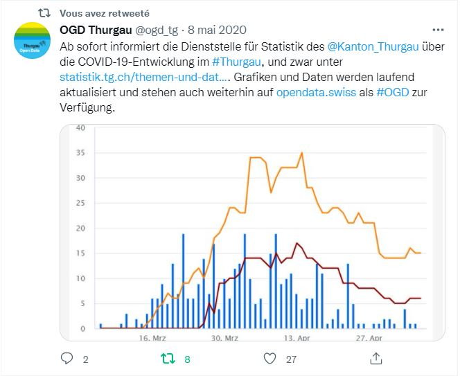

.. container:: custom-breadcrumbs

   - :fa:`home` :doc:`Handbuch <../../../index>` :fa:`chevron-right`
   - :doc:`Kommunikation Kanäle OGD <../leitfaden>` :fa:`chevron-right`
   - Twitter Beispiele

*************************************
Twitter Beispiele
*************************************

Twitter Beispiele
===================

.. figure:: ../../../_static/images/kommunikation/Twitterbeispiel_2.JPG
   :alt: Twitter Post zum Sonnendach

.. figure:: ../../../_static/images/kommunikation/Twitterbeispiel_4.JPG
   :alt: Twitter Post zum Post un Fernmeldeverkehr

.. figure:: ../../../_static/images/kommunikation/Twitterbeispiel_5.JPG
   :alt: Twitter Post zum Amt für Raumentwicklung

.. figure:: ../../../_static/images/kommunikation/Twitterbeispiel_6.JPG
   :alt: Twitter Post zu Hackathon VersusVirus
