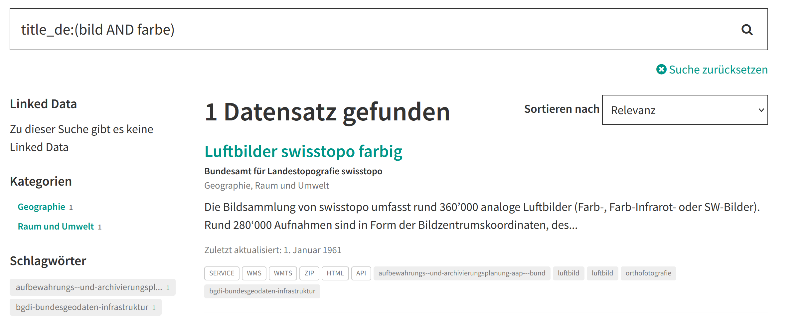
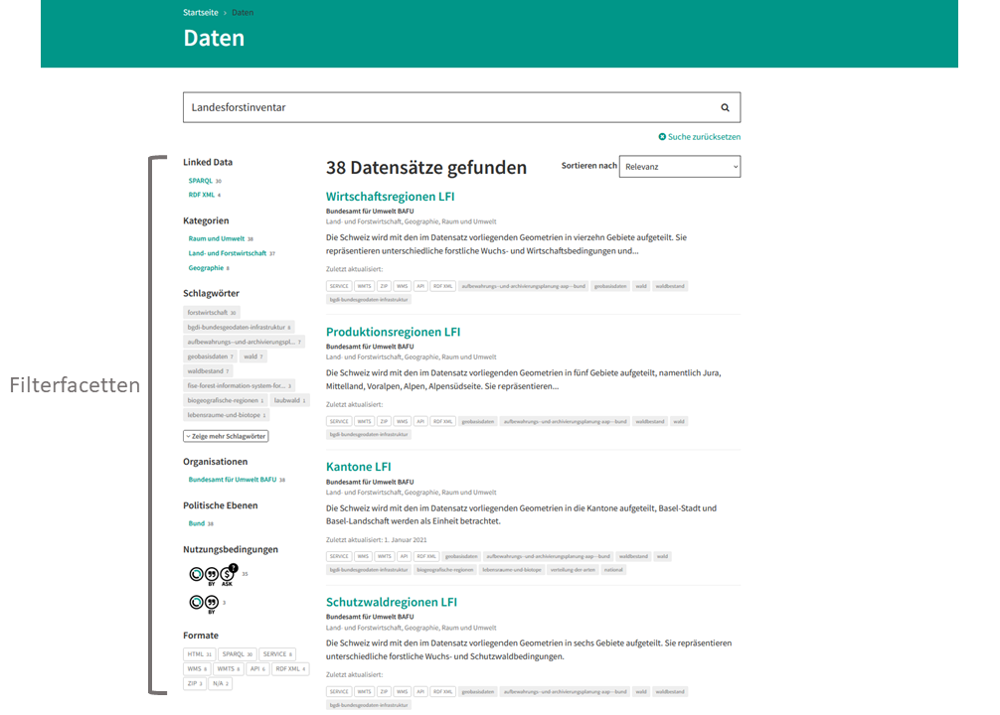

.. container:: custom-breadcrumbs

   - :fa:`home` :doc:`Handbuch <../../index>` :fa:`chevron-right`
   - :doc:`Nutzen <nutzen>` :fa:`chevron-right`
   - Daten suchen

************
Daten suchen
************

Wie finde ich die Daten, die ich brauche?
=========================================

.. container:: Intro

    Um Ihnen die Suche nach Daten zu erleichtern, bietet opendata.swiss
    ein Suchfeld an sowie Filtermöglichkeiten. Sie können mittels sogenannter
    Abfragesyntax (Querysyntax) komplexe Suchanfragen gegen die Metadaten 
    von opendata.swiss vornehmen.
    Hier erklären wir Ihnen, wie die Suche funktioniert, geben Erläuterungen 
    zur Abfragesyntax und bieten Ihnen hilfreiche Beispiele.
    

Sie können nach Datasets auf der `Einstiegsseite von opendata.swiss <https://opendata.swiss>`__
oder unter der Rubrik `Daten <https://opendata.swiss/de/dataset>`__ suchen. 
Wenn Sie nur an Datasets einer bestimmten Organisation interessiert sind, so
können Sie diese direkt auf der betreffenden `Organisationsseite <https://opendata.swiss/de/organization>`__
suchen. Wenn Sie an Beispielen für die Wiederverwendung von `Open Government Data <https://handbook.opendata.swiss/de/content/glossar/begriffe.html#term-Open-Government-Data>`__
interessiert sind, finden Sie unter der Rubrik `Showcases <https://opendata.swiss/de/showcase>`__ ein Suchfeld
in dem Sie nach Applikationen, Visualisierungen und Veranstaltungen suchen können. 

Wie funktioniert das Suchfeld von opendata.swiss?
-------------------------------------------------

Das Suchfeld von opendata.swiss ist so konzipiert, dass es einfache 
Phrasen (Suchbegriffe ohne komplexe Syntax) verarbeiten und nach einzelnen Begriffen
in mehreren Metadatenfeldern mit unterschiedlicher Gewichtung suchen kann, je nach 
Bedeutung der einzelnen Metadatenfelder. So hat beispielsweise das 
Feld "Titel" eine stärkere Gewichtung als das Feld "Beschreibung". Die
Suchmaschine Solr ordnet Ihre Anfrage entsprechend ein und liefert Ihnen
je nach Suchstrategie die passenden Treffer.

   

.. collapse:: Suchindex

    Der Suchindex ist im Grunde die "Datenbank", in der alle Informationen für die Suche gespeichert werden.
    Es wird ein benutzerdefiniertes Schema mit allen Datensatzfeldern, die indiziert werden sollen, verwendet.
    Das Schema ist flach, das heisst verschachtelte Elemente wie Ressourcen müssen anders 
    gespeichert werden, damit Solr sie indizieren kann. Das Gleiche gilt für die mehrsprachigen Felder, 
    die alle mit dem dazugehörenden Sprachsuffix gespeichert werden. So enthält "keywords_en" die englischen
    SChlüsselwörter. Standarmässig werden alle Felder, die zu einem Datensatz gehören, in ein 
    Feld (genannt "text") kopiert, so dass der Suchprozess nur ein Feld überprüfen muss, um eine Über-
    einstimmung zu finden. Wenn also ein Benutzer eine Suche mit der Abfrage "Wetter" in das Suchfeld
    eingibt, führt Solr diese Abfrage über das Feld "text" aller Datensätze aus.
    
   .. csv-table:: URL
        :align: center
        :header: "Index-Name", "Name des Metadatenfeldes"

        "downloadURL", "DownloadURL"
        "res_url", "URL der Ressource"

   .. csv-table:: Text-Felder
      :align: center
      :header: "Index-Name", "Name des Metadatenfeldes"

      "name", "Slug des Datasets, z.B. *alleenkonzept*"
      "title", "Titel des Datasets"
      "title_string", "Titel"
      "license", "Nutzungsbedingungen"
      "groups", "Kategorien"
      "organization", "Organisation"
      "res_name", "Titel der Ressource"
      "res_format", "Format der Ressource"
      "res_description", "Beschreibung der Ressource"
      "identifier", "Identifier"
      "see_alsos", "Verwandte Datasets"
      "maintainer", "Kontaktstelle"
      "author", "Urheber Showcase"
      "publisher", "Publisher"
      "contact_points", "Kontaktstellen"

   .. csv-table:: Übersetzte Felder
      :align: center
      :header: "Index-Name", "Name des Metadatenfeldes"

      "title", "Titel des Datasets"
      "keywords", "Schlagwörter"
      "groups", "Kategorien"
      "organization", "Organisation"
      "res_name", "Titel der Ressource"
      "res_description", "Beschreibung der Ressource"

.. figure:: ../../_static/images/daten-suchen/Trefferliste_de.png
   :alt: Suche auf opendata.swiss

Trefferliste
-------------
In der Trefferliste werden Ihnen alle Datasets angezeigt, die den von Ihnen eingegebenen Suchkriterien entsprechen. Wenn
Sie keine Suchkritieren ausgewählt haben, wird Ihnen eine Liste aller auf opendata.swiss vorhandenen Datasets angezeigt. 

In der Trefferliste finden Sie unterhalb des Suchfeldes die Anzahl der Datasets angegeben, die Ihrer Suchanfrage entsprechen. 
Damit Sie sich einen schnellen Überblick über die gefundenen Datasets verschaffen können, werden diese mit folgenden Metadaten angezeigt: 
*Titel des Datasets*, *Name der Organisation*, *Kategorien*, *Beschreibung*, *Letzte Aktualisierung der Metadaten (Ebene Dataset/Ressource)*, 
*Formate* und *Schlagwörter*.

Durch Anklicken des Dataset-Titels gelangen Sie zur Dataset-Seite. Hier finden Sie wichtige Beschreibungen (Metadaten) zum 
entsprechenden Dataset, wie Titel, Beschreibung, Nutzungsbedingungen, etc. Die Daten können entweder direkt über eine Download-URL heruntergeladen 
werden oder, wenn die Daten nur über eine Landing Page verfügbar sind, über eine Zugangs-URL. Dies können Sie direkt 
auf der Dataset-Seite machen oder Sie können auch weiter auf die Ressourcen-Seite navigieren.  

Stichwortsuche
---------------

Bei der Stichwortsuche geben Sie Ihren Suchbegriff oder Ihre Suchbegriffe in das Suchfeld ein. 
Wenn Sie Ihren Suchbegriff in das Suchfeld eingeben, erscheint unterhalb des Suchfeldes eine Auswahl von Vorschlägen ((Link zu Vorschläge fèr Suchbegriffe)).
Diese können Sie bei Bedarf anklicken. Mit der Eingabetaste (Enter-Taste) starten Sie die Suche.

.. admonition:: Wichtig

   Bitte achten Sie auf die korrekte Schreibweise Ihrer Suchbegriffe. 
   Falsch eingegebene Suchbegriffe ergeben keine Treffer. Gross- und 
   Kleinschreibung wird nicht berücksichtigt.

Vorschläge für Suchbegriffe
---------------------------

Bei der Eingabe von Suchbegriffen werden Ihnen Vorschläge angezeigt, 
die Sie bei Bedarf auswählen können. Für jede Sprache wird mehrmals täglich
ein in sich geschlossener Solr-Index aufgebaut. Das bedeutet, dass Änderungen 
an Datasets oder neue Datasets nicht sofort in den Vorschlägen berücksichtigt werden.

.. collapse:: Index - Vorschläge für Suchbegriffe

    Der entsprechende Index für die Vorschläge ist aus den folgenden Feldern aufgebaut:
    
    
   .. csv-table:: Index - Vorschläge für Suchbegriffe
        :align: center
        :header: "Index-Name", "Name des Metadatenfeldes"

        "dataset-title (translated)", "Titel des Datasets"
        "keywords", "Schlagwörter"
        "groups", "Kategorien"
        "organization", "Organisation"
        "distribution-name", "Titel der Ressource"
        "author", "Einreichende Person oder Stelle in der Showcase-Rubrik"
        "publishers", "Publisher"

Suchsprache
-----------

Die Syntax kommt von Apache Solr Lucene und das Vokabular stammt von opendata.swiss

.. collapse:: Tabelle Solr-Syntax
 
   .. csv-table:: Solr-Syntax
        :align: center
        :header: "Syntax-Element", "Funktion", "Beispiel", "Bedeutung"

        "`*`", "Existenz", "title_de:*", "Hat einen deutschen Titel"
        "`-`", "Ausschluss", "-title_de:open", Deutscher Titel enthält nicht Begriff *open*
        "`+`", "Einschluss", "+title_fr:ouvert", Französischer Titel enthält Begriff *ouvert*
        "`? *`", "Wildcards", "", "ein Zeichen, beliebig viele Zeichen"
        "AND", "und", "keywords_en:(geodaten&&energy)", "Schnittmenge"
        "OR", "oder", "organization:(kanton-thurgau || stadt-zurich)", "Vereinigungsmenge" 

Erweiterte Suchanfragen mithilfe von Operatoren
-----------------------------------------------

Eine Suchanfrage gliedert sich in einzelne Begriffe ("open"), Phrasen ("open data") (**link to Phrasensuche**)
und Operatoren. Um eine komplexere Suchanfrage zu erstellen, können Sie mehrere
Begriffe oder Phrasen mit Suchoperatoren kombinieren. Die Suchlogik folgt der 
Syntax von Apache Lucene `Apache Lucene/Solr <https://lucene.apache.org/core/3_6_0/queryparsersyntax.html>`__. 
Der Standardoperator im Suchfeld ist der Operator OR (**Link zur OR Kapitel**). Das bedeutet, dass, 
wenn Sie mehrere Begriffe in das Suchfeld eingeben, die Suchanfrage als OR-Anfrage behandelt wird,
ohne dass Sie diesen Operator eingeben müssen. Wenn Sie *open data* in das Suchfeld eingeben, 
werden die Begriffe als Einzelbegriffe *open* und *data* behandelt. In der Trefferliste finden
Sie nun Datasets aufgelistet, bei denen entweder *open* **oder** *data* im Suchindex gefunden wurde.
Wenn Sie nach der Phrase (**link zu phrasensuche**) *open data* suchen wollen, dann müssen Sie 
die Begriffe in Anführungs- und Schlusszeichen setzen: "open data". 

.. figure:: ../../_static/images/daten-suchen/suche_open-data.png
   :alt: Suche nach Begriffen open und data ohne Operatoren

Suchmodi
--------
**OR (||)**
^^^^^^^^^^^
Der Operator ``OR`` gibt Ihnen alle Datasets zurück, die entweder den Begriff *open* oder *data*
in ihrem Index enthalten. Dieser Operator ist als Standardoperator im Suchfeld implementiert. 
Sie können daher mehrere Begriffe auch ohne ``OR`` in das Suchfeld eingeben. 

.. figure:: ../../_static/images/daten-suchen/suchmodi_OR.png
   :alt: Suche nach Begriffen open und data mit dem OR-Operator

**AND (&&)**
^^^^^^^^^^^^
Mit dem Operator ``AND`` werden alle Datasets angezeigt, deren Suchindex *open* und *data* enthält. 
Datasets, die nur einen dieser Begriffe enthalten, erscheinen nicht in der Trefferliste. 

**Ein- und Ausschluss von Begriffen (+)(-)**
^^^^^^^^^^^^^^^^^^^^^^^^^^^^^^^^^^^^^^^^^^^^^
Wenn Sie nach Datasets suchen, die den Begriff *open*, aber nicht den Begriff *data* enthalten sollen, 
können Sie den gewünschten Begriff mit dem Operator ``+`` einschliessen und und den unerwünschten 
Begriff mit dem Operator ``-`` ausschliessen.   

.. figure:: ../../_static/images/daten-suchen/suchmodus_plusundminus.png
   :alt: Suche nach Begriffen mit Plus-Zeichen vor open und Minus-Zeichen vor data 

**Phrasensuche**
^^^^^^^^^^^^^^^^
Mit Anführungszeichen können Sie nach Begriffen suchen, die zusammengehören. In der Trefferliste
finden Sie mit ``"open data"`` nun Datasets, die *open data* als Phrase enthalten. Entscheidend ist 
die Position der beiden Begriffe. Datasets, die die Phrase *data open* enthalten, erscheinen 
nicht in der Trefferliste. 

**Suche in den Feldern**
^^^^^^^^^^^^^^^^^^^^^^^^
Wenn Sie nach einem Dataset suchen, in dessen Beschreibung der Begriff *open data* vorkommen soll,
können Sie dem Begriff die Feldbezeichnung ``description`` gefolgt von einem **Doppelpunkt** ``:`` voranstellen.

Wenn Sie nach einem Dataset suchen, das sowohl *open* als auch *data* in seiner Beschreibung enthalten soll, 
können Sie eine Suchanfrage mit dem Operator ``AND`` formulieren und in Klammern hinter die Feldbezeichnung setzen. 
Dasselbe können Sie mit dem Operator ``OR`` tun, wenn entweder der Begriff *open* oder der Begriff 
*data* in der Beschreibung des Datasets vorkommen soll.

Sie können auch Begriffe innerhalb eines bestimmten Feldes einschliessen (siehe Link to Ein und Ausschliessen): ``+{field}:{value}``.
Wenn Sie zum Beispiel an einem Dataset interessiert sind, in dessen englischem Titelfeld der Begriff ``power`` 
vorkommen soll. 

Die gleiche Suche ist auch möglich, wenn Sie zusätzlich einen Begriff ausschliessen wollen: ``-{field}:{value}``. Sie suchen 
zum Beispiel nach einem Dataset, in dessen englischem Titelfeld zwar der Begriff ``power`` vorkommt, nicht aber der Begriff ``hydraulic``. 

Weiter können Sie auch nach Datasets suchen, die bestimmte Schlüsselwörter enthalten. Sie möchten zum Beispiel alle
Datasets mit den englischsprachigen Schlagwörtern ``geology`` und ``geophysics`` finden.  

Es ist auch möglich, mehrere Suchbegriffe mit dem Operator ``OR`` zu verknüpfen.  Zum Beispiel möchten Sie
ein Dataset finden, das entweder von der Organisation ``Kanton Thurgau`` oder ``Stadt Zürich`` publiziert wird. 
Bei dieser Suche muss jedoch der Slug der Organisation angegeben werden. Diesen finden Sie in der URL der Organisationsseite
der jeweiligen Organisation. In unserem Beispiel wäre das für den Kanton Thurgau ``kanton-thurgau``. 

Diese Suche kann auch noch erweitert werden. In unserem Beispiel mit dem Suchbegriff ``karte``. 

**Wortstämme**
^^^^^^^^^^^^^^
Bitte beachten Sie bei der Suche in bestimmten Feldern ((Link to Index)), dass Wortstämme und 
Sonderzeichen nur in den sprachspezifischen Feldern berücksichtigt werden. Damit zum Beispiel 
das Dataset ``Luftbilder swisstopo farbig`` in der Trefferliste erscheint, können sie folgende
Suchanfrage in das Suchfeld eingeben: ``title_de:(bild AND farbe)``. 

.. admonition:: Wichtig

   Im allgemeinen Textfeld werden Wortstämme nicht berücksichtigt. 
   Wenn nur das Feld ``title`` in die Suche eingegeben wird, ohne ``_de``, 
   wird das entsprechende Dataset nicht gefunden. Im allgemeinen Textfeld 
   ergeben nur exakte Übereinstimmungen der Begriffe, wie z.B. ``Luftbilder``
   und ``farbig`` Treffer.  
   

Filtern
-------
Duch Anklicken der entsprechenden Facetten der Filterkategorien können Sie Ihre 
Suchergebnisse verfeinern. Es kann nach *Kategorien*, *Schlagwörtern*, *Organisationen*,
*politischen Ebenen*, *Nutzungsbedingungen* und den *Formaten* gefiltert werden. Wenn Sie 
nach Datasets einer bestimmten Kategorie suchen, können Sie diese direkt 
von der Startseite von `opendata.swiss <https://opendata.swiss>`__ bereits filtern.

In der Rubrik `Daten <https://opendata.swiss/de/dataset>`__ finden Sie alle Filtermöglichkeiten
links neben der Trefferliste. Eine Mehrfachauswahl innerhalb einer Filterkategorie ist möglich, jedoch 
nur innerhalb der gefilterten Ergebnisse in der Trefferliste (Schnittmenge). Interessieren Sie sich beispielsweise für Datasets
aus den Kategorien *Geographie* oder *Raum und Umwelt*, müssen Sie diese einzeln nacheinander auswählen, da sonst nur Dataset,
die beide Kategorien tragen gefunden werden. Nachdem Sie einen Filter gesetzt haben, können Sie die Trefferliste mit weiteren Filtermöglichkeiten, wie zum Beispiel *Formate* 
erweitern. Zum Beispiel wenn ich nur an Dataset interessiert bin, die der Kategorie *Geographie* zugehörig sind, 
aber nur Ressourcen mit dem Format *JSON* enthalten.  

Sortieren 
---------
Sie haben die Möglichkeit, Ihre Trefferliste zu sortieren. Dazu stehen Ihnen die Sortierung nach 
*Relevanz*, *Daten zuletzt geändert*, *Metadaten zuletzt geändert*, *Name aufsteigend* und nach 
*Name absteigend* zur Verfügung. 

.. admonition:: Wichtig

   Bei der Suche nach einem Begriff im Index, wird für jedes Dataset eine
   Punktzahl berechnet. Mit der Option *Relevanz* werden die Ergebnisse in 
   der Trefferliste nach der Punktzahl absteigend sortiert. 

SOLR-Konfiguration 
------------------
Ausführlichere Informationen zur Solr-Konfiguration finden Sie in der offiziellen `Solr-Dokumention <https://solr.apache.org/guide/6_6/index.html>`__ (Englisch).
Die `Konfiguration und das Schema von opendata.swiss ist auf Github <https://github.com/opendata-swiss/ckanext-switzerland-ng/tree/master/solr>`__ verfügbar. 
``solr.xml`` referenzierte Dateien, wie ``italian_stop.txt``, ``fr_elision.txt``, etc., sind im offiziellen CKAN-Repository der aktuellen 
`CKAN-Version auf Github <https://github.com/ckan/ckan/tree/master/ckanext/multilingual/solr>`__ zu finden. Alle anderer Dateien (z.B. ``stopwords.txt``) werden 
von Solr bereitgestellt.   

