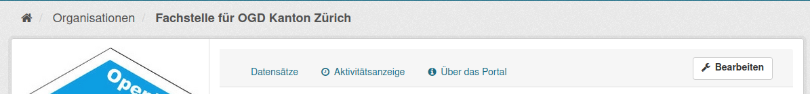
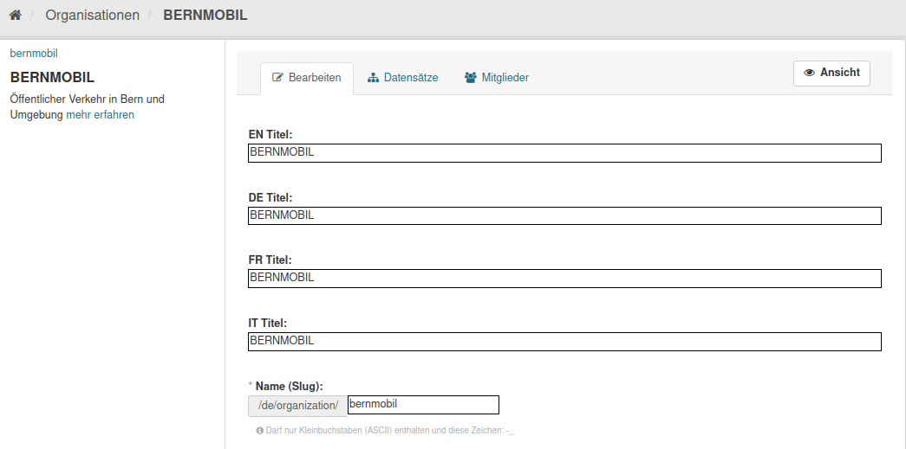
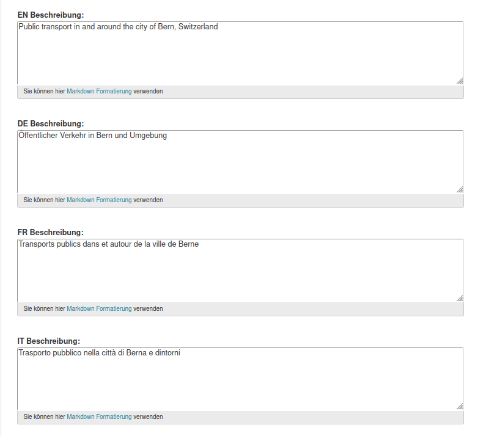
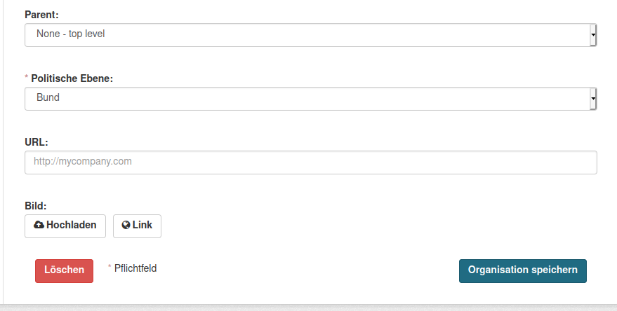
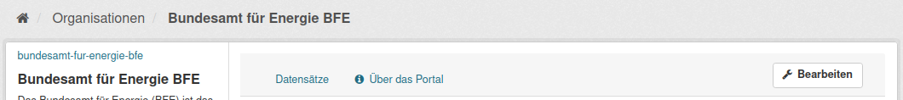
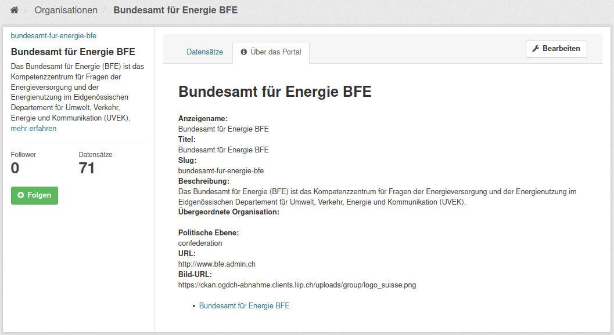
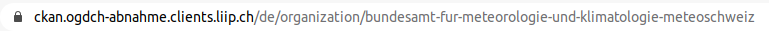
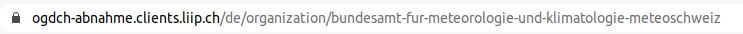
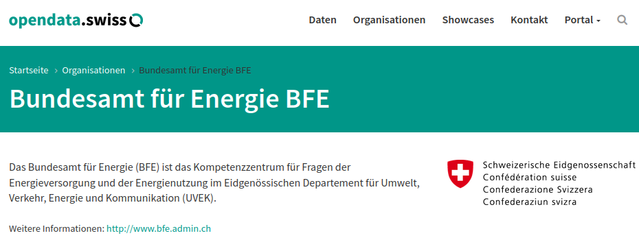

.. container:: custom-breadcrumbs

   - :fa:`home` :doc:`Handbuch <../../../index>` :fa:`chevron-right`
   - :doc:`Publizieren <../publizieren>` :fa:`chevron-right`
   - :doc:`Erst-Publizierende <../erstpublizierende>` :fa:`chevron-right`
   - Informationen zur Organisation ergänzen

***************************************
Informationen zur Organisation ergänzen
***************************************

Was muss ich bei Informationen zu meiner Organisation beachten?
===============================================================

.. container:: Intro

    Die Organisation legen wir für Sie an. Diese ergänzen Sie anschliessend mit Informationen über
    Ihre Organisation. Diese Angaben werden später auf
    opendata.swiss veröffentlicht. Die Informationen umfassen den Titel
    Ihrer Organisation, eine Beschreibung und ein Bild und den Link zur Website  der Organisation.
    Im :term:`Frontend <Frontend>` der Abnahmeumgebung sehen Sie, wie die
    Informationen auf opendata.swiss aussehen werden

Die Schritte auf einen Blick
----------------------------

- :ref:`Angaben zur Organisation ergänzen <organisation_bearbeiten>`
- :ref:`Ansicht der Organisation prüfen <organisations_ansicht_pruefen>`

.. _organisation_bearbeiten:

Informationen zur Organisation ergänzen
----------------------------------------

Um die Informationen zu Ihrer Organisation ergänzen zu können, müssen Sie die Rolle des Administrators
in Ihrer Organisation besitzen. (Mehrere Benutzerinnen und Benutzer einer Organisation können die Admininstrator-Rolle
besitzen/zugeteilt bekommen.) Wenn Sie auf Ihre Organisation gehen, sehen Sie als Administrator
den Button «Bearbeiten». Hier können Sie die Felder zu Ihrer Organisation ausfüllen.

Klicken Sie darauf, um das Webformular für Ihre Organisation zu öffnen:

Bei «Titel (EN) (DE) (FR) (IT)» geben Sie bitte einen Titel respektive den offiziellen Namen
Ihrer Organisation an.
Alle Bundesstellen müssen die Angaben mindestens auf Deutsch und Französisch eingeben – wünschenswert
wären allerdings alle vier Sprachen. Weitere Organisationen müssen Titel und Beschreibung in
mindestens einer Sprache eingeben.

Der sogenannte :term:`«Name/Slug» <Slug>` Ihrer Organisation wird von uns vergeben
und sorgt für die einwandfreie Zuordnung Ihrer Datasets zu Ihrer Organisation.
Dieser kann bei Bedarf editiert werden, beachten Sie bitte, dass er nur Kleinbuchstaben (ASCII)
und diese Zeichen: ``-``, ``_`` enthalten darf.

.. container:: important

    Wichtig: Der interne Organisations-Titel darf nicht mehr verändert werden,
    sobald Sie Datasets veröffentlicht haben.

Bei «Beschreibung (EN) (DE) (FR) (IT)» geben Sie bitte eine Beschreibung Ihrer Organisation an.
Alle Bundesstellen müssen die Angaben mindestens auf
Deutsch und Französisch eingeben – wünschenswert
wären allerdings alle vier Sprachen. Weitere
Organisationen müssen Titel und Beschreibung
in mindestens einer Sprache eingeben

Geben Sie bitte die «politische Ebene» an, auf der Ihre Organisation angesiedelt ist.
Falls es sich bei Ihrer Organisation um eine Unterorganisation einer bereits auf
opendata.swiss vertretenen Organisation handelt, kann das bei «Parent» eingetragen werden.

Unter «URL» verlinken Sie zur Website Ihrer Organisation.

Bitte wählen Sie ein «Bild» Ihrer Organisation aus
und verlinken Sie es im Feld «Link» oder und laden Sie es hoch.
So erhält Ihre Organisation eine bessere Präsenz auf opendata.swiss.

.. container:: important

    Vergessen Sie nicht, Ihre Änderungen abschliessend zu speichern
    indem Sie auf «Organisation speichern» klicken.

.. _organisations_ansicht_pruefen:

Ansicht der Organisation prüfen
--------------------------------

Überprüfen Sie die Angaben zu Ihrer Organisation: Nachdem Sie die Angaben zu Ihrer Organisation ergänzt haben,
klicken Sie auf den Info-Tab «Über das Portal».

Damit gelangen Sie zur Detailansicht Ihrer Organisation im :term:`Backend <Backend>`:

Anschliessend können Sie sich die Darstellung Ihre Organisation im
:term:`Frontend <Frontend>` der :term:`Abnahmeumgebung <Abnahmeumgebung>` von opendata.swiss ansehen:

Sie gelangen zu der Datenansicht Ihrer Organisation im Frontend, indem Sie
``ckan`` aus der Backend-URL Ihrer Organisation entfernen:

.. container:: bildunterschrift

   Beispielansicht einer Organisation im Frontend von opendata.swiss

.. container:: teaser

   :doc:`Nächster Schritt: Publikationsvariante auswählen <../publikationsvariante>`

Nachdem Sie Ihr Profil und Ihre Organisation eingerichtet haben,
können Sie als nächsten Schritt eine Publikationsvariante
für Ihre Datasets auswählen.
