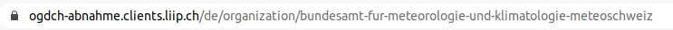

.. container:: custom-breadcrumbs

   - :fa:`home` :doc:`Handbuch <../../../index>` :fa:`chevron-right`
   - :doc:`Publizieren <../publizieren>` :fa:`chevron-right`
   - :doc:`Erst-Publizierende <../erstpublizierende>` :fa:`chevron-right`
   - Informationen zur Organisation ergänzen

***************************************
Informationen zur Organisation ergänzen
***************************************

Was muss ich bei Informationen zu meiner Organisation beachten?
===============================================================

.. container:: Intro

    Wir legen Ihre Organisation für Sie an, Sie ergänzen anschliessend die Informationen über
    Ihre Organisation. Diese Angaben werden später auf
    opendata.swiss veröffentlicht. Die Informationen umfassen den Titel
    Ihrer Organisation, eine Beschreibung und ein Bild und den Link zur Website.

Die Schritte auf einen Blick
----------------------------

- :ref:`Angaben zur Organisation ergänzen <organisation_bearbeiten>`
- :ref:`Ansicht der Organization prüfen <organisations_ansicht_pruefen>`

.. _organisation_bearbeiten:

Informationen zur Organisation ergänzen
----------------------------------------

Um die Informationen zu Ihrer Organization ergänzen müssen Sie die Rolle des Organisations-Admins
in Ihrer Organisation zugewiesen haben. Dann sehen Sie einen Schalter «Bearbeiten»,
wenn Sie zu Ihrer Organisation gehen

.. figure:: ../../../_static/images/publizieren/organisation/organisation-bearbeiten.png
   :alt: Bearbeiten der Organisation im Backend von opendata.swiss

.. figure:: ../../../_static/images/publizieren/organisation/organisations-titel-und-slug.png
   :alt: Organisationstitel und Slug

:Titel (EN) (DE) (FR) (IT): Bitte geben Sie einen Titel respektive den offiziellen Namen
                            Ihrer Organisation an. Alle Bundesstellen sollen die Angaben
                            mindestens auf Deutsch und Französisch eingeben – wünschenswert
                            wären allerdings alle vier Sprachen. Weitere Organisationen
                            sollen Titel und Beschreibung in mindestens einer Sprache eingeben.

:Name(Slug): Der sogenannte :term:`Name/Slug <Slug>` Ihrer Organisation wird von uns vergeben
             und sorgt für die einwandfreie Zuordnung Ihrer Datasets zu Ihrer Organisation.

.. container:: important

    Wichtig: Der :term:`Name/Slug <Slug>` darf nicht mehr verändert werden,
    sobald Sie Datasets veröffentlicht haben.

.. figure:: ../../../_static/images/publizieren/organisation/organisations-beschreibung.png
   :alt: Organisationsbeschreibung

:Beschreibung (EN) (DE) (FR) (IT): Bitte geben Sie eine Beschreibung Ihrer Organisation an.
                                   Alle Bundesstellen sollen die Angaben mindestens auf
                                   Deutsch und Französisch eingeben – wünschenswert
                                   wären allerdings alle vier Sprachen. Weitere
                                   Organisationen sollen Titel und Beschreibung
                                   in mindestens einer Sprache eingeben

.. figure:: ../../../_static/images/publizieren/organisation/organisations-formular.png
   :alt: Organisation: Url und weitere Felder

:Parent: Falls es sich bei Ihrer Organisation um eine Unterorganisation einer bereits
         auf opendata.swiss vertretenen Organisation handelt, kann das hier eingetragen werden.

:Politische Ebene: Hier machen wir schon eine Einstellung für Sie.

:URL: Bitte geben Sie hier die Website Ihrer Organisation an.

:Bild: Laden Sie entweder ein Bild Ihrer Organisation hoch, imdem Sie «Hochladen» klicken, oder verlinken Sie
       mit Hilfe des Schalters «Hochladen» zu einem Bild Ihrer Organisation. So erhält Ihre Organisation
       eine bessere Präsenz auf opendata.swiss.

Vergessen Sie nicht, Ihre Änderungen abschliessend zu speichern
indem Sie auf «Organisation speichern» klicken.

.. _organisations_ansicht_pruefen:

Ansicht der Organization prüfen
--------------------------------

Überprüfen Sie die Angaben zu Ihrer Organisation zuerst im :term:`Backend <Backend>`.
Klicken Sie dazu auf «Üder das Portal»

.. figure:: ../../../_static/images/publizieren/organisation/organisations-info-ansehen.png
   :alt: Organisation im Backend ansehen

.. figure:: ../../../_static/images/publizieren/organisation/organisation-pruefen-backend.png
   :alt: Organisation im Backend

Anschliessend können Sie sich die Darstellung Ihre Organisation im
:term:`Frontend <Frontend>` der Abnahmeumgebung von opendata.swiss ansehen:

.. figure:: ../../../_static/images/publizieren/harvesting/organisation-ckan-url.png
   :alt: Beispielansicht eines publizierten Datasets

.. figure:: ../../../_static/images/publizieren/organisation/organisation-frontend.png
   :alt: Organisation im Frontend

.. container:: teaser

   :doc:`Nächster Schritt: Publikationsvariante auswählen <../publikationsvariante>`

Nachdem Sie Ihr Profil und Ihre Organisation eingerichtet haben,
können Sie im nächsten Schritt eine Publikationsvariante
für Ihre Datasets auswählen.
