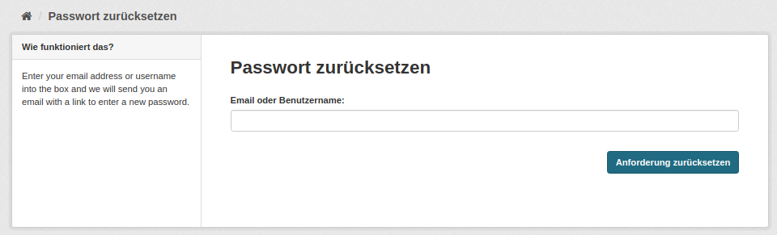
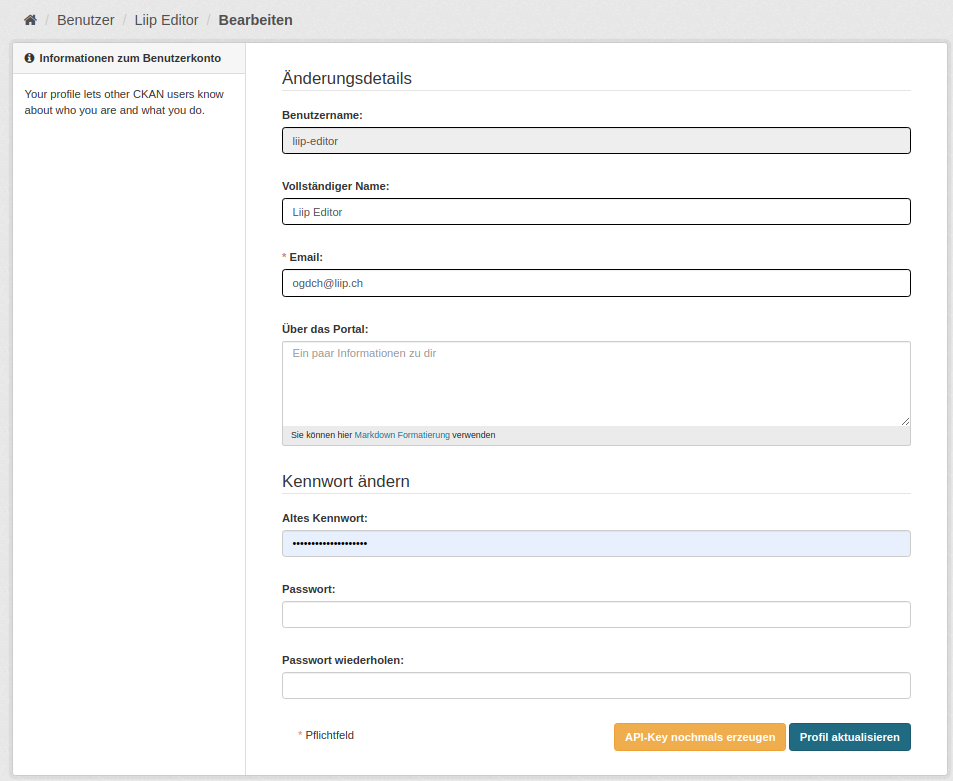
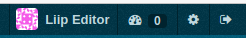

.. container:: custom-breadcrumbs

   - :fa:`home` :doc:`Handbuch <../../../index>` :fa:`chevron-right`
   - :doc:`Publizieren <../publizieren>` :fa:`chevron-right`
   - :doc:`Erst-Publizierende <../erstpublizierende>` :fa:`chevron-right`
   - Profil verwalten

****************
Profil verwalten
****************

Wie kann ich mein Profil editieren?
===================================

.. container:: Intro

    Mit dem von uns zugestellten Login können Sie sich
    auf der :term:`Abnahmeumgebung <Abnahmeumgebung>`
    von opendata.swiss einloggen. Dort können Sie Ihre Organisation
    sowie auch Ihre aktuellen Einträge auf opendata.swiss managen und erfassen.

Die Schritte auf einen Blick
----------------------------

- :ref:`Passwort setzen <passwort_setzen>`
- :ref:`Benutzer-Dashboard <benutzer_dashboard>`
- :ref:`Benutzerkontenverwaltung <benutzerkonten_verwaltung>`
- :ref:`Benutzer-Navigation <benutzer_navigation>`

.. _passwort_setzen:

Passwort setzen
--------------------------

Sie erhalten von uns nach der Registrierung eine E-Mail mit Ihrem Benutzernamen und
einem Link zum Setzen Ihres Passworts.

Bitte geben Sie Ihren Benutzernamen ein und klicken Sie auf «Anforderung zurücksetzen».
Sie erhalten dann eine zweite E-Mail mit einem direkten Link für das Setzen Ihres Passworts.
Anschliessend können Sie sich dann im Backend der :term:`Abnahmeumgebung <Abnahmeumgebung>`
von opendata.swiss einloggen.

.. _benutzer_dashboard:

Benutzer-Dashboard
-------------------

Nach dem Einloggen gelangen Sie zu Ihrem Benutzer-Dashboard.
Sie können zu Ihrer Organisation wechseln,
indem Sie auf den Tab «Meine Organisationen» klicken.

.. figure:: ../../../_static/images/publizieren/benutzer/benutzer-dashboard.png
   :alt: Benutzer Dashboard im Backend von opendata.swiss

.. _benutzerkonten_verwaltung:

Benutzerkontenverwaltung
--------------------------

Zu Ihrem Benutzerkonto gelangen Sie, wenn Sie im Dashboard auf «Bearbeitete Einstellungen» klicken.

Den «Benutzernamen» haben Sie bereits bei Ihrer Registrierung erhalten. Dieser
dient zu Ihrer eindeutigen Identifikation auf der Plattform und kann nicht geändert werden.
«Vollständiger Name» ist der Name, mit dem Sie und andere Benutzerinnen und Benutzer
im :term:`Backend <Backend>` erscheinen.
Ihre «E-Mail»  haben wir bereits bei der Registrierung erfasst.
Beim Feld «Über das Portal» können Sie Zusatzinformationen zu Ihrer Person eingeben.

.. container:: important

    Nicht vergessen: Bestätigen Sie alle gemachten
    Änderungen mit einem Klick auf den Button «Profil aktualisieren».

.. _benutzer_navigation:

Benutzer-Navigation
--------------------------

Als Benutzer steht Ihnen ganz oben rechts eine Navigationsleiste zur Verfügung:

- Das Dashboard-Icon führt Sie zu Ihrem Benutzer-Dashboard.
- Wenn Sie auf Ihren Benutzernamen klicken, gelangen Sie zur
  Darstellung Ihres Profils, wie andere berechtigte Benutzerinnen und Benutzer  (etwa ein Sysadmin) Sie sehen.
- Der Button mit dem Settings-Icon und der Bezeichnung “Bearbeiten” führt zum Editieren Ihres Benutzerprofils.
- Ganz rechts oben können Sie sich ausloggen.

.. container:: materialien

    Mehr zum Thema

So loggen Sie sich auf dem Backend von opendata.swiss ein:

- :download:`Screencast zum Login <../../../_static/screencasts/login.gif>` - In diesem Screencast zeigen wir Ihnen das Einloggen auf dem :term:`Backend <Backend>`

.. container:: teaser

   :doc:`Nächster Schritt: Informationen zur publizierenden Organisation ergänzen <organisation-einrichten>`

Ihr Profil ist nun angelegt und ausgefüllt, jetzt
können Sie Informationen zu Ihrer Organisation eingeben.

