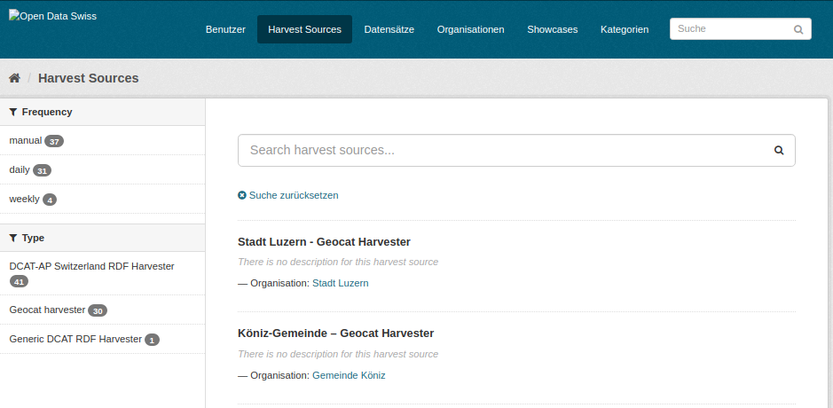
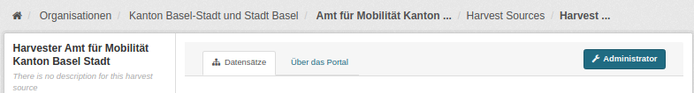
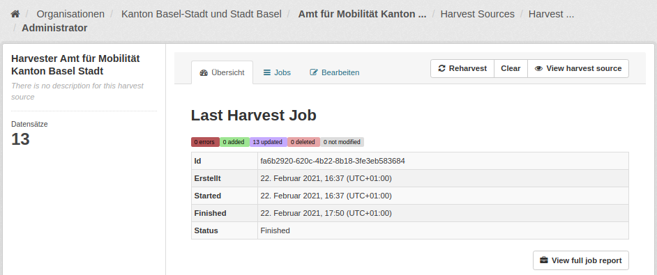
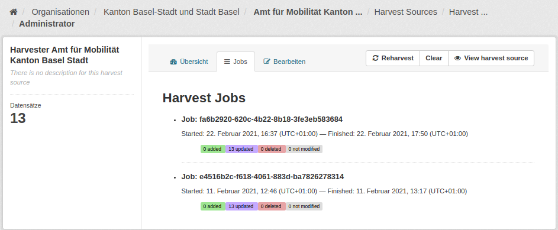
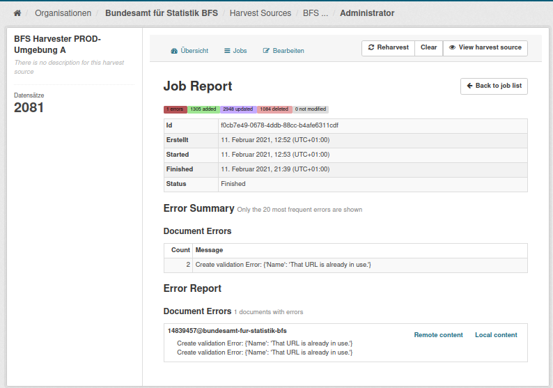
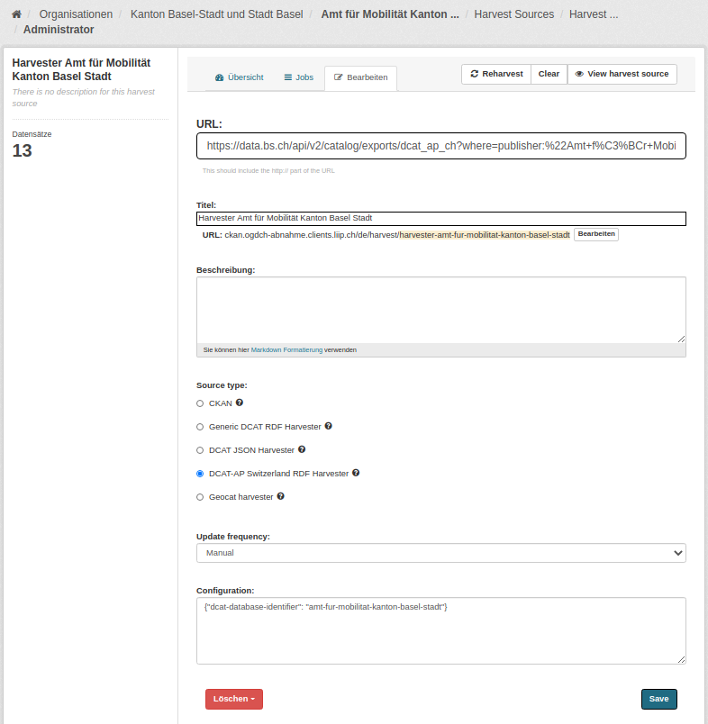
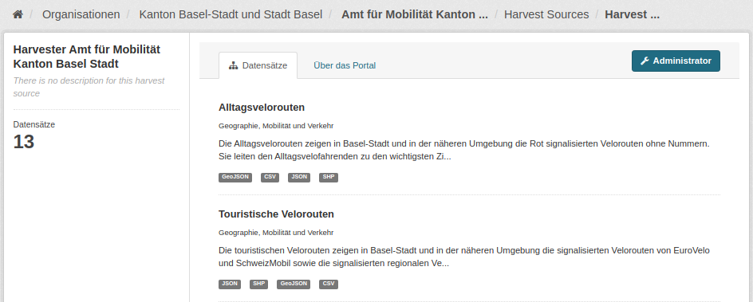
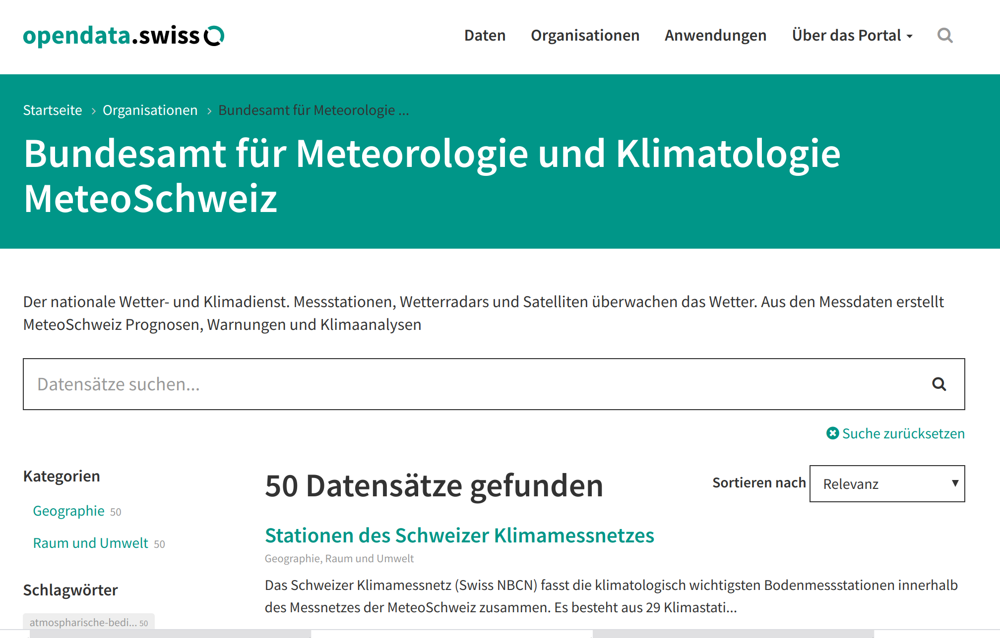
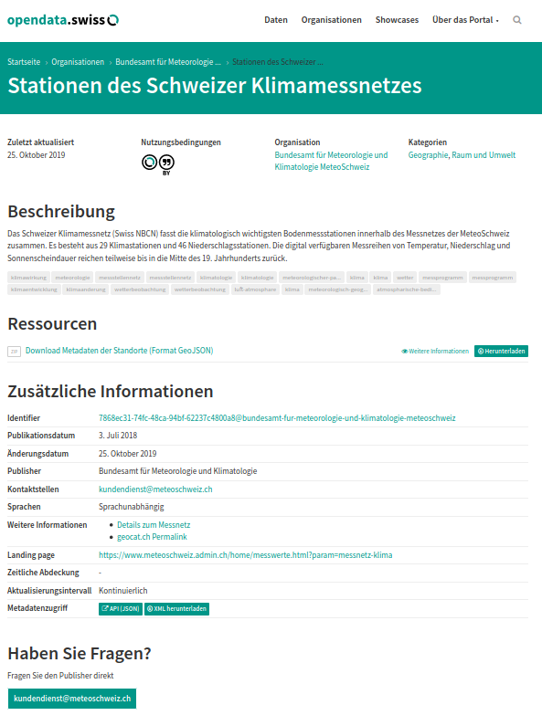

.. container:: custom-breadcrumbs

   - :fa:`home` :doc:`Handbuch <../../../index>` :fa:`chevron-right`
   - :doc:`Publizieren <../publizieren>` :fa:`chevron-right`
   - :doc:`Publikationsvariante <../publikationsvariante>` :fa:`chevron-right`
   - Harvester

*********************************
Metadaten mit Harvester hochladen
*********************************

Wie lade ich meine Metadaten mittels Harvester hoch?
====================================================

.. container:: Intro

    Mit einem Harvester lassen sich grössere Datenmengen einfach und schnell publizieren.
    Es bedeutet, dass Ihre Datasets automatisch durch opendata.swiss
    aktualisiert werden können, der Aufwand für die :doc:`Datenpflege <../../pflegen/pflegen>`
    reduziert sich für Sie. Voraussetzung dafür ist, dass
    :doc:`Ihre Organisation mitsamt Benutzerinnen und Benutzern registriert ist <../erstpublizierende/kontakt-bfs>`.
    Dies erfolgt in Absprache mit der
    :term:`Geschäftsstelle OGD <Geschäftsstelle Open Government Data (OGD)>`.
    Wir erklären Ihnen hier,
    wie das Harvesting funktioniert.

Die Schritte auf einen Blick
-----------------------------

- :ref:`Harvester einrichten <harvesting-einrichten>`
- :ref:`Katalog-Endpunkt übergeben <harvesting-katalog-endpunkt>`
- :ref:`Katalog-Endpunkt mit Paginierung übergeben <harvesting-paginierung>`
- :ref:`Harvester testen <harvesting-testen>`
- :ref:`Den Harvester verwalten <harvesting-verwalten>`
- :ref:`Harvesting Fehler beheben <harvesting-fehler-beheben>`
- :ref:`Harvester Einstellugen <harvester-einstellungen>`
- :ref:`Datasets prüfen <harvesting-pruefen>`
- :ref:`Datenkatalog veröffentlichen <harvesting-veroeffentlichen>`

.. admonition:: Gut zu wissen

    Sollten Sie zum ersten Mal Daten publizieren, führen wir Sie durch den
    Prozess und unterstützen Sie dabei, die korrekte Übermittlung und Darstellung
    Ihrer Daten sicherzustellen, unabhängig von der :doc:`Publikationsvariante <../publikationsvariante>`.

Alle Schritte im Detail
------------------------

.. _harvesting-einrichten:

Harvester einrichten
--------------------

Wenn Sie Ihre Daten im :doc:`Standard DCAT-AP-CH <../../glossar/bibliothek/dcat-ap-ch>`
bereitstellen können, übernehmen wir das Einrichten des Harvesters
für Sie. Sie müssen nichts weiter tun, als uns die
URL mit dem :term:`Katalog-Endpunkt <Katalog Endpunkt (Catalogue endpoint)>`
zu übermitteln.
In speziellen Fällen, zum Beispiel wenn ein Datenkatalog nicht im DCAT-AP-CH Standard
geliefert werden kann, kann ein spezifisches Mapping definiert werden.
`Bitte kontaktieren Sie uns hierfür <mailto:opendata@bfs.admin.ch>`__.

.. admonition:: Gut zu wissen

    Pro Organisation wird jeweils ein Endpunkt für das Harvesten benötigt.
    Falls Sie also Daten von mehreren Organisationen verwalten,
    benötigen wir auch mehrere Endpunkte. Beachten Sie beim Vorbereiten
    Ihres Datenkatalogs die besondere Struktur des Dataset-Identifiers,
    die im
    :doc:`Standard DCAT-AP-CH <../../glossar/bibliothek/dcat-ap-ch>`
    beschrieben ist und für jede Organisation individuell ist.

.. _harvesting-katalog-endpunkt:

Katalog-Endpunkt übergeben
--------------------------

Senden Sie uns hierfür eine `E-Mail mit der URL <mailto:opendata@bfs.admin.ch>`__,
unter der wir Ihren Datenkatalog herunterladen können.
Diese URL ist gleichzeitig ein RDF-Endpunkt.

.. container:: important

    Wichtig: Der Datenkatalog muss im Format
    :doc:`DCAT-AP-CH <../../glossar/bibliothek/dcat-ap-ch>` vorliegen.

.. _harvesting-paginierung:

Katalog-Endpunkt mit Paginierung übergeben
------------------------------------------

.. code-block:: xml

  <hydra:PagedCollection rdf:about="http://opendata.swiss/catalog.xml?page=3">
    <hydra:lastPage>http://opendata.swiss/catalog.xml?page=4</hydra:lastPage>
    <hydra:itemsPerPage rdf:datatype="http://www.w3.org/2001/XMLSchema#integer">1000</hydra:itemsPerPage>
    <hydra:totalItems rdf:datatype="http://www.w3.org/2001/XMLSchema#integer">3479</hydra:totalItems>
    <hydra:firstPage>http://opendata.swiss/catalog.xml?page=1</hydra:firstPage>
    <hydra:previousPage>http://opendata.swiss/catalog.xml?page=2</hydra:previousPage>
  </hydra:PagedCollection>

Falls Ihr Datenkatalog zu gross ist und nicht in einer einzigen
Anfrage übermittelt werden kann, besteht die Möglichkeit,
ihn seitenweise zu übergeben. Dafür empfehlen wir, die Paginierung
mit dem `Hydra Vocabulary <https://www.hydra-cg.com/spec/latest/core/>`__
zu implementieren. Senden Sie uns anschliessend eine
`E-Mail mit der entsprechenden URL <mailto:opendata@bfs.admin.ch>`__.

.. _harvesting-testen:

Harvester testen
--------------------------------

Das Harvesting von Datasets im DCAT-AP-CH Standard wird von uns für Sie getestet.
Nachdem wir Ihre URL erhalten und den Harvester eingerichtet haben,
lassen wir ihn auf Ihrem Endpunkt in der Abnahmeumgebung erstmalig laufen.
Unter Umständen liefert der Harvester anfangs Fehler zurück, die Sie dann
in Ihrem Datenkatalog beheben müssen.

Am Prozess des Testens und der iterativen Verbesserung Ihrer Daten sind Sie von Anfang an
mit einbezogen. Sie haben selbst Zugang zu Ihrem Harvester, seinen Jobläufen und Fehlerberichten.
Sollten Sie bei allfälligen Fehlern Fragen haben, dann
`wenden Sie sich bitte an uns <mailto:opendata@bfs.admin.ch>`__ und wir helfen Ihnen weiter

.. _harvesting-verwalten:

Den Harvester verwalten
--------------------------------

Im Folgenden erklären wir Ihnen den Zugang zu Ihrem Harvester:

Klicken Sie auf den Button «Harvest Sources». Dann gelangen Sie zu einer Liste aller Harvester. Geben Sie
den Namen Ihres Harvesters ins Suchfeld ein, um nach Ihrem Harvester zu finden. Den Namen
des Harvesters erhalten Sie von uns.

Wenn Sie Ihren Harvester gefunden haben: klicken Sie auf den Link, dann gelangen Sie zur Detailansicht
des Harvesters:

In der Detailansicht Ihres Harvesters sind alle Datasets aufgelistet, die der Harvester über den Zugriff auf
Ihren :term:`Katalog Endpunkt <Katalog Endpunkt (Catalogue endpoint)>` automatisch erzeugt hat.

Klicken Sie auf den Button «Administrator» um Ihren Harvester zu verwalten. Sie gelangen dann zu einem
Dashboard für das Management Ihres Harvesters.

Hier wird Ihnen jeweils der aktuellste Harvest Job angezeigt.

Sie haben folgende Möglichkeiten:

- Der Tab «Jobs» führt Sie zu einer Liste vergangener Harvest Jobs
- Der Tab «Bearbeiten» führt Sie zur Bearbeitung der Einstellungen Ihres Harvesters
- Der Button «Reharvest» stösst einen erneuten Harvesterlauf an,
  so dass die Datasets anhand dem eingetragenen
  :term:`Katalog-Endpunkt <Katalog Endpunkt (Catalogue endpoint)>` aktualisiert werden
- Über den Button «View harvest source» gelangen Sie zurück auf die Detailseite Ihres Harvesters

.. container:: important

    Vorsicht: Der Button «Clear» löscht alle Datasets und vergangenen Jobs des Harvester. Machen Sie das nur,
    wenn das wirklich Ihre Absicht ist.

.. admonition:: Gut zu wissen

    Harvester laufen als Hintergrundprozesse. Wenn Sie Ihren Harvester anstossen, wird dadurch ein Harvest Job
    erzeugt und in eine Jobqueue gestellt. Wie schnell Ihr Harvest Job Ergebnisse liefert, hängt auch davon ab, wie lang
    die Jobqueue gerade ist. Deshalb kann die Zeit, die Sie
    auf die Ergebnisse Ihres Harvesters warten müssen, stark variieren.

.. _harvesting-fehler-beheben:

Harvesting Fehler beheben
--------------------------

Wenn Ihr letzter Harvest Job Fehler gemeldet hat, sehen Sie das auf dem Dashboard.
Klicken Sie dann auf den Tab «Jobs», um zur Jobliste zu gelangen:

Hier können Sie die Harvesting Fehler im Detail ansehen:

- In der «Error Summary» sind die Fehlerarten mit der Häufigkeit ihres Vorkommens gelistet
- Im «Error Report» sind alle Fehler einzeln gelistet.

Je nach Art des Fehlers steht Ihnen noch Einsicht in den «Remote Content» und den «Local Content»
zur Verfügung:

- Im «Remote Content» sehen Sie den Datenkatalog an Ihrem :term:`Katalog-Endpunkt <Katalog Endpunkt (Catalogue endpoint)>`
  so wie der Harvester ihn abholt.
- Der «Local Content» betrifft oft nur ein Dataset: hier können Sie in einer JSON Darstellung sehen, wie das Dataset
  auf opendata.swiss angekommen ist.

Wenn Sie beim Testen Ihres Harvesters auf Fehler stossen, die Sie nicht verstehen und nicht beheben
können, dann
`melden Sie sich bei uns <mailto:opendata@bfs.admin.ch>`__. Wir unterstützen Sie beim Einrichten und Testen
Ihres Harvesters.

.. _harvester-einstellungen:

Harvester Einstellungen
--------------------------

Harvester haben ausser dem :term:`Katalog-Endpunkt <Katalog Endpunkt (Catalogue endpoint)>` noch weitere
Einstellungen.

.. container:: important

    Wichtig: Wir haben Ihren Harvester bereits für Sie konfiguriert. Im Normalfall sollten die
    Einstellungen so bleiben, wie wir es für Sie eingerichtet haben.

Die «URL» ist der :term:`Katalog-Endpunkt <Katalog Endpunkt (Catalogue endpoint)>` an dem Ihre Daten abgeholt werden.

Unter dem «Titel» finden Sie den Harvester in der Harvester-Liste.
Das Feld «Beschreibung» ist für Anmerkungen gedacht.

Der «Source type» Ihres Harvesters hängt von der Publikationsvariante ab: in der hier beschriebenen Publikationsvariante
hat der Harvester die Einstellung «DCAT-AP Switzerland RDF Harvester». Auch in der Publikationsvariante
:doc:`Metadaten via geocat.ch publizieren <geodaten>` kommen Harvester
zum Einsatz. Diese haben dann den Typ «Geocat Harvester».

Die Harvester sind bezüglich dem Feld «Update frequency» auf «Manual» eingestellt,
obwohl sie täglich laufen, da ihre Startzeit nicht
über die Weboberfläche, sondern über Hintergrundprozesse,
gesteuert wird.
Beim Feld «Configuration» werden gegebenenfalls weitere Konfigurationen eingetragen, die Ihr Harvester benötigt, um Ihre
Daten korrekt zu importieren.

.. container:: important

    Wichtig: Pro Organisation kann es nur einen Harvester mit derselben Konfiguration geben.

.. container:: important

    Wichtig: Bitte löschen Sie Ihren Harvester nicht,
    sondern `wenden Sie sich an uns <mailto:opendata@bfs.admin.ch>`__,
    falls Sie ihn nicht
    mehr benötigen, damit der Harvester und seine Daten fachgerecht entfernt werden können.

.. _harvesting-pruefen:

Datasets prüfen
----------------------------

Sobald Ihr Harvester fehlerfrei durchläuft, kontrollieren Sie bitte Ihre Datensätze in der
Detailansicht des Harvesters:

Kontrollieren Sie bitte auch die Frontendansicht Ihrer Datasets:

Sie gelangen zur Ansicht Ihrer Organisation im Frontend,
indem Sie ``ckan`` aus der URL Ihrer Organisation im Backend entfernen:

.. figure:: ../../../_static/images/publizieren/organisation/ckan-organisations-url.png
   :alt: CKAN URL einer Organisation

.. figure:: ../../../_static/images/publizieren/organisation/frontend-organisations-url.png
   :alt: Frontend URL einer Organisation

.. container:: bildunterschrift

   Beispielansicht einer publizierten Organisation

.. container:: bildunterschrift

   Beispielansicht eines publizierten Datasets

.. _harvesting-veroeffentlichen:

Datasets veröffentlichen
----------------------------

Nach einer abschliessenden Prüfung Ihrer Datasets richten wir das Harvesting
für Sie in der Produktionsumgebung ein.
`Kontaktieren Sie uns <mailto:opendata@bfs.admin.ch>`__,
um das Go-Live gemeinsam zu planen.

.. container:: support

   Support

Sie haben eine Frage zum Harvester?
`Schreiben Sie uns <mailto:opendata@bfs.admin.ch>`__
und wir helfen Ihnen gerne weiter.

.. container:: materialien

   Mehr zum Thema

- :doc:`DCAT-AP-CH (Link, englisch) <../../glossar/bibliothek/dcat-ap-ch>` – Beschreibung des aktuell von opendata.swiss genutzten Datenstandards DCAT-AP-CH
- :download:`Harvester konfigurieren <../../../_static/screencasts/configure-harvester.gif>` - In diesem Screencast zeigen wir Ihnen, wie Sie Ihren Harvester konfigurieren können
- :download:`Harvester starten <../../../_static/screencasts/run-harvester.gif>` - In diesem Screencast zeigen wir Ihnen, wie Sie Ihren Harvester starten können