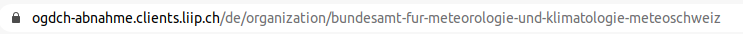

.. container:: custom-breadcrumbs

   - :fa:`home` :doc:`Handbuch <../../../index>` :fa:`chevron-right`
   - :doc:`Publizieren <../publizieren>` :fa:`chevron-right`
   - :doc:`Publikationsvariante <../publikationsvariante>` :fa:`chevron-right`
   - Harvester

*********************************
Metadaten mit Harvester hochladen
*********************************

Wie lade ich meine Metadaten mittels Harvester hoch?
====================================================

.. container:: Intro

    Mit einem Harvester lassen sich grössere Datenmengen einfach und schnell publizieren.
    Es bedeutet, dass Ihre Datasets automatisch durch opendata.swiss angezogen und
    aktualisiert werden können, der Aufwand für die :doc:`Datenpflege <../../pflegen/pflegen>`
    reduziert sich für Sie. Voraussetzung dafür ist, dass
    :doc:`Ihre Organisation mitsamt Benutzerinnen und Benutzern registriert ist <../erstpublizierende/kontakt-bfs>`.
    Dies erfolgt in Absprache mit der
    :term:`Geschäftsstelle OGD <Geschäftsstelle Open Government Data (OGD)>`.
    Wir erklären Ihnen hier,
    wie das sogenannte Harvesting funktioniert.

Die Schritte auf einen Blick
-----------------------------

- :ref:`Harvester einrichten <harvesting-katalog-endpunkt>`
- :ref:`Katalog-Endpunkt übergeben <harvesting-katalog-endpunkt>`
- :ref:`Katalog-Endpunkt mit Paginierung übergeben <harvesting-paginierung>`
- :ref:`Harvester testen <harvesting-testen>`
- :ref:`Den Harvester verwalten <harvesting-verwalten>`
- :ref:`Harvesting Fehler beheben <harvesting-fehler-beheben>`
- :ref:`Harvestier Einstellugen <harvester-einstellungen>`
- :ref:`Datenasets prüfen <harvesting-pruefen>`
- :ref:`Datenkatalog veröffentlichen <harvesting-veroeffentlichen>`

.. admonition:: Gut zu wissen

    Sollten Sie zum ersten Mal Daten publizieren, führen wir Sie durch den
    Prozess und unterstützen Sie dabei, die korrekte Übermittlung und Darstellung
    Ihrer Daten sicherzustellen, unabhängig von der Publikationsvariante.

Alle Schritte im Detail
------------------------

.. _harvesting-einrichten:

Harvester einrichten
--------------------

Wenn Sie Ihre Daten im :doc:`Standard DCAT-AP-CH <../../glossar/bibliothek/dcat-ap-ch>`
bereitstellen können, übernehmen wir das Einrichten des Harvesters
für Sie. Sie müssen nichts weiter tun, als uns die
URL mit dem :term:`Katalog-Endpunkt <Katalog Endpunkt (Catalogue endpoint)>`
zu übermitteln.
In speziellen Fällen, zum Beispiel wenn ein Datenkatalog nicht im DCAT-AP-CH Standard
geliefert werden kann, kann ein spezifisches Mapping definiert werden.
`Bitte kontaktieren Sie uns hierfür <mailto:opendata@bfs.admin.ch>`__.

.. admonition:: Gut zu wissen

    Pro Organisation wird jeweils ein Endpunkt für das Harvesten benötigt.
    Falls Sie also Daten von mehreren Organisationen verwalten,
    benötigen wir auch mehrere Endpunkte. Beachten Sie beim Vorbereiten
    Ihres Datenkatalogs die besondere Struktur des Dataset-Identifiers,
    die im
    :doc:`Standard DCAT-AP-CH <../../glossar/bibliothek/dcat-ap-ch>`
    beschrieben ist und für jede Organisation individuell ist.

.. _harvesting-katalog-endpunkt:

Katalog-Endpunkt übergeben
--------------------------

`Senden Sie uns hierfür eine E-Mail <mailto:opendata@bfs.admin.ch>`__ mit der URL,
unter der wir Ihren Datenkatalog herunterladen können.
Diese URL ist gleichzeitig ein RDF-Endpunkt.

.. container:: important

    Wichtig: Der Datenkatalog muss im Format
    :doc:`DCAT-AP-CH <../../glossar/bibliothek/dcat-ap-ch>` vorliegen.

.. _harvesting-paginierung:

Katalog-Endpunkt mit Paginierung übergeben
------------------------------------------

.. code-block:: xml

  <hydra:PagedCollection rdf:about="http://opendata.swiss/catalog.xml?page=3">
    <hydra:lastPage>http://opendata.swiss/catalog.xml?page=4</hydra:lastPage>
    <hydra:itemsPerPage rdf:datatype="http://www.w3.org/2001/XMLSchema#integer">1000</hydra:itemsPerPage>
    <hydra:totalItems rdf:datatype="http://www.w3.org/2001/XMLSchema#integer">3479</hydra:totalItems>
    <hydra:firstPage>http://opendata.swiss/catalog.xml?page=1</hydra:firstPage>
    <hydra:previousPage>http://opendata.swiss/catalog.xml?page=2</hydra:previousPage>
  </hydra:PagedCollection>

Falls Ihr Datenkatalog zu gross ist und nicht in einer einzigen
Anfrage übermittelt werden kann, besteht die Möglichkeit,
ihn seitenweise zu übergeben. Dafür empfehlen wir die Paginierung
mit dem `Hydra Vocabulary <https://www.hydra-cg.com/spec/latest/core/>`__
zu implementieren. `Senden Sie uns abschliessend eine E-Mail <mailto:opendata@bfs.admin.ch>`__
mit der entsprechenden URL.

.. _harvesting-testen:

Harvester testen
--------------------------------

Das Harvesting von Datasets im DCAT-AP-CH Standard wird von uns für Sie getestet.
Nachdem wir Ihre URL erhalten und den Harvester eingerichtet haben,
lassen wir ihn auf Ihrem Endpunkt in der Abnahmeumgebung erstmalig laufen.
Unter Umständen liefert der Harvester anfangs Fehler zurück, die Sie dann beheben
in Ihrem Datenkatalog beheben müssen.

Am Prozess des Testens und iterativen Verbesserns Ihrer Daten sind Sie von Anfang an
mit einbezogen. Sie haben selbst Zugang zu Ihrem Harvester, seinen Jobläufen und Fehlerberichten.

Sollten Sie bei allfälligen Fehlern Fragen haben, dann
`wenden Sie sich gerne an uns <mailto:opendata@bfs.admin.ch>`__, und wir helfen Ihnen weiter

.. _harvesting-verwalten:

Den Harvester verwalten
--------------------------------

Im Folgenden erklären wir Ihnen den Zugang zu Ihrem Harvester:

Klicken Sie auf «Harvest Sources». Dann gelangen Sie zu einer Liste aller Harvester. Geben Sie
den Namen Ihres Harvesters ins Suchfeld ein, um nach Ihrem Harvester zu suchen. Den Namen erhalten
Sie von uns.

Wenn Sie Ihren Harvester gefunden haben: klicken Sie auf den Link, dann gelangen Sie zur Detailansicht
des Harvesters:

In der Detailansicht sind alle Datasets aufgelistet, die dem Harvester zugeordnet sind: das sind alle
Datasets, die der Harvester über den Zugriff auf den Harvest-Endpunkt automatisch erzeugt hat.

Klicken Sie auf «Administrator» um Ihren Harvester zu verwalten. Sie gelangen dann zu einem
Dashboard für das Management Ihres Harvesters.

Hier wird Ihnen jeweils der aktuellste Harvestjob angezeigt.

Sie haben folgende Möglichkeiten:

- «Jobs» führt Sie zu einer Liste vergangener Harvest Jobs
- «Bearbeiten» führt Sie zur Bearbeitung der Einstellungen Ihres Harvesters
- «Reharvest» stösst einen erneuten den Harvesterlauf an, zum Aktualisieren Ihrer Datasets
  von dem eingetragenen :term:`Katalog-Endpunkt <Katalog-Endpunkt>`
- «View harvest source»: damit gelangen Sie zurück auf die Detailseite Ihres Harvesters

.. container:: important

    Vorsicht: «Clear» Löscht alle Datasets und vergangenen Jobs des Harvester. Machen Sie das nur
    wenn das wirklich Ihre Absicht ist.

.. admonition:: Gut zu wissen

    Harvester laufen als Hintergrundprozesse. Wenn Sie Ihren Harvester anstossen, wird dadurch ein Harvesterjob
    erzeugt und in eine Jobqueue gestellt. Wie schnell Ihr Harvster-Job Ergebnisse liefert, hängt auch davon, wie lang
    die Jobqueue gerade ist. Deshalb kann die Zeit, die Sie
    auf die Ergebnisse Ihres Harvesters warten müssen stark varieren.

.. _harvesting-fehler-beheben:

Harvesting Fehler beheben
--------------------------

Wenn Ihr letzter Harvestjob Fehler gemeldet hat, sehen Sie dass auf dem Dashboard.
Klicken Sie dann auf «Jobs», um zur Jobliste zu gelangen:

.. figure:: ../../../_static/images/publizieren/harvesting/harvest-jobs.png
   :alt: Organisation im Frontend von opendata.swiss

Hier können Sie die Harvesting Fehler im Detail ansehen:

- In der «Error Summary» sind die Fehlerarten mit der Häufigkeit Ihres Vorkommens gelistet
- Im «Error Report» sind alle Fehler nochmal einzeln gelistet.

Je nach Art des Fehler steht Ihnen noch Einsicht in den «Remote Content» und den «Local Content»
zur Verfügung:

- «Remote Content» ist der Url zu Ihrem Katalog-Endpunkt und identisch mit dem Url, den sie in den EInstellungen
  des Harvesters eingetragen haben.
- «Local Content» betrifft oft nur ein Dataset: hier können sie in einer JSON Darstellung sehen, wie das Dataset
  auf opendata.swiss angekommen ist.

Wenn Sie beim Testen Ihres Harvesters auf Fehler stossen, die Sie nicht verstehen und nicht beheben
können, dann
`melden Sie sich gerne bei uns <mailto:opendata@bfs.admin.ch>`__. Wir unterstützen Sie beim Einrichten und Testen
Ihres Harvesters.

.. _harvester-einstellungen:

Harvester Einstellungen
--------------------------

Sie haben Zugang zu den Einstellungen Ihres Harvesters. Deshalb erklären wir Ihnen
diese Einstellungen im Folgenden:

.. container:: important

    Wichtig: Wir haben Ihren Harvester bereits für Sie konfiguriert. Im Normalfall sollten die
    Einstellungen so bleiben, wie wir es für Sie eingerichtet haben.

:URL: Der Url des Katalog-Endpunkts an dem die Datasets abgeholt werden.

:Titel: Der Titel des Harvesters unter dem der Harvester in der Harvester-Liste angezeigt wird.
:Beschreibung: Bemerkungen zu Ihrem Harvester. Einige Harvester werden täglich automatische zu einer bestimmten
               Zeit gestartet. Wenn das so ist kann diese Zeit hier eingetragen werden. Auch sonstige Besonderheiten
               Ihres Harvesters können hier beschrieben werden.
:Source type: Benutzt werden nur «DCAT-AP Switzerland RDF Harvester» oder «Geocat Harvester», falls Sie Geodaten
              veröffentlichen, die über swisstopo publiziert wurden, siehe
              :doc:`Metadaten via geocat.ch publizieren <geodaten>`
:Update frequency: Viele Harvester sind hier auf «Manual» eingestellt, obwohl sie täglich laufen, da ihr Start
                   plattformweit im Hintergrund gesteuert wird.
:Configuration: Hier werden Konfigurationen eingetragen, die der Harvester benötigt, um die Datasets
                korrekt zu importieren. Bitte nur ändern, wenn Sie genau wissen, was Sie tun.

.. container:: important

    Wichtig: Pro Organisation kann es nur einen Harvester mit derselben Konfiguration geben.

.. container:: important

    Wichtig: Bitte löschen Sie Ihren Harvester nicht, sondern `wenden Sie sich an uns <mailto:opendata@bfs.admin.ch>`__,
    falls Sie ihn nicht
    mehr benötigen, damit der Harvester und seine Daten fachgerecht entfernt werden können.

.. _harvesting-pruefen:

Datasets prüfen
----------------------------

Sobald Ihr Harvester fehlerfrei durchläuft kontrollieren Sie bitte Ihre Datensätze in der
Detailansicht des Harvesters:

Kontrollieren Sie bitte auch die Frontendansicht Ihrer Datasets:

Sie gelangen zu der Ansicht Ihrer Organisation im Frontend,
imdem Sie ``ckan`` aus dem Url Ihrer Organisation im Backend entfernen:

.. figure:: ../../../_static/images/publizieren/harvesting/organisation-ckan-url.png
   :alt: Beispielansicht eines publizierten Datasets

.. figure:: ../../../_static/images/publizieren/harvesting-frontend-check.png
   :alt: Organisation im Frontend von opendata.swiss

.. container:: bildunterschrift

   Beispielansicht einer publierten Organisation

.. figure:: ../../../_static/images/publizieren/harvesting-dataset-frontend-check.png
   :alt: Dataset im Frontend von opendata.swiss

.. container:: bildunterschrift

   Beispielansicht eines publizierten Datasets

.. _harvesting-veroeffentlichen:

Datasets veröffentlichen
----------------------------

Nach einer abschliessenden Prüfung Ihrer Datasets richten wir das Harvesting
für Sie in der Produktionsumgebung ein.
`Kontaktieren Sie uns <mailto:opendata@bfs.admin.ch>`__,
um das Go-Live gemeinsam zu planen.

.. container:: support

   Support

Sie haben eine Frage zum Harvester?
`Schreiben Sie uns <mailto:opendata@bfs.admin.ch>`__
und wir helfen Ihnen gerne weiter.

.. container:: materialien

   Mehr zum Thema

- :doc:`DCAT-AP-CH (Link, englisch) <../../glossar/bibliothek/dcat-ap-ch>` – Beschreibung des aktuell von opendata.swiss genutzte Datenstandards DCAT-AP-CH
- :download:`Harvester konfigurieren <../../../_static/screencasts/configure-harvester.gif>`- In diesem Screencast zeigen wir Ihnen, wie Sie Ihren Harvester konfigurieren können
- :download:`Harvester starten <../../../_static/screencasts/run-harvester.gif>`- In diesem Screencast zeigen wir Ihnen, wie Sie Ihren Harvester starten können