.. container:: custom-breadcrumbs

   - :fa:`home` :doc:`Handbuch <../../../index>` :fa:`chevron-right`
   - :doc:`Publizieren <../publizieren>` :fa:`chevron-right`
   - :doc:`Publikationsvariante <../publikationsvariante>` :fa:`chevron-right`
   - Manuell erfassen

**************************
Metadaten manuell erfassen
**************************

Wie erfasse ich Metadaten manuell im Webformular?
=================================================

.. container:: Intro

    Bei der manuellen Datenerfassung geben Sie selbst
    Ihre Metadaten im :term:`Backend <Backend>` von opendata.swiss ein.
    Voraussetzung dafür ist, dass Ihre Organisation mitsamt
    Benutzerinnen und Benutzern registriert ist. Eine Anleitung für die
    Erstregistrierung finden Sie
    :doc:`hier <../erstpublizierende/kontakt-bfs>`.

    Hier erklären wir Ihnen
    Schritt für Schritt, wie Sie das Webformular ausfüllen müssen.

Die Schritte auf einen Blick
----------------------------

- :ref:`Dataset erstellen <manuell-datensatz-erstellen>`
- :ref:`Metadaten eingeben <manuell-metadaten-eingeben>`
- :ref:`Ressourcen hinzufügen <manuell-resource-hinzufuegen>`
- :ref:`Dataset weiter bearbeiten <manuell-dataset-aktionen>`
- :ref:`Dataset prüfen <manuell-vorschau-pruefen>`
- :ref:`Dataset veröffentlichen <manuell-datensatz-veroeffentlichen>`
- :ref:`Dataset im Frontend prüfen <manuell-datensatz-frontend>`
- :ref:`Veröffentlichung in der Produktionsumgebung <manuell_go_live>`

.. admonition:: Gut zu wissen

    Sollten Sie zum ersten Mal Daten publizieren, führen wir Sie durch den Prozess
    und unterstützen Sie dabei, die korrekte Übermittlung und Darstellung
    Ihrer Daten sicherzustellen.
    Kontaktieren Sie uns, um einen
    `Termin für die Einführung zur Publikation auf opendata.swiss <mailto:opendata@bfs.admin.ch>`__
    zu vereinbaren.

Alle Schritte im Detail
=======================

.. _manuell-datensatz-erstellen:

Dataset erstellen
-----------------

Um Datasets zu erfassen, müssen Sie sich im :term:`Backend <Backend>` von opendata.swiss einloggen.
Handelt es sich um eine Erstpublikation oder möchten Sie eine neue oder
besonders komplexe Publikation testweise durchführen,
ist die :term:`Abnahmeumgebung <Abnahmeumgebung>` dafür die richtige Wahl.
Handelt es sich um eine wiederholte Publikation und Sie möchten Ihre Datasets
direkt veröffentlichen, können Sie sich in die
:term:`Produktionsumgebung <Produktionsumgebung>` einloggen.

Gehen Sie auf Ihr :ref:`Dashboard <benutzer_dashboard>`.

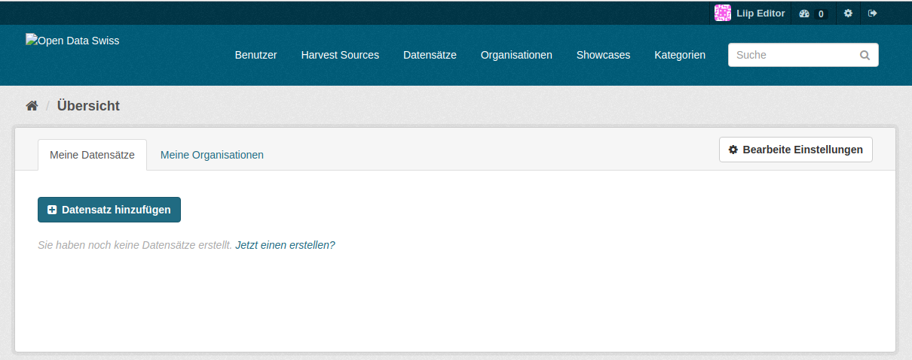

Klicken Sie auf den Button «Datensatz hinzufügen», um das Webformular zu öffnen.

.. _manuell-metadaten-eingeben:

Metadaten eingeben
-------------------

Um sicherzustellen, dass die Datasets wiederverwendet werden können,
werden verschiedene Metadaten und Beschreibungen zu den Datasets publiziert.

.. figure:: ../../../_static/images/publizieren/manuelle-datenerfassung/dataset-anlegen.png
   :alt: Dataset manuell erfassen

Als Erstes müssen Sie Ihrem Dataset einen Namen geben (“Titel für den Slug”).
Aus ihm wird der :term:`Slug <Slug>` des Datasets gebildet. Dieses Feld dient nur
zur Bildung des Slugs. Später wird der Titel Ihres Datasets aus
den Einträgen im Datenfeld «Titel (EN) (DE) (FR) (IT)» ermittelt:
Bitte legen Sie den Titel Ihres Datasets in mindestens einer Landessprache
und auf Englisch fest.
(Der Eintrag in Englisch wird bei der Weitergabe Ihres Datasets
an das :term:`europäische Datenportal <Europäisches Datenportal>` benötigt.)

.. container:: important

    Wichtig: Verändern Sie den Slug nicht mehr,
    nachdem das Dataset publiziert wurde. Ansonsten können Nutzende,
    die Ihre Daten bereits verwenden, diese nicht mehr erreichen.

Organisation und Identifier
^^^^^^^^^^^^^^^^^^^^^^^^^^^^

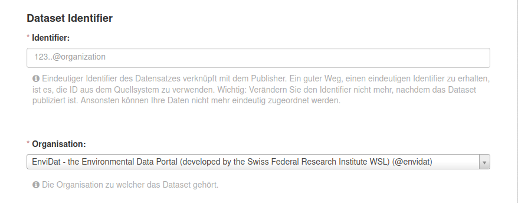

Hier müssen Sie den sogenannten «Identifier» eingeben. Dieser sorgt dafür,
dass das Dataset mit Ihrer Organisation verknüpft wird. Dafür können
Sie die ID aus Ihrem Quellsystem verwenden oder eine beliebige ID definieren.
Bitte stellen Sie sicher, dass Ihr Dataset der richtigen Organisation zugeteilt ist.

Für eine detaillierte Beschreibung des Inhalts der Metadaten-Felder orientieren
Sie sich bitte an der
`Publikation eCH-0200 DCAT-Anwendungsprofil für Datenportale in der Schweiz (DCAT-AP CH) <https://www.ech.ch/de/dokument/85dffcd6-6bda-4b60-a028-9c2fd8a8573a>`__.

.. container:: important

    Wichtig: Verändern Sie den Identifier nicht mehr, nachdem das Dataset
    publiziert ist. Ansonsten können Ihre Daten nicht mehr eindeutig zugeordnet werden.

Sichtbarkeit
^^^^^^^^^^^^^

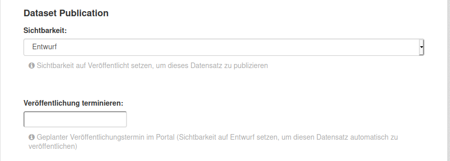

Dieses Felder dient zur :ref:`Veröffentlichung Ihres Datasets <manuell-datensatz-veroeffentlichen>`.
In der Dropdown-Auswahl können Sie die Sichtbarkeit des Datasets auf dem Frontend einstellen.
Die Voreinstellung für die «Sichtbarkeit» ist
«Entwurf». Lassen Sie diese Voreinstellung zunächst so. Sie bedeutet, dass Ihr Dataset noch
nicht öffentlich sichtbar ist. Sobald sie dieses auf dem Frontend sichtbar machen wollen,
wählen Sie in der Dropdown-Auswahl die Option “public” aus.

Dataset-Informationen
^^^^^^^^^^^^^^^^^^^^^^^^

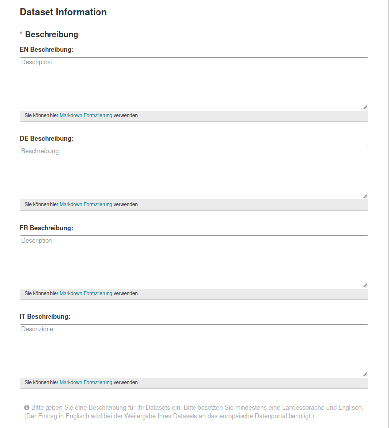

Bitte geben Sie im Feld «Beschreibung (EN) (DE) (FR) (IT)» eine Beschreibung Ihres Datasets an.
Alle Bundesstellen sollen die Angaben mindestens auf Deutsch und auf
Französisch eingeben – wünschenswert wären allerdings alle vier Sprachen.
Eine Beschreibung auf Englisch erleichtert das Auffinden Ihres Dataset auf dem
:term:`europäischen Datenportal <Europäisches Datenportal>`.

Daten
^^^^^

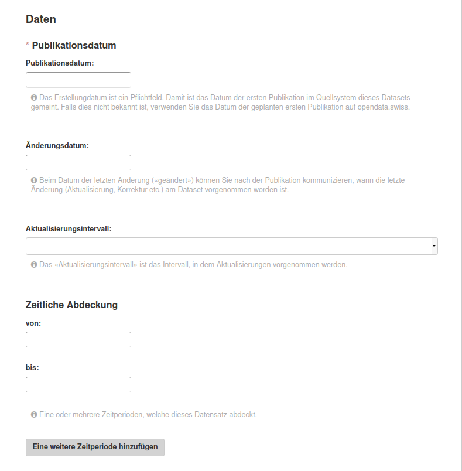

Hier gilt es das Pflichtfeld «Publikationsdatum» auszufüllen. Damit ist das Datum
der ersten Publikation im Quellsystem dieses Datasets gemeint.
Falls dies nicht bekannt ist, verwenden Sie das Datum der geplanten ersten
Publikation auf opendata.swiss. Beim Datum der letzten Änderung («Änderungsdatum»)
können Sie nach der Publikation kommunizieren, wann die letzte Änderung
(Aktualisierung, Korrektur etc.) am Dataset vorgenommen worden ist.
Weiter sollen Sie hier das Intervall, in dem Aktualisierungen
vorgenommen werden («Aktualisierungsintervall») und den Zeitraum, den das Dataset
umfasst («Zeitliche Abdeckung»), angeben.

Publisher-Informationen
^^^^^^^^^^^^^^^^^^^^^^^

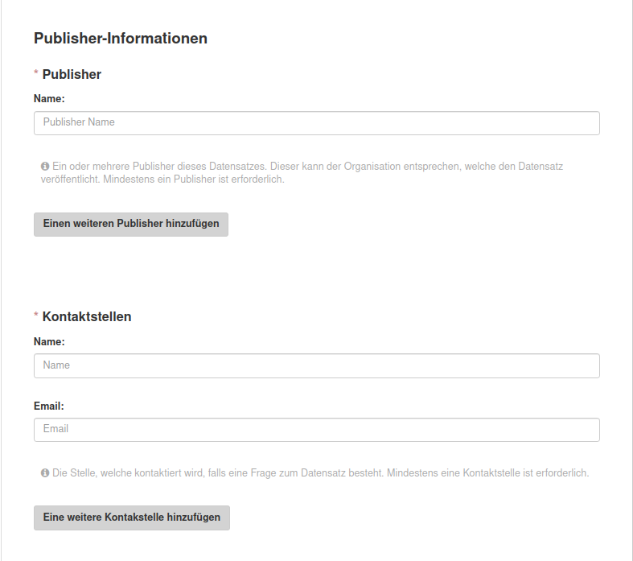

Hier müssen Sie Angaben zu Ihnen als datenpublizierende Organisation eingeben.
Im Pflichtfeld «Publisher» geben Sie die für das Dataset verantwortliche Organisation an.
Dies können auch mehrere Organisationen sein,
jedoch keine Personen.
Im Pflichtfeld «Kontaktstellen» muss eine
Ansprechperson angegeben werden, die von den Datennutzenden bei Rückfragen
kontaktiert werden darf. Es ist mindestens eine Person mit E-Mail-Adresse erforderlich.

Sprachen
^^^^^^^^

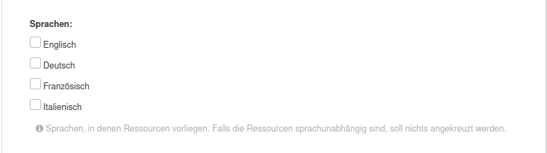

Falls Ihre Ressourcen in unterschiedlichen Sprachen vorliegen, können Sie diese hier angeben.
Liegen Ihre Ressourcen sprachunabhängig vor, kann das Eingabefeld hier leer gelassen werden.

Weitere Informationen
^^^^^^^^^^^^^^^^^^^^^^^

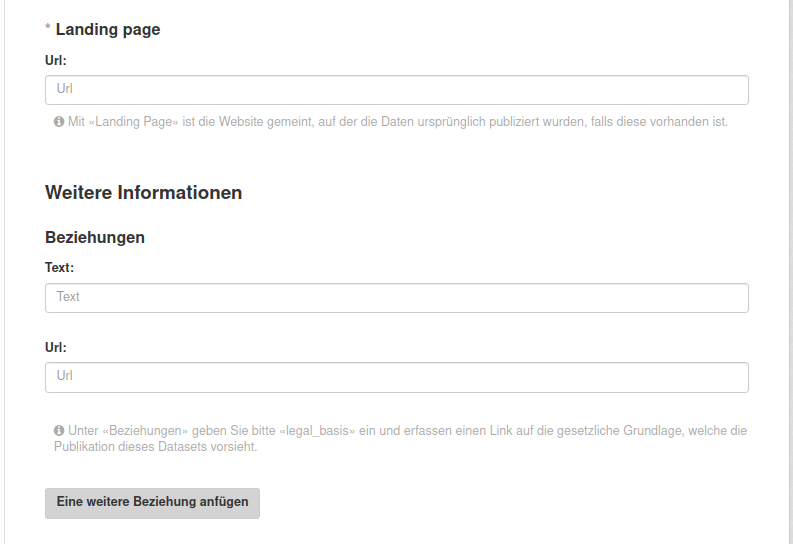

Mit «Landing Page»
ist die Website gemeint, auf der die Daten ursprünglich publiziert wurden,
falls diese vorhanden ist.
Unter «Beziehungen» tragen Sie bitte in das Textfeld «legal_basis» ein und geben im
Feld «Url» den Link auf die gesetzliche Grundlage, die für die Publikation dieses Datasets vorgesehen ist, an.
Wenn dies für Ihre Daten nicht relevant ist, lassen Sie das Feld leer.

Verwandte Datasets
^^^^^^^^^^^^^^^^^^^^

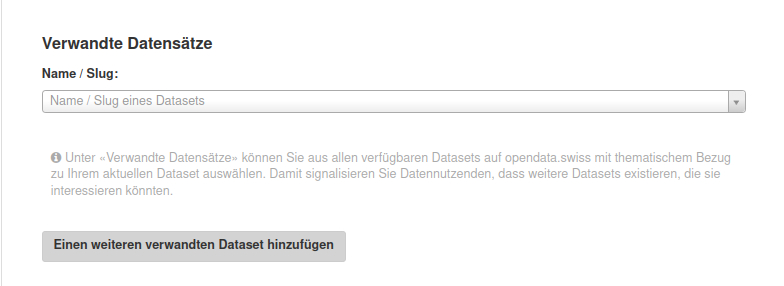

Unter «Verwandte Datensätze»
können Sie aus allen verfügbaren Datasets auf opendata.swiss jene mit
thematischem Bezug zu Ihrem aktuellen Dataset auswählen. Damit
signalisieren Sie den Datennutzenden, dass weitere thematisch interessante Datasets existieren.

Schlagwörter definieren
^^^^^^^^^^^^^^^^^^^^^^^^^

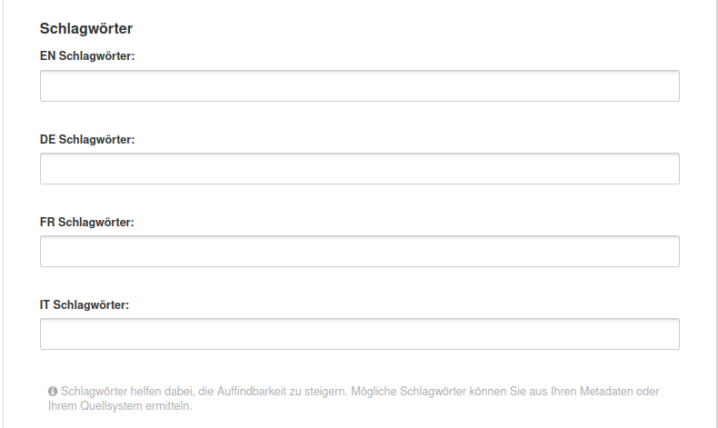

Es ist wichtig ein oder mehrere Schlagwörter zum Dataset anzugeben. Schlagwörter helfen dabei,
die Auffindbarkeit zu steigern.
So können diese als Filtermöglichkeit verwendet werden, um die Auswahl der Datasets thematisch einzugrenzen.
Mögliche Schlagwörter können Sie aus Ihren Metadaten oder
Ihrem Quellsystem ermitteln. Sie können auch aus den meistgenutzten Schlagwörtern auswählen.

Kategorien auswählen
^^^^^^^^^^^^^^^^^^^^^^^^^

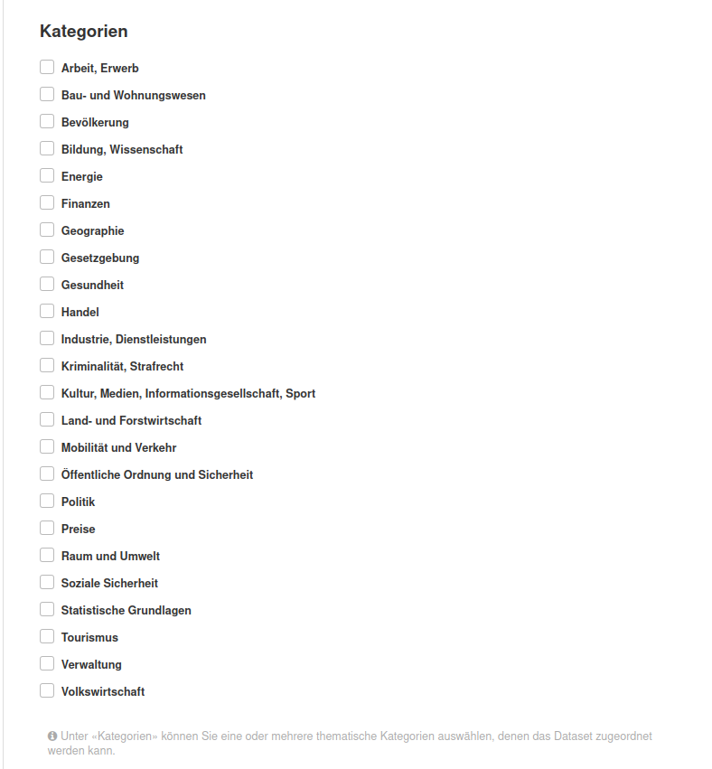

Unter «Kategorien» können Sie eine oder mehrere thematische Kategorien
auswählen, denen das Dataset zugeordnet werden kann.

.. _manuell-resource-hinzufuegen:

Ressourcen hinzufügen
-----------------------

Wenn Sie mit der Eingabe der Metadaten für Ihr Dataset
fertig sind, müssen Sie Ihrem Dataset als nächstes eine oder mehrere Ressourcen
hinzufügen. Klicken Sie auf den Button «Als nächstes: Distribution hinzufügen», um in das Webformular für
die Ressourcen zu gelangen.

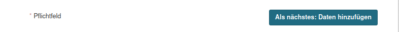

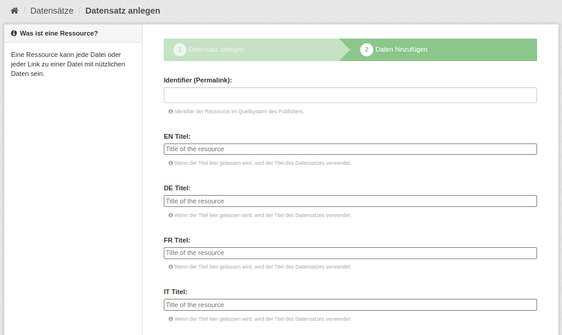

Eine «Ressource» ist eine spezifische Repräsentierung.
Dies können unterschiedliche Bereitstellungsformen eines Datasets
sein (media-type or format), unterschiedliche Zeitreihen
oder auch unterschiedliche Aggregationsstufen.
Das Erfassen einer
Ressource funktioniert ähnlich wie zuvor beim gesamten Dataset: Wählen Sie einen geeigneten
Identifier aus Ihrem Quellsystem aus,
legen Sie Titel und Beschreibung fest. Für die Sprachversionen
gelten die gleichen Regeln wie bei Datasets: Alle Bundesstellen
sollen die Angaben mindestens auf Deutsch und Französisch eingeben –
wünschenswert wären allerdings alle vier Sprachen. Weitere Organisationen sollen Titel und Beschreibung
in mindestens einer Sprache eingeben.
Falls die Ressource sprachunabhängig ist, wählen Sie unter «Sprache»
keine Sprache aus.
Auch hier müssen Sie unter dem Pflichtfeld «Erstellt»
das Datum der Veröffentlichung der Ressource angeben.

.. container:: important

    Wichtig: Jedes Dataset muss mindestens 1 Ressource haben.

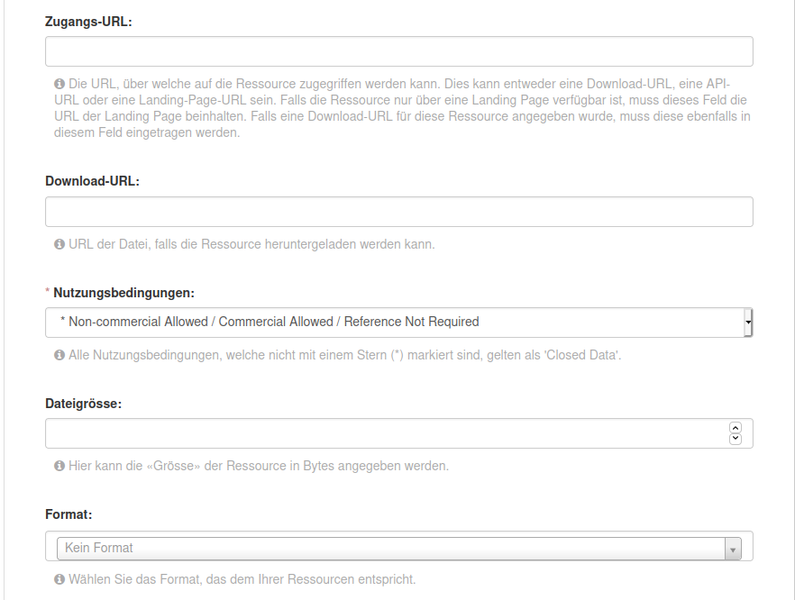

Für jede Ressource müssen Sie unter «Zugangs-URL» eine URL angeben,
über welche auf die Ressource
zugegriffen werden kann. Falls sich hinter der URL ein Download verbirgt,
muss die URL auch im Feld «Download-URL» eingetragen werden. Ebenfalls
optional kann die «Grösse» der Ressource in Bytes angegeben werden.
Unter «Format» wählen Sie das Format, das dem Ihrer Ressourcen entspricht.

.. container:: important

    Wichtig: `Unter «Nutzungsbedingungen» müssen
    Sie eine der Bedingungen auswählen, die auf opendata.swiss vorgesehen sind <https://opendata.swiss/de/terms-of-use>`__.

.. container:: important

    Wichtig: Bitte berücksichtigen Sie bei der Publikation von Ressourcen die
    :doc:`«OGD-Richtlinien» <../../glossar/bibliothek/ogd-richtlinien>`.

Sie haben jetzt Ihre erste Ressource angelegt und können jetzt entweder mit dem Button «Beenden»
Ihr Dataset und Ihre Ressource abspeichern oder Sie können mit dem Button
«Speichern & weitere hinzufügen» mit dem Hinzufügen von Ressourcen fortfahren.

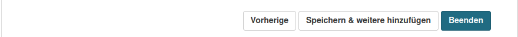

.. _manuell-dataset-aktionen:

Dataset weiter bearbeiten
--------------------------------

Das Hinzufügen weiterer Ressourcen ist auch nach dem Anlegen Ihres Dataset noch möglich.

Gehen Sie dazu zur Detailansicht Ihres Datasets im Backend der Abnahmeumgebung und klicken Sie auf
«Bearbeiten» und anschliessend auf «Ressourcen»:

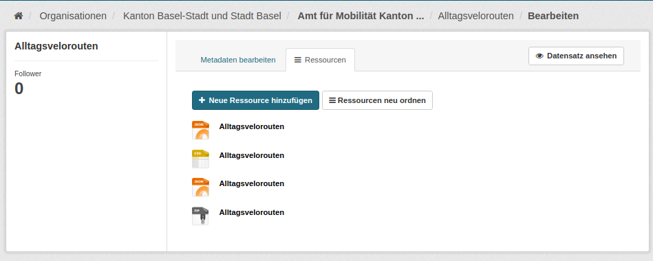

.. _manuell-vorschau-pruefen:

Dataset prüfen
-----------------

Sehen Sie sich Ihr Dataset in der Detailansicht an: Sind alle Felder so ausgefüllt,
wie Sie es erwarten, dann können Sie Ihr Dataset :ref:`veröffentlichen <manuell-datensatz-veroeffentlichen>`.

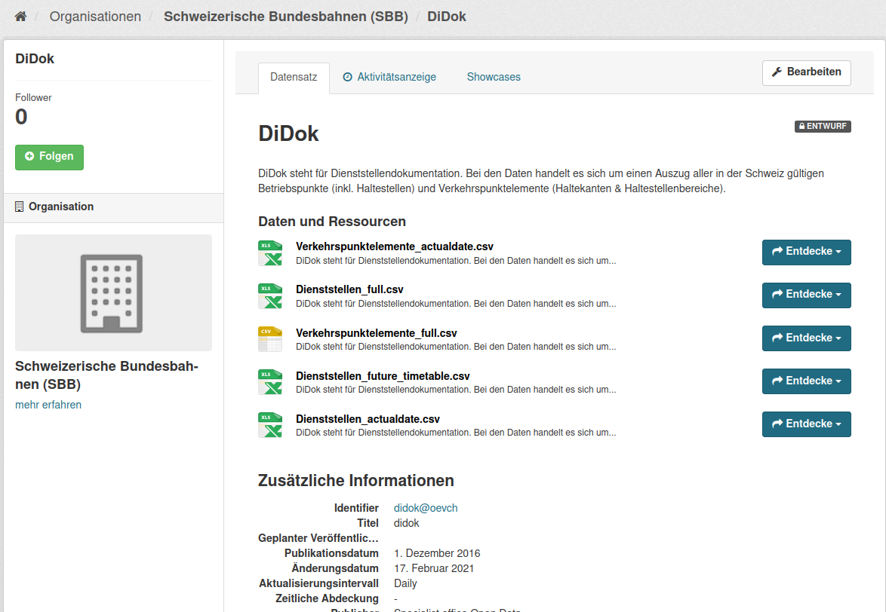

.. _manuell-datensatz-veroeffentlichen:

Dataset veröffentlichen
---------------------------

In der Detailansicht wird Ihnen ganz oben rechts der Status Ihres Datasets angezeigt:
«Entwurf» bedeutet, Sie bearbeiten die Metadaten des Datasets noch weiter. In diesem
Zustand ist Ihr Dataset im Frontend der Abnahmeumgebung
noch nicht sichtbar. Der Status
«Veröffentlicht» gibt an, dass das Dataset in der Abnahmeumgebung publiziert ist.

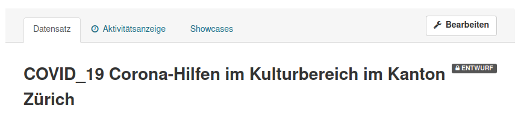

Gehen Sie dazu zurück zu «Bearbeiten», «Metadaten bearbeiten» und scrollen Sie
bis zum Feld «Sichtbarkeit». Sie können Ihr Dataset sofort veröffentlichen, indem Sie den
Status von «Entwurf» auf «Veröffentlicht» ändern. Alternativ können Sie eine zukünftige
Veröffentlichung planen, indem Sie im darunterliegenden Feld einen
Veröffentlichungstermin in der Zukunft festlegen.

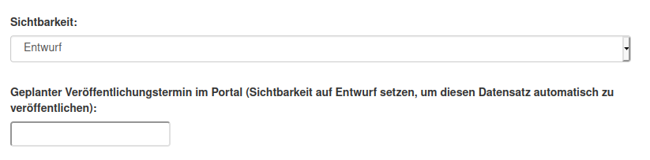

.. container:: important

    Wichtig: Vergessen Sie nicht nach der Änderung auf «Aktualisieren» zu klicken.

.. _manuell-datensatz-frontend:

Dataset im Frontend prüfen
-----------------------------

Sobald Ihr Dataset veröffentlicht ist, kann es auch im Frontend der Abnahmeumgebung angesehen werden.
Sie gelangen zu der Datenansicht Ihres Datasets im Frontend,
indem Sie ``ckan`` aus der URL Ihres Datasets entfernen:

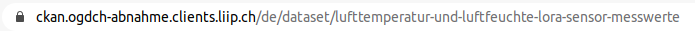

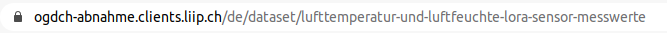

Bitte prüfen Sie hier Ihre Daten nochmals:

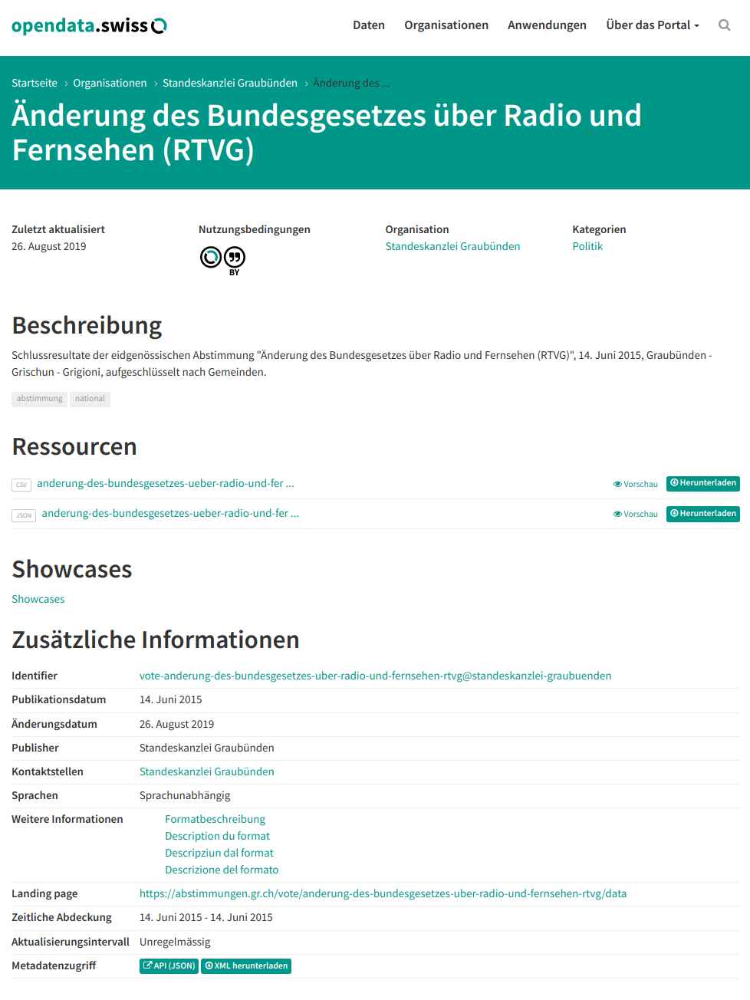

.. container:: bildunterschrift

   Beispielansicht eines publizierten Datasets

.. figure:: ../../../_static/images/publizieren/resource-frontend.png
   :alt: Beispielansicht einer publizierten Ressource

.. container:: bildunterschrift

   Beispielansicht einer publizierten Ressource

.. _manuell_go_live:

Veröffentlichung in der Produktionsumgebung
---------------------------------------------

Sollten Sie zum ersten Mal Daten publizieren, muss Ihr Dataset
von der :term:`Abnahmeumgebung <Abnahmeumgebung>` noch auf die
:term:`Produktionsumgebung <Produktionsumgebung>` übertragen werden.
Dies übernehmen wir für Sie,
`geben Sie uns einfach per E-Mail Bescheid <mailto:opendata@bfs.admin.ch>`__.

.. container:: support

   Support

Sie haben eine Frage zum manuellen Erfassen Ihres Datasets?
`Schreiben Sie uns <mailto:opendata@bfs.admin.ch>`__
und wir helfen Ihnen gerne weiter.

.. _manuell-mehr-zum-thema:

.. container:: materialien

    Mehr zum Thema

- :doc:`DCAT-AP-CH (Link, englisch) <../../glossar/bibliothek/dcat-ap-ch>` – Beschreibung des aktuell von opendata.swiss genutzte Datenstandards DCAT-AP-CH
- :download:`Veröffentlichung eines Datasets terminieren <../../../_static/screencasts/schedule-dataset.gif>`- In diesem Screencast zeigen wir Ihnen, wie Sie die Veröffentlichung Ihres Datasets terminieren können
- :download:`Dataset aktualisieren <../../../_static/screencasts/update-dataset.gif>`- In diesem Screencast zeigen wir Ihnen das Aktualisieren Ihres Datasets
- :download:`Ressource hinzufügen <../../../_static/screencasts/add-resource.gif>`- In diesem Screencast zeigen wir Ihnen, wie Sie Ihrem Dataset eine Ressource hinzufügen können
- :download:`Ressource aktualisieren <../../../_static/screencasts/update-resource.gif>`- In diesem Screencast zeigen wir Ihnen, wie Sie bei Ihrem Dataset eine Ressource aktualisieren können
