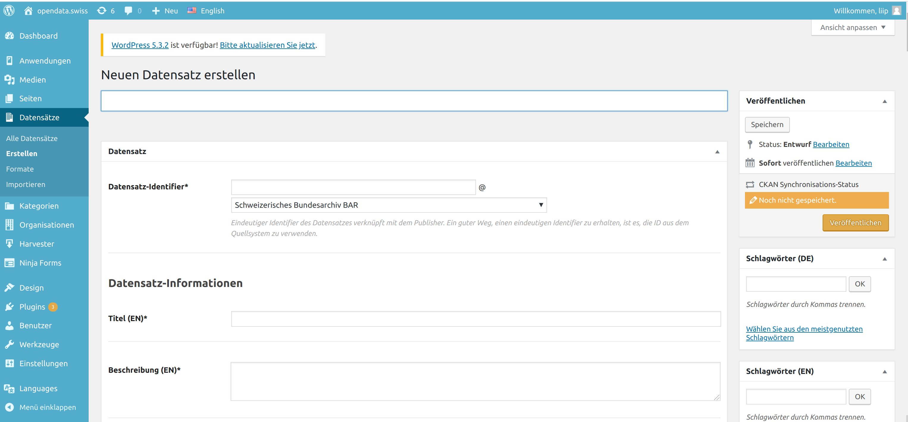
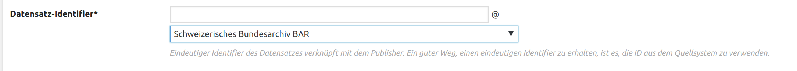
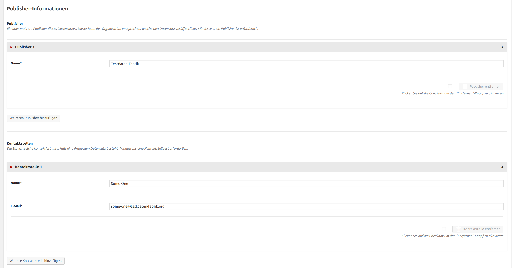
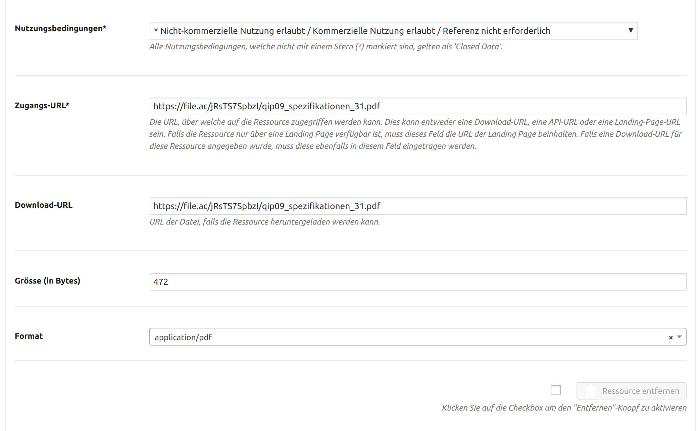
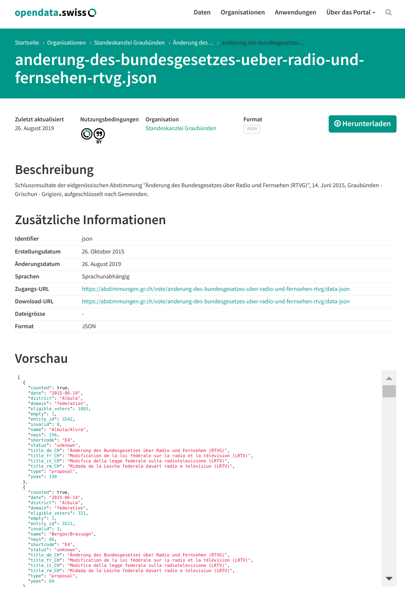

.. container:: custom-breadcrumbs

   - :fa:`home` :doc:`Handbuch <../../../index>` :fa:`chevron-right`
   - :doc:`Publizieren <../publizieren>` :fa:`chevron-right`
   - :doc:`Publikationsvariante <../publikationsvariante>` :fa:`chevron-right`
   - Manuell erfassen

**************************
Metadaten manuell erfassen
**************************

Wie erfasse ich Metadaten manuell im Webformular?
=================================================

.. container:: Intro

    Hier ist der Name Programm: Bei der manuellen Datenerfassung geben Sie selbst
    Ihre Metadaten im :term:`Backend <Backend>` von opendata.swiss ein.
    Voraussetzung dafür ist, dass Ihre Organisation mitsamt
    Benutzerinnen und Benutzern registriert ist.
    :doc:`Für die erste Registrierung <../erstpublizierende/kontakt-bfs>`.
    sind wir zuständig. Hier erklären wir Ihnen
    Schritt für Schritt, wie Sie das Webformular ausfüllen müssen.

Die Schritte auf einen Blick
----------------------------

- :ref:`Dataset erstellen <manuell-datensatz-erstellen>`
- :ref:`Metadaten eingeben <manuell-resource-hinzufuegen>`
- :ref:`Ressourcen hinzufügen <manuell-resource-hinzufuegen>`
- :ref:`Schlagwörter definieren <manuell-schlagwoerter-definieren>`
- :ref:`Vorschau des Datasets prüfen <manuell-vorschau-pruefen>`
- :ref:`Dataset veröffentlichen <manuell-datensatz-veroeffentlichen>`

.. admonition:: Gut zu wissen

    Sollten Sie zum ersten Mal Daten publizieren, führen wir Sie durch den Prozess
    und unterstützen Sie dabei, die korrekte Übermittlung und Darstellung
    Ihrer Daten sicherzustellen, unabhängig von der Publikationsvariante.
    Kontaktieren Sie uns, um einen
    `Termin für die Einführung zur Publikation auf opendata.swiss <mailto:opendata@bfs.admin.ch>`__
    zu vereinbaren.

Alle Schritte im Detail
=======================

.. _manuell-datensatz-erstellen:

Dataset erstellen
-----------------

Um Datasets zu erfassen, müssen Sie sich im Backend von opendata.swiss einloggen.
Handelt es sich um eine Erstpublikation oder möchten Sie eine neue oder
besonders komplexe Publikation testweise durchführen,
ist die :term:`Abnahmeumgebung <Abnahmeumgebung>` dafür die richtige Wahl.
Handelt es um eine wiederholte Publikation und Sie möchten Ihre Datasets
direkt veröffentlichen, können Sie sich in die
:term:`Produktionsumgebung <Produktionsumgebung>` einloggen.
Im Menü links wählen Sie «Datensätze» > «Dataset erstellen».
Als Erstes müssen Sie Ihrem Dataset einen Titel geben.
Aus ihm wird der Permalink des Datasets gebildet.

.. container:: important

    Wichtig: Verändern Sie diesen Titel und den Permalink nicht mehr,
    nachdem das Dataset publiziert wurde. Ansonsten können Nutzende,
    die Ihre Daten bereits verwenden, diese nicht mehr erreichen.

Metadaten eingeben
^^^^^^^^^^^^^^^^^^

Um sicherzustellen, dass die Datasets wiederverwendet werden können,
werden verschiedene Metadaten und Beschreibungen zu den Datasets publiziert.
Die Metadaten umfassen die Bereiche Datensatz-Informationen, Daten,
Publisher-Informationen und Weitere Informationen. Zunächst
müssen Sie den sogenannten Identifier eingeben. Dieser sorgt dafür,
dass das Dataset mit Ihrer Organisation verknüpft wird. Dafür können
Sie die ID aus Ihrem Quellsystem verwenden oder eine beliebige ID definieren.
Bitte stellen Sie sicher, dass Ihr Dataset der richtigen Organisation zugeteilt ist.

Für eine detaillierte Beschreibung des Inhalts der Metadaten-Felder orientieren
Sie sich bitte an der
`Publikation eCH-0200 DCAT-Anwendungsprofil für Datenportale in der Schweiz (DCAT-AP CH) <https://www.ech.ch/de/dokument/85dffcd6-6bda-4b60-a028-9c2fd8a8573a>`__.

.. container:: important

    Wichtig: Verändern Sie den Identifier nicht mehr, nachdem das Dataset
    publiziert ist. Ansonsten können Ihre Daten nicht mehr eindeutig zugeordnet werden.

Datensatz-Informationen
^^^^^^^^^^^^^^^^^^^^^^^

Bitte geben Sie hier den Titel und die Beschreibung Ihres Datasets an.
Alle Bundesstellen sollen die Angaben mindestens auf Deutsch und
Französisch eingeben – wünschenswert wären allerdings alle vier Sprachen.
Weitere Organisationen sollen Titel und Beschreibung in mindestens einer
Sprache eingeben. Falls nur eine Sprache vorliegt, wird die Eingabe
für alle anderen Sprachversionen übernommen.

.. figure:: ../../../_static/images/publizieren/dataset-information.png
   :alt: dataset information

Daten
^^^^^

Hier gilt es das Pflichtfeld «Erstellt» auszufüllen. Damit ist das Datum
der ersten Publikation im Quellsystem dieses Datasets gemeint.
Falls dies nicht bekannt ist, verwenden Sie das Datum der geplanten ersten
Publikation auf opendata.swiss. Beim Datum der letzten Änderung («geändert»)
können Sie nach der Publikation kommunizieren, wann die letzte Änderung
(Aktualisierung, Korrektur etc.) am Dataset vorgenommen worden ist. Weiter
sollen Sie hier das Intervall, in dem Aktualisierungen vorgenommen
werden («Aktualisierungsintervall») und den Zeitraum,
den das Dataset umfasst («Zeitliche Abdeckung»), angeben.

.. figure:: ../../../_static/images/publizieren/dataset-daten.png
   :alt: daten

Publisher-Informationen
^^^^^^^^^^^^^^^^^^^^^^^
Hier müssen Sie Angaben zu Ihnen als datenpublizierender Organisation eingeben.
Im Pflichtfeld «Publisher» wählen Sie die verantwortliche Organisation
für das Dataset aus. Dies können auch mehrere Organisationen sein,
jedoch keine Personen. Im Pflichtfeld «Kontaktstellen» muss eine
Ansprechperson angegeben werden, die von Datennutzenden bei Rückfragen
kontaktiert werden darf. Es ist mindestens eine Person mit E-Mail-Adresse erforderlich.

Weitere Informationen
^^^^^^^^^^^^^^^^^^^^^

Unter «Kategorien» können Sie eine oder mehrere thematische Kategorien
auswählen, denen das Dataset zugeordnet werden kann. Mit «Landing Page»
ist die Website gemeint, auf der die Daten ursprünglich publiziert wurden,
falls diese vorhanden ist. Unter «Beziehungen» geben Sie bitte «legal_basis»
ein und erfassen einen Link auf die gesetzliche Grundlage, welche die
Publikation dieses Datasets vorsieht. Unter «Verwandte Datensätze»
können Sie aus allen verfügbaren Datasets auf opendata.swiss mit
thematischem Bezug zu Ihrem aktuellen Dataset auswählen. Damit
signalisieren Sie Datennutzenden, dass weitere Datasets existieren,
die sie interessieren könnten.

.. figure:: ../../../_static/images/publizieren/dataset-kategorien.png
   :alt: kategorien

.. _manuell-resource-hinzufuegen:

Ressourcen hinzufügen
---------------------

.. figure:: ../../../_static/images/publizieren/webformular-resourcen.png
   :alt: resource

Eine «Ressource» ist eine spezifische Repräsentierung.
Dies können unterschiedliche Bereitstellungsformen eines Datasets
sein (media-type or format), unterschiedliche Zeitreihen
oder auch unterschiedliche Aggregationsstufen. Das Erfassen einer
Ressource funktioniert ähnlich wie zuvor beim gesamten Dataset:
Wählen Sie einen geeigneten Identifier aus Ihrem Quellsystem aus,
legen Sie Titel und Beschreibung fest. Für die Sprachversionen
gelten die gleichen Regeln wie bei Datasets: Alle Bundesstellen
sollen die Angaben mindestens auf Deutsch und Französisch eingeben –
wünschenswert wären allerdings alle vier Sprachen. Weitere Organisationen
sollen Titel und Beschreibung in mindestens einer Sprache eingeben.
Falls die Ressource sprachunabhängig ist, wählen Sie unter «Sprache»
keine Sprache aus. Auch hier müssen Sie unter dem Pflichtfeld «Erstellt»
das Datum der Veröffentlichung der Ressource angeben.

.. container:: important

    Wichtig: Jedes Dataset muss mindestens 1 Ressource haben.

.. container:: important

    Wichtig: Unter «Nutzungsbedingungen» müssen Sie nun hier die
    Bedingung auswählen, die Sie im
    :doc:`Kapitel «Rechtliche Nutzung prüfen» <../../vorbereiten/dataset/rechtlicher-check>`
    ermittelt haben.

Optional können Sie noch unter «Zugangs-URL» eine URL angeben,
über welche auf die Ressource
zugegriffen werden kann. Falls sich hinter der URL ein Download verbirgt,
muss die URL auch im Feld «Download-URL» eingetragen werden.
Ebenfalls optional kann die «Grösse» der Ressource in Bytes angegeben werden.
Unter «Format» wählen Sie das Format, das dem Ihrer Ressourcen entspricht.

.. container:: important

    Wichtig: Bitte berücksichtigen Sie bei der Publikation einer Ressourcen
    :doc:`die technischen Anforderungen <../../vorbereiten/dataset/technischer-check>`
    von opendata.swiss.

.. _manuell-schlagwoerter-definieren:

Schlagwörter definieren
-----------------------

Es ist wichtig, dass Sie ganz oben rechts im Webformular ein
oder mehrere Schlagwörter zum Dataset angeben, getrennt durch Kommas.
Schlagwörter helfen dabei, die Auffindbarkeit zu steigern.
Mögliche Schlagwörter können Sie aus Ihren Metadaten oder Ihrem Quellsystem ermitteln.
Sie können auch aus den meistgenutzten Schlagwörtern auswählen.
Für die Sprache gelten die gleichen Regeln wie bei den Ressourcen.

.. figure:: ../../../_static/images/publizieren/dataset-schlagworte.png
   :alt: dataset schlagworte
   :width: 50%

.. _manuell-vorschau-pruefen:

Vorschau des Datasets prüfen
------------------------------

.. figure:: ../../../_static/images/publizieren/dataset-preview.png
   :alt: Screenshot

Abschliessend können Sie sich eine Vorschau Ihres Datasets anzeigen lassen.
Dafür klicken Sie oben in der Menüleiste auf «Datensatz anzeigen».
Sie sehen Ihr Dataset nun so, wie es im Frontend erscheint – egal,
ob Sie sich in der :term:`Abnahmeumgebung <Abnahmeumgebung>`
oder :term:`Produktionsumgebung <Produktionsumgebung>` befinden.
Sieht alles so aus wie in unserer Beispielansicht, kann das Dataset veröffentlicht werden.

.. _manuell-datensatz-veroeffentlichen:

Dataset veröffentlichen
-----------------------

Im Bearbeitungsmodus wird Ihnen ganz oben rechts der Status Ihres Datasets
angezeigt: «Entwurf» bedeutet, Sie bearbeiten die Metadaten des Datasets noch weiter.
In diesem Zustand ist Ihr Dataset im Frontend der
Abnahmeumgebung mit dem Vermerk «privat» und einem Schlosssymbol markiert.
«Veröffentlicht» gibt an, dass das Dataset in der Abnahmeumgebung publiziert ist.

In der Produktionsumgebung haben Sie ausserdem die Möglichkeit,
die Veröffentlichung Ihres Datasets zu terminieren.
Unter «Veröffentlichung planen» können Sie die Datums- und Zeitangabe nutzen,
um eine Publikation in der Zukunft festzulegen und
bestätigen dies mit einem Klick auf «Planen».
Die Veröffentlichung lässt sich verlässlich auf ein bestimmtes Datum planen,
die Festlegung der Uhrzeit kann um ± eine Stunde von der effektiven Publikation abweichen.

Sollten Sie zum ersten Mal Daten publizieren, muss
Ihr Dataset von der Abnahmeumgebung noch auf die Produktionsumgebung
übertragen werden. Dies übernehmen wir für Sie,
`geben Sie uns einfach per E-Mail Bescheid <mailto:opendata@bfs.admin.ch>`__.

.. container:: important

    Wichtig: Vergessen Sie nicht nach jeder Änderung
    von bereits publizierten Daten auf «Aktualisieren» zu klicken.

.. figure:: ../../../_static/images/publizieren/dataset-aktualisieren.png
   :alt: dataset aktualisieren
   :width: 50%

.. figure:: ../../../_static/images/publizieren/dataset-frontend.png
   :alt: Screenshot

.. container:: bildunterschrift

   Beispielansicht eines publizierten Datasets

.. container:: bildunterschrift

   Beispielansicht einer publizierten Ressource

.. container:: support

   Support

Sie haben eine Frage zum manuelle Erfassen Ihres Datensatzes?
`Schreiben Sie uns <mailto:opendata@bfs.admin.ch>`__
und wir helfen Ihnen gerne weiter.
