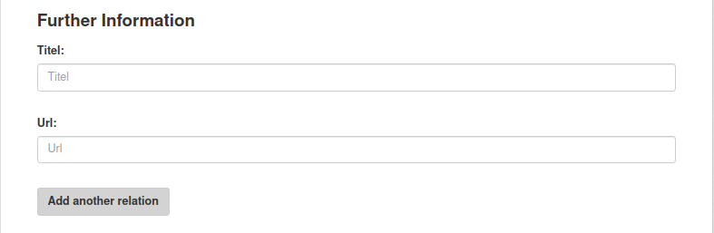
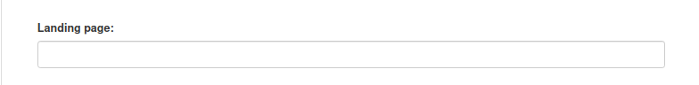
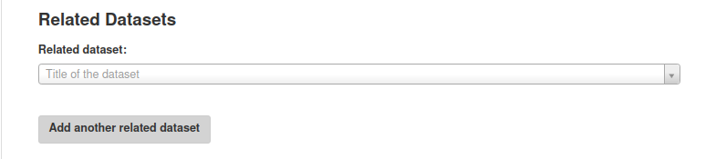
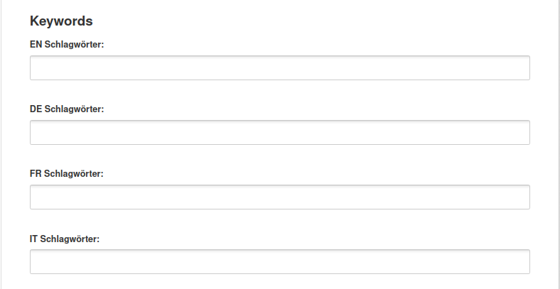
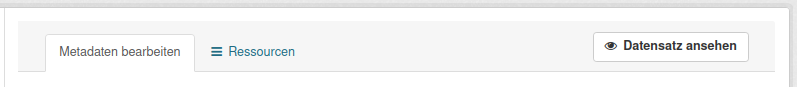

.. container:: custom-breadcrumbs

   - :fa:`home` :doc:`Handbuch <../../../index>` :fa:`chevron-right`
   - :doc:`Publizieren <../publizieren>` :fa:`chevron-right`
   - :doc:`Publikationsvariante <../publikationsvariante>` :fa:`chevron-right`
   - Manuell erfassen

**************************
Metadaten manuell erfassen
**************************

Wie erfasse ich Metadaten manuell im Webformular?
=================================================

.. container:: Intro

    Hier ist der Name Programm: Bei der manuellen Datenerfassung geben Sie selbst
    Ihre Metadaten im :term:`Backend <Backend>` von opendata.swiss ein.
    Voraussetzung dafür ist, dass Ihre Organisation mitsamt
    Benutzerinnen und Benutzern registriert ist.
    :doc:`Für die erste Registrierung <../erstpublizierende/kontakt-bfs>`.
    sind wir zuständig. Hier erklären wir Ihnen
    Schritt für Schritt, wie Sie das Webformular ausfüllen müssen.

Die Schritte auf einen Blick
----------------------------

- :ref:`Dataset erstellen <manuell-datensatz-erstellen>`
- :ref:`Metadaten eingeben <manuell-metadaten-eingeben>`
- :ref:`Ressource hinzufügen <manuell-resource-hinzufuegen>`
- :ref:`Dataset weiter bearbeiten  <manuell-dataset-aktionen>`
- :ref:`Vorschau des Datasets prüfen <manuell-vorschau-pruefen>`
- :ref:`Dataset veröffentlichen <manuell-datensatz-veroeffentlichen>`

.. admonition:: Gut zu wissen

    Sollten Sie zum ersten Mal Daten publizieren, führen wir Sie durch den Prozess
    und unterstützen Sie dabei, die korrekte Übermittlung und Darstellung
    Ihrer Daten sicherzustellen, unabhängig von der Publikationsvariante.
    Kontaktieren Sie uns, um einen
    `Termin für die Einführung zur Publikation auf opendata.swiss <mailto:opendata@bfs.admin.ch>`__
    zu vereinbaren.

Alle Schritte im Detail
=======================

.. _manuell-datensatz-erstellen:

Dataset erstellen
-----------------

Um Datasets zu erfassen, müssen Sie sich im Backend von opendata.swiss einloggen.
Handelt es sich um eine Erstpublikation oder möchten Sie eine neue oder
besonders komplexe Publikation testweise durchführen,
ist die :term:`Abnahmeumgebung <Abnahmeumgebung>` dafür die richtige Wahl.
Handelt es um eine wiederholte Publikation und Sie möchten Ihre Datasets
direkt veröffentlichen, können Sie sich in die
:term:`Produktionsumgebung <Produktionsumgebung>` einloggen.

Nach dem Einloggen gelangen Sie zu Ihrem Dashboard.

.. figure:: ../../../_static/images/publizieren/benutzer/benutzer-dashboard.png
   :alt: Benutzer Dashboard im Backend von opendata.swiss

Klicken Sie auf «Dataset hinzufügen», um das Webformular zu öffnen.

.. _manuell-metadaten-eingeben:

Metadaten eingeben
-------------------

Um sicherzustellen, dass die Datasets wiederverwendet werden können,
werden verschiedene Metadaten und Beschreibungen zu den Datasets publiziert.

.. figure:: ../../../_static/images/publizieren/manuelle-datenerfassung/dataset-anlegen.png
   :alt: Dataset manuell erfassen

Als Erstes müssen Sie Ihrem Dataset einen Namen geben.
Aus ihm wird der Permalink des Datasets gebildet. Dieses Feld dient nur zur Bildung des
Permalinks. Später wird der Titel Ihres Datasets aus den Einträgen im
Datenfeld Titel (EN) (DE) (FR) (IT) ermittelt

:Titel (EN) (DE) (FR) (IT): Bitte geben Sie einen Titel Ihres Datasets ein. Bitte besetzen
                            Sie midestens eine Landessprache und Englisch.
                            (Der Eintrag in Englisch wird bei der Weitergabe Ihres
                            Datasets an das europäische Datenportal benötigt

.. container:: important

    Wichtig: Verändern Sie den Permalink nicht mehr,
    nachdem das Dataset publiziert wurde. Ansonsten können Nutzende,
    die Ihre Daten bereits verwenden, diese nicht mehr erreichen.

.. figure:: ../../../_static/images/publizieren/manuelle-datenerfassung/dataset-identifier.png
   :alt: Eingabefeld Identifier im Webformular

:Dataset Identifier: Zunächst müssen Sie den sogenannten Identifier eingeben. Dieser sorgt dafür,
                     dass das Dataset mit Ihrer Organisation verknüpft wird. Dafür können
                     Sie die ID aus Ihrem Quellsystem verwenden oder eine beliebige ID definieren.
                     Bitte stellen Sie sicher, dass Ihr Dataset der richtigen Organisation zugeteilt ist.

Für eine detaillierte Beschreibung des Inhalts der Metadaten-Felder orientieren
Sie sich bitte an der
`Publikation eCH-0200 DCAT-Anwendungsprofil für Datenportale in der Schweiz (DCAT-AP CH) <https://www.ech.ch/de/dokument/85dffcd6-6bda-4b60-a028-9c2fd8a8573a>`__.

.. container:: important

    Wichtig: Verändern Sie den Identifier nicht mehr, nachdem das Dataset
    publiziert ist. Ansonsten können Ihre Daten nicht mehr eindeutig zugeordnet werden.

.. figure:: ../../../_static/images/publizieren/manuelle-datenerfassung/dataset-veroeffentlichen.png
   :alt:  Eingabefeld Sichtbarkeit im Webformular

Diese Felder dienen später der Veröffentlichung Ihres Datasets.

:Sichtbarkeit: Die Voreinstellung ist auf
               «Entwurf». Lassen Sie diese Voreinstellung zunächst so. Sie bedeutet, dass Ihr Dataset noch
               nicht öffentlich sichtbar ist. Sie können diese Einstellung ändern, sobald
               Sie Ihr Dataset in einem späteren Schritt veröffentlichen wollen.

.. figure:: ../../../_static/images/publizieren/manuelle-datenerfassung/dataset-beschreibung.png
   :alt: Eingabefeld Beschreibung im Webformular

:Beschreibung (EN) (DE) (FR) (IT): Bitte geben Sie hier eine Beschreibung Ihres Datasets an.
                            Alle Bundesstellen sollen die Angaben mindestens auf Deutsch und
                            Französisch eingeben – wünschenswert wären allerdings alle vier Sprachen.
                            Eine Englische Beschreibung erleichtert das Aufinden Ihres Dataset im
                            europäischen Datenportal.

.. figure:: ../../../_static/images/publizieren/manuelle-datenerfassung/dataset-zeitangaben.png
   :alt: Eingabefeld zur Aktualisierung im Webformular

:Publikationsdatum: Hier gilt es das Pflichtfeld «Publikationsdatum» auszufüllen. Damit ist das Datum
                    der ersten Publikation im Quellsystem dieses Datasets gemeint.
                    Falls dies nicht bekannt ist, verwenden Sie das Datum der geplanten ersten
                    Publikation auf opendata.swiss.
:Änderungsdatum: Beim Datum der letzten Änderung («Änderungsdatum»)
                 können Sie nach der Publikation kommunizieren, wann die letzte Änderung
                 (Aktualisierung, Korrektur etc.) am Dataset vorgenommen worden ist.
:Aktualisierungsintervall: Weiter
                           sollen Sie hier das Intervall, in dem Aktualisierungen vorgenommen
                           werden («Aktualisierungsintervall») und den Zeitraum,
                           den das Dataset umfasst («Zeitliche Abdeckung»), angeben.

.. figure:: ../../../_static/images/publizieren/manuelle-datenerfassung/dataset-publishers-kontakte.png
   :alt: Eingabefeld Publisher im Webformular

Hier müssen Sie Angaben zu Ihnen als datenpublizierender Organisation eingeben.
Im Pflichtfeld «Publisher» wählen Sie die verantwortliche Organisation
für das Dataset aus. Dies können auch mehrere Organisationen sein,
jedoch keine Personen. Im Pflichtfeld «Kontaktstellen» muss eine
Ansprechperson angegeben werden, die von Datennutzenden bei Rückfragen
kontaktiert werden darf. Es ist mindestens eine Person mit E-Mail-Adresse erforderlich.

.. figure:: ../../../_static/images/publizieren/manuelle-datenerfassung/dataset-sprachen.png
   :alt: Eingabefeld Sprachen im Webformular

:Sprachen: Falls Ihre Resourcen sprachabhängig sind können Sie hier angeben, in welcher Sprache Ihre Resourcen vorliegen.
           Sind Ihre Resourcen sprachunabhängig, kann das Eingabefeld leer bleiben.

:Further Information: Unter «Weitere Informationen» können Sie allgemeine Links angeben, etwa zu Dokumentation, die dem Benutzer helfen
                      Ihr Dataset besser zu verstehen.

:Landing Page: Mit «Landing Page»
               ist die Website gemeint, auf der die Daten ursprünglich publiziert wurden,
               falls diese vorhanden ist.

:Related Datasets: Unter «Verwandte Datensätze»
                   können Sie aus allen verfügbaren Datasets auf opendata.swiss mit
                   thematischem Bezug zu Ihrem aktuellen Dataset auswählen. Damit
                   signalisieren Sie Datennutzenden, dass weitere Datasets existieren,
                   die sie interessieren könnten.

:Schlagwörter: Schlagwörter helfen dabei, die Auffindbarkeit zu steigern.
               Mögliche Schlagwörter können Sie aus Ihren Metadaten oder Ihrem Quellsystem ermitteln.
               Sie können auch aus den meistgenutzten Schlagwörtern auswählen.

.. figure:: ../../../_static/images/publizieren/manuelle-datenerfassung/dataset-kategorien.png
   :alt: Eingabefeld Kategorien im Webformular

:Kategorien: Unter «Kategorien» können Sie eine oder mehrere thematische Kategorien
             auswählen, denen das Dataset zugeordnet werden kann.

.. figure:: ../../../_static/images/publizieren/manuelle-datenerfassung/dataset-speichern.png
   :alt: Eingabefeld Kategorien im Webformular

Wechseln Sie zu den Resourcen, wenn Sie mit der Eingabe der Metadaten für Ihr Dataset
fertig sind indem Sie auf «Als Nächstes: Daten hinzufügen» klicken.

.. _manuell-resource-hinzufuegen:

Ressourcen hinzufügen
-----------------------

Eine «Ressource» ist eine spezifische Repräsentierung.
Dies können unterschiedliche Bereitstellungsformen eines Datasets
sein (media-type or format), unterschiedliche Zeitreihen
oder auch unterschiedliche Aggregationsstufen.

.. figure:: ../../../_static/images/publizieren/manuelle-datenerfassung/resource-anlegen.png
   :alt: Abschnitt Ressource im Webformular

Das Erfassen einer
Ressource funktioniert ähnlich wie zuvor beim gesamten Dataset: Wählen Sie einen geeigneten
Identifier aus Ihrem Quellsystem aus,
legen Sie Titel und Beschreibung fest. Für die Sprachversionen
gelten die gleichen Regeln wie bei Datasets: Alle Bundesstellen
sollen die Angaben mindestens auf Deutsch und Französisch und Englisch eingeben –
wünschenswert wären allerdings alle vier Sprachen.

Falls die Ressource sprachunabhängig ist, wählen Sie unter «Sprache»
keine Sprache aus. Auch hier müssen Sie unter dem Pflichtfeld «Erstellt»
das Datum der Veröffentlichung der Ressource angeben.

.. container:: important

    Wichtig: Jedes Dataset muss mindestens 1 Ressource haben.

.. figure:: ../../../_static/images/publizieren/manuelle-datenerfassung/resource-urls-nutzungsrechte-format.png
   :alt: Abschnitt Ressource im Webformular

:Zugangs-Url, Access-Url: Für jede Resource müssen Sie unter «Zugangs-URL» eine URL angeben,
                          über welche auf die Ressource
                          zugegriffen werden kann. Falls sich hinter der URL ein Download verbirgt,
                          muss die URL auch im Feld «Download-URL» eingetragen werden.

:Nutzungsbedingungen: Legen Sie die Nutzungsbedingungen für Ihre Daten fest.

.. container:: important

    Wichtig: Unter «Nutzungsbedingungen» müssen Sie nun hier die
    Bedingung auswählen, die Sie im
    :doc:`Kapitel «Publikationsrichtlinien» <../../vorbereiten/publikationsrichtlinien>`
    ermittelt haben.

:Dateigrösse: Optional kann die «Grösse» der Ressource in Bytes angegeben werden.
:Format:      Unter «Format» wählen Sie das Format, das dem Ihrer Ressourcen entspricht.

.. container:: important

    Wichtig: Bitte berücksichtigen Sie bei der Publikation einer Ressourcen
    :doc:`OGD-Richtlinien <../../glossar/bibliothek/ogd-richtlinien>`
    von opendata.swiss.

Sie haben jetzt Ihre erste Resource angelegt und können jetzt entweder mit dem Schalter «Beenden»
Ihr Dataset und Ihre Resource abspeichern oder Sie können mit dem Schalter
«Speichern & weitere hinzufügen» mit dem Hinzufügen von Resourcen fortfahren.

.. figure:: ../../../_static/images/publizieren/manuelle-datenerfassung/resource-aktionen.png
   :alt: Mögliche Aktionen nach der Anlage der ersten Resource im Webformular

.. _manuell-dataset-aktionen:

Dataset weiter bearbeiten
--------------------------------

Das Hinzufügen weiterer Resourcen ist auch nach der Anlage Ihres Dataset noch möglich.
Gehen Sie dazu zur Detailansicht Ihres Datasets im Backend der Abnahmeumgebung und klicken Sie auf
«Bearbeiten». Sie haben dann folgende Möglichkeiten Ihr Dataset zu bearbeiten:

Sie können:

- mit «Bearbeiten» das Dataset selbst aktualisieren
- mit «Resourcen» die Resourcen des Datasets bearbeiten: das beinhaltet das Aktualisieren vorhandener Resourcen,
  die Neuanlage zusätzlicher Resourcen, die Festlegung der Anzeigereihenfolge der Resourcen

Sehen Sie dazu auch unsere Screencasts:

- :download:`Dataset aktualisieren <../../../_static/screencasts/update-dataset.gif>`- In diesem Screencast zeigen wir Ihnen das Aktualisieren Ihres Datasets
- :download:`Resource hinzufügen <../../../_static/screencasts/add-resource.gif>`- In diesem Screencast zeigen wir Ihnen, wie Sie Ihrem Dataset eine Resource hinzufügen können
- :download:`Resource aktualisieren <../../../_static/screencasts/update-resource.gif>`- In diesem Screencast zeigen wir Ihnen, wie Sie bei Ihrem Dataset eine Resource aktualisieren können

.. _manuell-vorschau-pruefen:

Vorschau des Datasets prüfen
------------------------------

.. figure:: ../../../_static/images/publizieren/dataset-preview.png
   :alt: Vorschau eines Datasets auf opendata.swiss

Abschliessend können Sie sich eine Vorschau Ihres Datasets anzeigen lassen.
Dafür klicken Sie oben in der Menüleiste auf «Datensatz anzeigen».
Sie sehen Ihr Dataset nun so, wie es im Frontend erscheint – egal,
ob Sie sich in der :term:`Abnahmeumgebung <Abnahmeumgebung>`
oder :term:`Produktionsumgebung <Produktionsumgebung>` befinden.
Sieht alles so aus wie in unserer Beispielansicht, kann das Dataset veröffentlicht werden.

.. _manuell-datensatz-veroeffentlichen:

Dataset veröffentlichen
-----------------------

.. figure:: ../../../_static/images/publizieren/manuelle-datenerfassung/dataset-veroeffentlichen.png
   :alt: Dataset Veröffentlichung im Webformular

Im Bearbeitungsmodus wird Ihnen ganz oben rechts der Status Ihres Datasets
angezeigt: «Entwurf» bedeutet, Sie bearbeiten die Metadaten des Datasets noch weiter.
In diesem Zustand ist Ihr Dataset im Frontend der
Abnahmeumgebung mit dem Vermerk «privat» und einem Schlosssymbol markiert.
«Veröffentlicht» gibt an, dass das Dataset in der Abnahmeumgebung publiziert ist.

In der Produktionsumgebung haben Sie ausserdem die Möglichkeit,
die Veröffentlichung Ihres Datasets zu terminieren.
Unter «Veröffentlichung planen» können Sie die Datums- und Zeitangabe nutzen,
um eine Publikation in der Zukunft festzulegen und
bestätigen dies mit einem Klick auf «Planen».
Die Veröffentlichung lässt sich verlässlich auf ein bestimmtes Datum planen,
die Festlegung der Uhrzeit kann um ± eine Stunde von der effektiven Publikation abweichen.

Sollten Sie zum ersten Mal Daten publizieren, muss
Ihr Dataset von der Abnahmeumgebung noch auf die Produktionsumgebung
übertragen werden. Dies übernehmen wir für Sie,
`geben Sie uns einfach per E-Mail Bescheid <mailto:opendata@bfs.admin.ch>`__.

.. container:: important

    Wichtig: Vergessen Sie nicht nach jeder Änderung
    von bereits publizierten Daten auf «Aktualisieren» zu klicken.

.. figure:: ../../../_static/images/publizieren/dataset-aktualisieren.png
   :alt: Datensatz aktualisieren im Webformular
   :width: 50%

.. figure:: ../../../_static/images/publizieren/dataset-frontend.png
   :alt: Beispielansicht eines publizierten Datasets

.. container:: bildunterschrift

   Beispielansicht eines publizierten Datasets

.. figure:: ../../../_static/images/publizieren/resource-frontend.png
   :alt: Beispielansicht einer publizierten Ressource

.. container:: bildunterschrift

   Beispielansicht einer publizierten Ressource

.. container:: support

   Support

Sie haben eine Frage zum manuelle Erfassen Ihres Datensatzes?
`Schreiben Sie uns <mailto:opendata@bfs.admin.ch>`__
und wir helfen Ihnen gerne weiter.

.. _manuell-mehr-zum-thema:

.. container:: materialien

    Mehr zum Thema

- :doc:`DCAT-AP-CH (Link, englisch) <../../glossar/bibliothek/dcat-ap-ch>` – Beschreibung des aktuell von opendata.swiss genutzte Datenstandards DCAT-AP-CH
- :download:`Veröffentlichung eines Datasets terminieren <../../../_static/screencasts/schedule-dataset.gif>`- In diesem Screencast zeigen wir Ihnen, wie Sie die Veröffentlichung Ihres Datasets terminieren können

