.. container:: custom-breadcrumbs

   - :fa:`home` :doc:`Handbuch <../../../index>` :fa:`chevron-right`
   - :doc:`Publizieren <../publizieren>` :fa:`chevron-right`
   - :doc:`Publikationsvariante <../publikationsvariante>` :fa:`chevron-right`
   - Manuell erfassen

**************************
Metadaten manuell erfassen
**************************

Wie erfasse ich Metadaten manuell im Webformular?
=================================================

.. container:: Intro

    Bei der manuellen Datenerfassung tragen Sie
    Ihre Metadaten selbst im :term:`Input-Bereich <Input-Bereich>` von `i14y.admin.ch <https://input.i14y.admin.ch/>`__ ein.
    Voraussetzung dafür ist, dass Ihre Organisation mitsamt
    Benutzerinnen und Benutzern registriert ist. Fall Ihre Organisation noch kein Konto auf I14Y oder auf opendata.swiss hat, 
    melden Sie sich bei der  `Geschäftsstelle OGD <mailto:opendata@bfs.admin.ch>`__. Eine Anleitung für die
    Kontenverwaltung finden Sie  `hier <https://i14y-ch.github.io/handbook/de/2_rollen_prozesse/kontenverwaltung/>`__. Bitte teilen Sie uns die E-Mail-Adresse,
    mit der Sie sich registriert haben, sowie die erforderlichen Informationen zu Ihrer Organisation mit.

    Wie Sie :term:`Datensätze <Dataset>` über das Webinterface beschreiben, erklären wir Ihnen hier Schritt für Schritt. 

.. collapse:: Infobox: Gemeinsamer Input-Bereich i14y.ch und opendata.swiss

   Damit die Metadaten nicht auf zwei Plattformen bewirtschaftet werden müssen, bieten opendata.swiss und die Interoperabilitätsplattform i14y.ch
   einen gemeinsamen Input-Bereich an. 

Die Schritte auf einen Blick
----------------------------

- :ref:`Beschreibung eines Datensatzes erstellen <manuell-datensatz-erstellen>`
- :ref:`Metadaten eingeben <manuell-metadaten-eingeben>`
- :ref:`Beschreibung der Distributionen erstellen <manuell-distribution-hinzufuegen>`
- :ref:`Datensatz prüfen <manuell-vorschau-pruefen>`
- :ref:`Datensatz veröffentlichen <manuell-datensatz-veroeffentlichen>`
- :ref:`Datensatz im Frontend prüfen <manuell-datensatz-frontend>`

.. admonition:: Gut zu wissen

    Sollten Sie zum ersten Mal Datensätze publizieren, führen wir Sie durch den Prozess
    und unterstützen Sie dabei, die korrekte Übermittlung und Darstellung
    Ihrer Daten sicherzustellen.
    Kontaktieren Sie uns, um einen
    `Termin für die Einführung zur Publikation auf opendata.swiss <mailto:opendata@bfs.admin.ch>`__
    zu vereinbaren.

Alle Schritte im Detail
=======================

.. _manuell-datensatz-erstellen:

Beschreibung eines Datensatzes erstellen
-----------------------------------------

Um Metadaten zu einem Datensatz zu erfassen, müssen Sie sich in den :term:`Input-Bereich <Input-Bereich>` von I14Y einloggen.
Falls Ihnen mehrere Rollen zugewiesen sind, wählen Sie bitte das für Sie zutreffende Profil für die Publikation und Pflege von OGD aus.

Sie befinden sich nun im Input-Bereich. Hier sehen Sie drei Kacheln, über die Sie zu den verschiedenen Arbeitsbereichen gelangen: 
**Katalog pflegen**, **Konzepte pflegen** und **I14Y-Interoperabilitätsplattform**. 
Unterhalb dieser Kacheln finden Sie die Kachel **Meine Daten**. Dort werden Aufgaben aufgelistet, die Sie betreffen.

Um einen Datensatz in ihrem Katalog zu erfassen, klicken Sie in der Kachel **Daten meiner Organisation** auf **Dataset**.

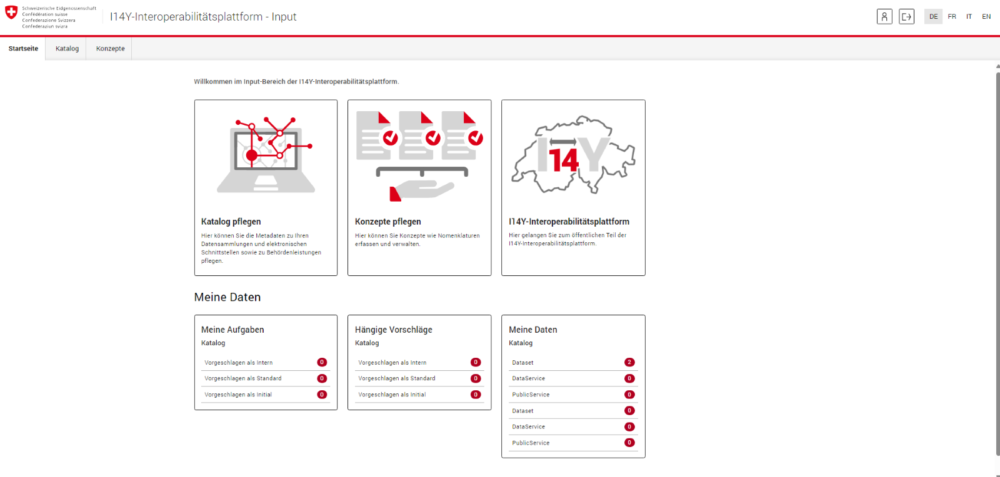

Sie gelangen nun in den Arbeitsbereich **«I14Y-Metadatenkatalog»**. Hier sehen Sie eine Liste der Datensätze Ihrer Organisation/Herausgeber. Diese Liste ist entsprechend leer, wenn Ihre Organisation zum ersten Mal publiziert. 
Für jeden Datensatz werden der Titel, Identifikator, Herausgeber, Typ, Status und die Publikation angezeigt. 

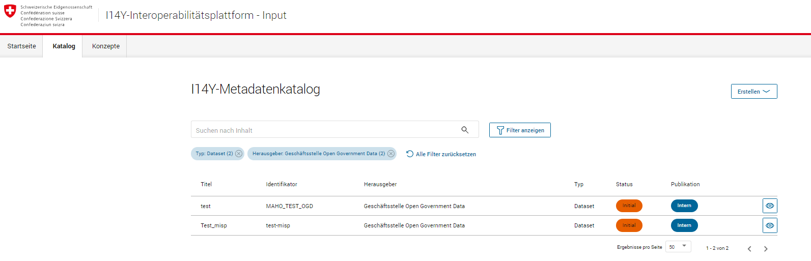

.. _manuell-metadaten-eingeben:

Metadaten eingeben
-------------------

.. container:: important

    Wichtig: Gewisse Metadatenfelder im Input-Bereich von I14Y sind für die Veröffentlichung von OGD nicht erforderlich.
    Die entsprechenden Felder müssen nicht ausgefüllt werden. Es wird jedoch empfohlen, die Felder zu nutzen, damit die Beschreibung, die auch auf I14Y zu finden ist, möglichst vollständig ist. 
    Zudem können viele dieser Felder für das organisationsinterne Datenmanagement hilfreich sein.    

.. collapse:: Infobox: Metadatenstandard DCAT-AP CH 

   Auf dem Portal opendata.swiss und auf der Interoperabilitätsplattform I14Y werden Datensätze
   gemäss den Vorgaben des DCAT-Standards in der aktuell gültigen Version mit dem Applikationsprofil für die Schweiz beschrieben `(DCAT-AP CH 2.0)  <https://dcat-ap.ch/>`__. 
   Die I14Y bietet einige optionale Zusatzfelder an, die im aktuellen DCAT-Standard nicht vorgesehen sind. Damit lassen sich die Datenangebote noch detaillierter beschreiben. 
   Darüber hinaus können in I14Y auch die Struktur sowie die einzelnen Datenkonzepte beschrieben werden. 

   DCAT-AP ist ein Anwendungsprofil des Data Catalog Vocabulary (DCAT) und dient zur Beschreibung der in Datenportalen verzeichneten Daten. 
   Es richtet sich insbesondere an die Betreiber von Open-Data-Portalen und deren Datenpublizierende. 
   Die Schweizerische Ableitung DCAT-AP-CH wird seit 2016 von opendata.swiss verwendet. 
   Diese wird kontinuierlich im Rahmen der `eCH Fachgruppe OGD   <https://www.ech.ch/de/der-verein/fachgruppen/open_government_data>`__ weiterentwickelt.

| 

Klicken Sie nun auf die Schaltfläche **«Erstellen»**. Es öffnet sich ein Dropdown-Menü mit drei verschiedenen Auswahlmöglichkeiten. 
Für die Beschreibung eines Datensatzes wählen Sie die Option **«Neue Datensammlung erfassen»**.
    
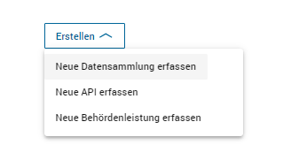

Um sicherzustellen, dass der Datensatz gefunden und wiederverwendet werden kann, werden verschiedene Metadaten zum Datensatz erfasst und auf I14Y sowie opendata.swiss veröffentlicht. 
**Metadatenfelder, die mit einem Stern** ``*`` **gekennzeichnet sind, müssen ausgefüllt werden.** 
**Bitte beachten Sie:** Je mehr Informationen Sie in den Metadaten angeben, desto leichter wird der Datensatz gefunden und desto besser kann er wiederverwendet werden.

Details
^^^^^^^^
Bitte geben Sie im Feld **Titel (EN) (DE) (FR) (IT)** und im Feld **Beschreibung (EN) (DE) (FR) (IT)** einen **aussagekräftigen Titel** und eine **Beschreibung** Ihres Datensatzes an.
Für die **Bundesstellen** sind diese Angaben in **zwei Landessprachen obligatorisch**. Für alle **anderen Organisationen** ist **mindestens eine Landessprache** erforderlich - wünschenswert wären alle vier Sprachen.
Eine Beschreibung auf Englisch erleichtert das Auffinden Ihres Datensatzes auf dem
:term:`europäischen Datenportal <Europäisches Datenportal>`.

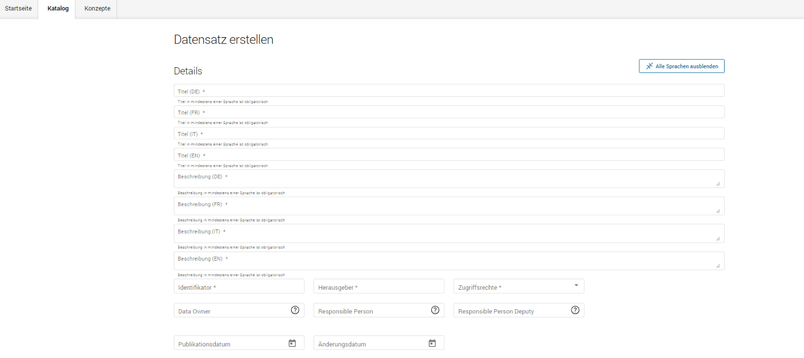

Im Feld **Identifikatior** geben Sie den Identifikator des Datensatzes ein. Sie können dafür die ID aus Ihrem Quellsystem verwenden oder eine beliebige ID definieren. 
Bitte beachten Sie, dass der Datensatz-Identifikator innerhalb der Datensätze Ihrer Organisation eindeutig sein muss. 
Es wird empfohlen, die ID aus dem Quellsystem des Herausgebers zu verwenden. Sie kann die folgenden Zeichen ``A-Za-z``, ``0-9``, ``-`` und ``_`` enthalten. 
Im Feld **Herausgeber** erscheint als Dropdown Ihre Organisation in der Auswahlliste. 
Wählen Sie unter **Zugriffsrechte**  die Option «Öffentlich» für die OGD-Datensätze. 
Die folgenden Felder **Data Owner**, **Responsible Person** und **Responsible Person Deputy** werden auf opendata.swiss nicht angezeigt, sind jedoch für das interne Datenmanagement wichtig. 
Informationen zu den **Rollen** finden Sie `hier  <https://i14y-ch.github.io/handbook/de/2_rollen_prozesse/rollen/>`__.
Das Feld **Publikationsdatum** muss ausgefüllt werden. Es handelt sich um das Datum der ersten Publikation im Quellsystem dieses Datensatzes. Ist dieses nicht bekannt, ist das Datum der geplanten Erstpublikation auf `opendata.swiss  <https://opendata.swiss/de>`__ / `i14y.ch  <https://www.i14y.admin.ch/de/home>`__  zu verwenden.
Im Feld **Änderungsdatum** wird nach der Publikation das Datum der letzten Aktualisierung oder Änderung des Datensatzes angegeben.

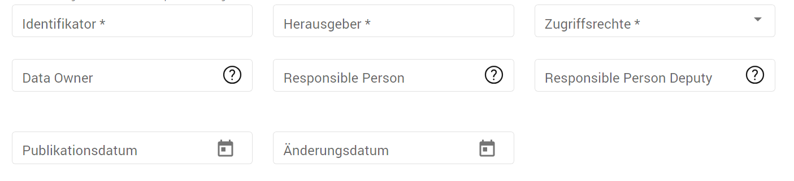

.. container:: important

    Wichtig: Verändern Sie den Identifikator nicht mehr, nachdem der Datensatz
    publiziert ist. Ansonsten können Ihre Daten nicht mehr eindeutig zugeordnet werden. 

Kontaktstellen
^^^^^^^^^^^^^^^
In diesem Bereich können Sie die Kontaktstelle hinterlegen, die bei Fragen zum vorliegenden Datensatz zuständig ist. 
Für die Publikation auf opendata.swiss muss mindestens das Feld **Organisation** in zwei Landessprachen (Bund) oder in mindestens einer Sprache (Andere) ausgefüllt sowie eine E-Mailadresse hinterlegt werden. Wenn Sie weitere Kontakstellen hinzufügen möchten, können Sie dies über die Schaltfläche **+ Neue Kontaktstelle** tun.  

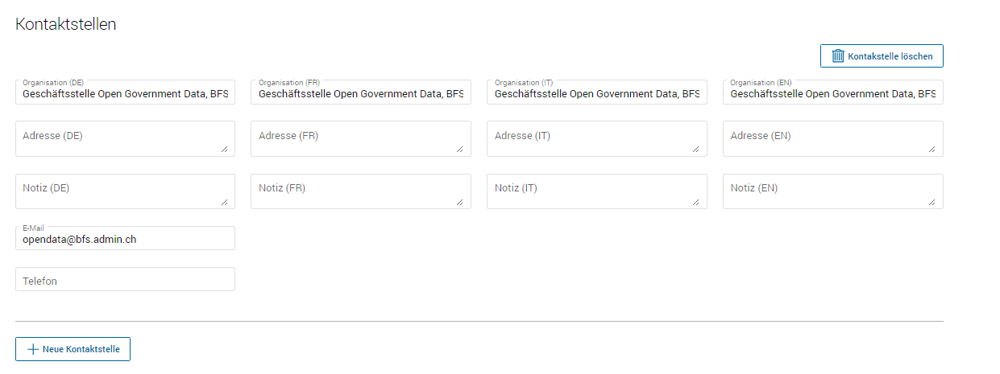

Sprachen
^^^^^^^^^
Dieses Feld zeigt an, in welchen Sprachen der Datensatz verfügbar ist. 
Zur Auswahl stehen die Sprachen Deutsch, Französisch, Italienisch, Rätoromanisch (wird auf opendata.swiss nicht angezeigt) und Englisch. 
Ist der Datensatz sprachunabhängig, lassen Sie das Feld leer. 

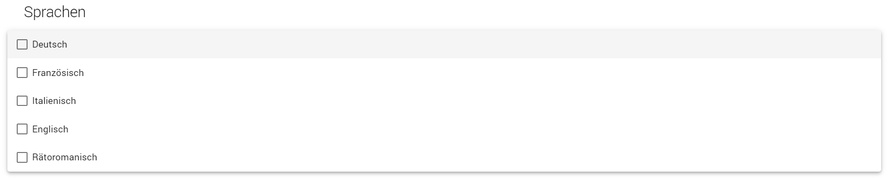

Katalog und Themen
^^^^^^^^^^^^^^^^^^^
Im Feld **Kataloge und Themen** geben Sie den Themenbereich Ihres Datensatzes an. In einem ersten Schritt wählen Sie aus der Liste der Themen von I14Y. Damit Sie Ihren Datensatz auf opendata.swiss publizieren können, müssen Sie ihn zuerst speichern. 
Klicken Sie dazu auf die Schaltfläche **Speichern und schliessen**, die im unteren Rand des Webformulars eingeblendet wird. 

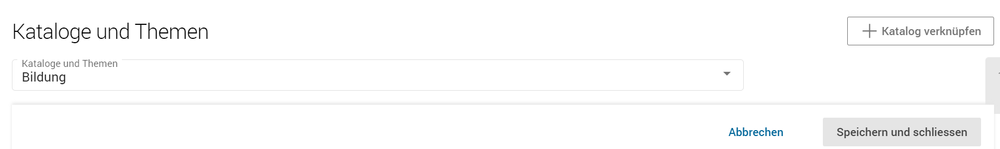

Um den Opendata-Katalog hinzuzufügen, öffnen Sie die Beschreibung Ihres Datensatzes, indem Sie auf die Schaltfläche **Bearbeiten** klicken. Kehren Sie zum Bereich **Kataloge und Themen** zurück.
Klicken Sie nun auf die Schaltfläche **Katalog verknüpfen**. Der Opendata-Katalog Ihrer Organisation ``Opendata + Name der Organisation`` erscheint. Wählen Sie diesen aus.  

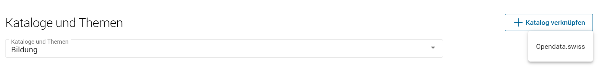

Im Bereich **Kataloge und Themen** erscheint nun ein weiteres Feld mit Ihrem Opendata-Katalog. Klicken Sie auf das Dropdown-Menü und wählen Sie den entsprechenden Bereich aus der Liste der Opendata-Themen. 
Es handelt sich dabei um die `EU-Themenliste, die im Standard DCAT-AP CH Version 2.0.0  <https://dcat-ap.ch/releases/2.0/dcat-ap-ch.html#dataset-theme-category>`__ definiert ist. Die hier ausgewählten Bereiche werden auf opendata.swiss angezeigt. 
Die Themenvokabulare von I14Y und opendata.swiss unterscheiden sich in einigen Punkten sowie in der Anzahl der Auswahlmöglichkeiten. 
Kategorisierung und Anzahl der Bereiche sind daher nicht deckungsgleich.   

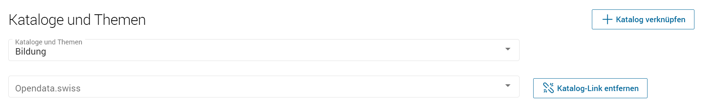

Ihr Datensatz wurde jetzt erfolgreich mit Ihrem Opendata-Katalog verknüpft, so dass der Datensatz auf opendata.swiss angezeigt wird.

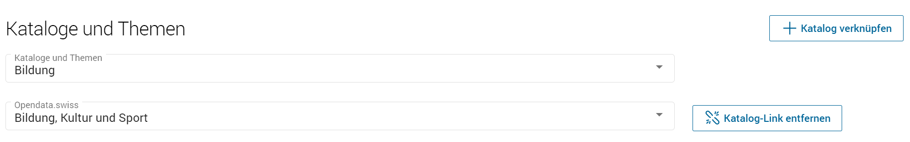

Schutzbedarf
^^^^^^^^^^^^^
Die Felder im Bereich **Schutzbedarf** sind für die Publikation auf I14Y relevant. 
Informationen zum Ausfüllen dieser Felder finden Sie im `Handbuch von I14Y <https://i14y-ch.github.io/handbook/de/6_anhang/eingabefelder/>`__. 

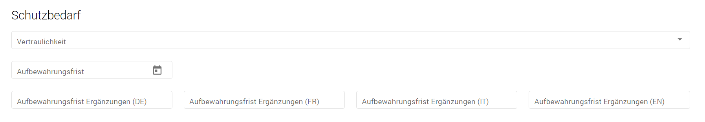

Schlüsselwörter
^^^^^^^^^^^^^^^^
Geben Sie die Schlüsselwörter in die entsprechenden Sprachfelder ein und klicken Sie anschliessend auf das Symbol mit dem Häkchen. 
Fügen Sie weitere Schlüsselwörter hinzu, indem Sie auf das Plus-Symbol klicken. Der Schlüsselwort-Eintrag wird dadurch direkt gespeichert; ein Klick auf den Speichern-Knopf unten ist nicht nötig. 
Um Schlüsselwörter zu löschen, wählen Sie das Papierkorb—Symbol. 
Vergessen Sie nicht, die entsprechende Zeile zu markieren.   

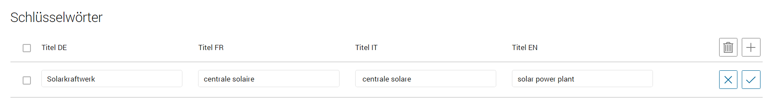

.. collapse:: Infobox: Warum Schlüsselwörter wichtig sind und was es dabei zu beachten gilt

   Damit der Datensatz besser auffindbar wird, können Schlüsselwörter hinterlegt werden. 
   Diese werden auch als Filtermöglichkeit verwendet, um die Auswahl der Datensätze thematisch einzugrenzen. 
   Es ist sinnvoll, Synonyme oder allgemeine Begriffe zu hinterlegen. 
   Dieses Feld sollte insbesondere für jene Begriffe genutzt werden, die in der `Termdat-Datenbank des Bundes <https://www.termdat.bk.admin.ch/search>`__ verzeichnet sind. 
   Hier finden Sie zudem auch die Begriffe in den Landessprachen sowie in Englisch. 
   Mögliche Schlüsselwörter können Sie aus Ihren Metadaten oder Ihrem Quellsystem ermitteln. 
   Sie können auch aus den am häufigsten verwendeten Schlüsselwörtern auf opendata.swiss auswählen.
 
| 

Landing page
^^^^^^^^^^^^
Tragen Sie hier den Link zu der Webseite Ihrer Organisation ein, auf der weitere Informationen zu dem betreffenden Datenangebot zu finden sind oder über die die Originaldaten abgerufen werden können. 

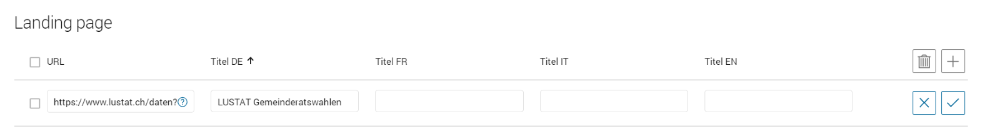

Räumliche Abdeckung
^^^^^^^^^^^^^^^^^^^^
Das Feld **Räumliche Abdeckung** beschreibt das geographische Gebiet, das von den Daten abgedeckt wird. Einige Beispiele: “Schweiz”, “Kanton Solothurn”, “Aarau”. Zurzeit kann Freitext eingegeben werden. 
Für Gebiete, die in den folgenden Vokabularen enthalten sind, müssen die entsprechenden Begriffe verwendet werden:
`VOCAB-EU-CONTINENT <http://publications.europa.eu/resource/authority/continent>`__, `VOCAB-EU-COUNTRY <https://publications.europa.eu/resource/authority/country>`__,
`VOCAB-EU-PLACE <https://publications.europa.eu/resource/authority/place>`__, `GEONAMES <http://sws.geonames.org/>`__. 
Das Feld **GeoIV ID** wird nicht auf opendata.swiss angezeigt. Informationen zu diesem Feld finden Sie im `Handbuch von I14Y <https://i14y-ch.github.io/handbook/de/6_anhang/eingabefelder/>`__:

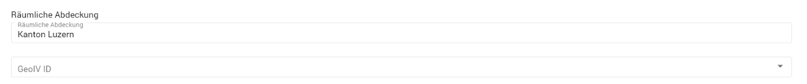

Zeitliche Abdeckung
^^^^^^^^^^^^^^^^^^^^
Im Feld **Zeitliche Abdeckung** können Sie den Zeitraum angeben, den der Datensatz umfasst. Wählen Sie dazu im Kalender das Datum «Von» und «Bis». 
Im Feld **Frequenz** können Sie aus der Dropdown-Liste die Häufigkeit auswählen, mit der der Datensatz aktualisiert wird. 

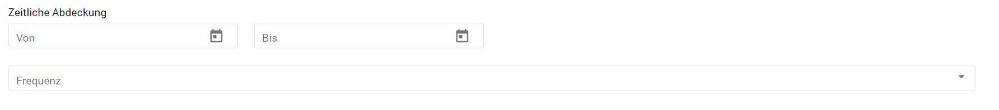

Konform zu
^^^^^^^^^^^
Im Feld «Konform zu» werden technische Spezifikationen erfasst. 
Setzen Sie dazu einen Link auf das entsprechende Dokument, z.B. auf die Beschreibung eines Standards bei eCH. 

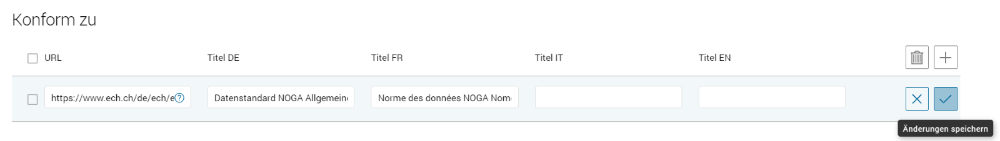

Dokumente
^^^^^^^^^^
Im Feld **Dokumente** können Sie weitere Dokumente eintragen, die in direktem Zusammenhang mit Ihrem Angebot stehen, z.B. einen Link zu einem wissenschaftlichen Artikel, einer Anleitung oder einem Hintergrundtext.

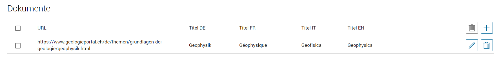

Wird referenziert von
^^^^^^^^^^^^^^^^^^^^^^
**Beachten Sie: Dieses Feld wird nicht auf opendata.swiss angezeigt.** 
In diesem Feld können Ressourcen erfasst werden, die sich auf den beschriebenen Datensatz beziehen – etwa eine Publikation, die auf Grundlage der Daten verfasst wurde.

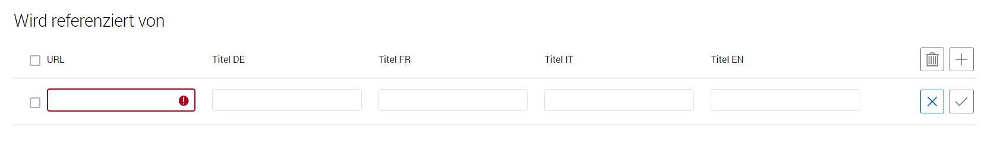

Qualifizierte Rollenzuordnung
^^^^^^^^^^^^^^^^^^^^^^^^^^^^^^
**Beachten Sie: Dieses Feld wird nicht auf opendata.swiss angezeigt.**
Falls weitere Organisationen für Teilbereiche des Datensatzes verantwortlich sind, können Sie diese hier hinterlegen. Wählen Sie die Rolle aus der Liste aus, die am besten passt. Und wählen Sie in einem zweiten Schritt die beteiligte Organisation aus. Hinterlegt sind alle Organisationen, die die I14Y-Interoperabilitätsplattform nutzen.

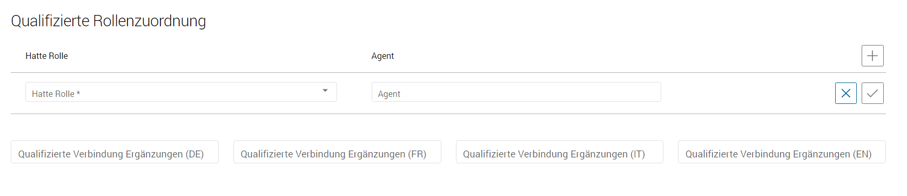

Verweis auf verwandte Datensätze
^^^^^^^^^^^^^^^^^^^^^^^^^^^^^^^^^^
Im Feld **Qualifizierte Beziehung** können Sie aus allen auf opendata.swiss verfügbaren Datensätzen diejenigen auswählen, die einen thematischen Bezug zu Ihrem aktuellen Datensatz haben. 
Dadurch können Datennutzende über Ihren Datensatz auf andere Datensätze aufmerksam gemacht werden, die für sie von Interesse sein könnten. 
Wählen Sie in der Dropdown-Liste «Hatte Rolle» die Option «Verwandt».  

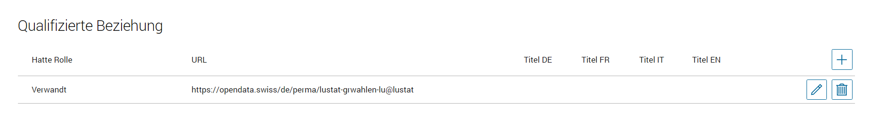

Im Feld **URL** geben Sie den **Perma-Link des Datensatzes** an, auf den Sie verlinken möchten. 
Es ist wichtig, dass Sie den Perma-Link des Datensatzes angeben.  
Gehen Sie dazu auf die Seite des Datensatzes auf https://opendata.swiss, den Sie verlinken möchten. 
Unter **Zusätzliche Informationen** finden Sie das Feld **Identifier**. Bewegen Sie die Maus über den Identifier (im Beispiel «lustat-grwahlen-lu@lustat», klicken Sie mit der rechten Maustaste und wählen Sie die Option «Link kopieren». 
Geben Sie diesen im Eingabefeld «URL» ein. Der Perma-Link hat die Form ``[https://opendata.swiss/perma/lustat-grwahlen-lu@lustat]``. 
Im Pfad der URL sehen Sie ``perma`` gefolgt vom entsprechenden ``Identifier`` des Datensatzes.  

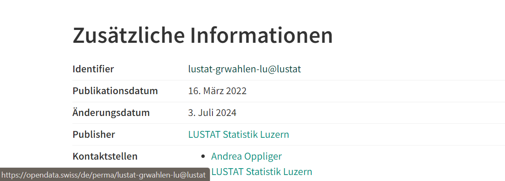

Verwandte Ressourcen
^^^^^^^^^^^^^^^^^^^^^
In diesem Bereich werden allfällige gesetzliche Grundlagen zum betreffenden Datenangebot erfasst, also etwa Gesetze und Verordnungen. **Handelt es sich um die gesetzliche Grundlage, setzen sie bitte in die Sprachfelder die folgende Terme: "Rechtliche Grundlagen"(DE), "Base légale"(FR), "Basi legali" (IT) und "legal basis"(EN)**. 
Setzen Sie dazu einen Link zum betreffenden Dokument auf `Fedlex <https://www.fedlex.admin.ch/de/>`__ oder auf die entsprechende Online-Ressource, die den Text enthält. 
Zudem lassen sich verwandte Ressourcen verlinken, die nicht zum Feld Qualifizierte Beziehungen passen, etwa zusätzliches Material wie einen Artikel, ein Beispiel oder eine Dokumentation.

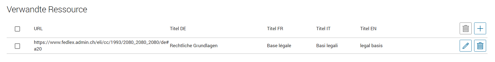

Bild
^^^^^
**Beachten Sie: Dieses Feld wird nicht auf opendata.swiss angezeigt.**
Links zu Minibildern, die den Inhalt des Datensatzes illustrieren. 
Pro Datensatz können Links zu höchstens drei Bildern hinzugefügt werden.

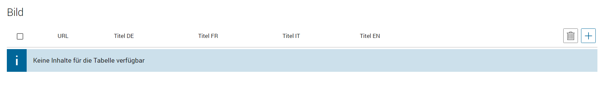

Version
^^^^^^^^^
**Beachten Sie: Diese Felder werden nicht auf opendata.swiss angezeigt.**
Unter dem Feld **Version** können Sie die Versionsnummer Ihres Datensatzes eintragen.
Beim Feld **Versionshinweise** können Sie zusätzliche Informationen zum betreffenden Datensatzes erfassen. 

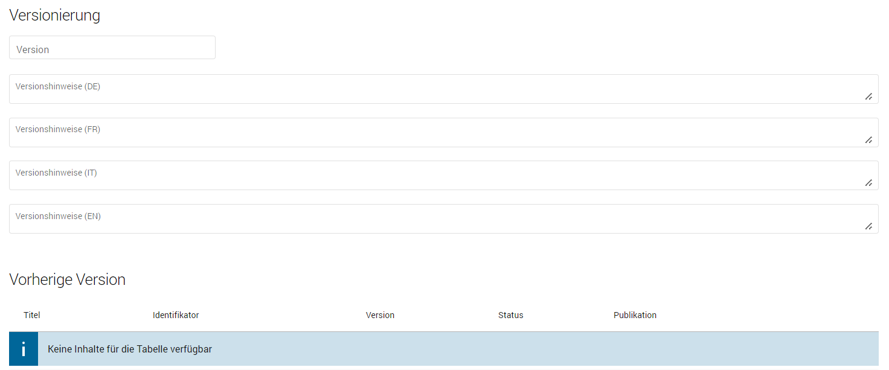

| 

Sie sind am Ende der Eingabe der Metadatenfelder zur Beschreibung des Datensatzes angelangt. 
Sie können nun die Eingabe der Metadatenfelder speichern und schliessen. 
Der nächste Schritt besteht darin, dem Datensatz mindestens eine Distribution hinzuzufügen. 

.. _manuell-distribution-hinzufuegen:

Beschreibung der Distribution erstellen
---------------------------------------

Wenn Sie die Eingabe der Metadaten für Ihren Datensatz abgeschlossen haben, müssen Sie als Nächstes eine oder mehrere Distributionen zu Ihrem Datensatz hinzufügen. 
Speichern und schliessen Sie die Metadaten des Datensatzes, wählen Sie den Reiter **Distributionen** und klicken Sie auf die Schaltfläche **Erstellen**, um zum Webformular für die Beschreibung der Distribution zu gelangen.

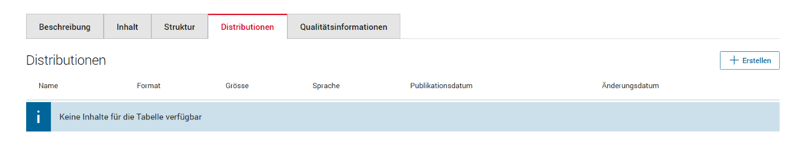

Details zur Distribution
^^^^^^^^^^^^^^^^^^^^^^^^^
Die Erfassung einer Distribution funktioniert ähnlich wie die beim Datensatz: Wählen Sie einen geeigneten Identifikator aus Ihrem Quellsystem aus, geben Sie Titel und Beschreibung ein. 
Für die Sprachversionen gelten die gleichen Regeln wie beim Datensatz: Alle Bundesstellen müssen die Angaben mindestens auf Deutsch und Französisch eingeben – wünschenswert wären allerdings alle vier Sprachen. 
Andere Organisationen müssen Titel und Beschreibung in mindestens einer Sprache eingeben. Falls die Distribution sprachunabhängig ist, wählen Sie unter dem Feld **Sprache** keine Sprache aus. 
Auch hier ist im Pflichtfeld **Publikationsdatum** das Veröffentlichungsdatum der Distribution anzugeben. 

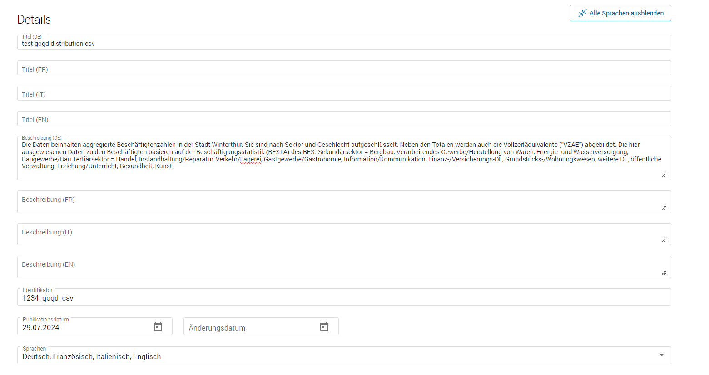

.. container:: important

    Wichtig: Jedes Dataset muss **mindestens eine Distribution** haben.

.. collapse:: Infobox: Was ist eine Distribution

   Eine «Distribution» ist eine spezifische Darstellung des Datensatzes. 
   Ein Datensatz kann in mehreren Serialisierungen vorliegen, die sich vielerlei Hinsicht unterscheiden können, z. B. hinsichtlich der natürlichen Sprache, des Medientyps oder des Formats, der schematischen Organisation, der zeitlichen und räumlichen Auflösung, des Detaillierungsgrads oder der Profile (die eines oder alle der oben genannten Merkmale enthalten können). 

| 

Zugangs-URL
^^^^^^^^^^^^^
Für jede Distribution müssen Sie unter **Zugangs-URL** eine URL angeben, über welche auf die Distribution zugegriffen werden kann. Falls sich hinter der URL ein direkter Download verbirgt, muss die URL auch als **Download-URL** eingetragen werden. 
Klicken Sie hierzu auf das Kästchen bei **Download-URL**. Optional kann die **Grösse** der Distribution in Bytes angegeben werden. Unter **Format** wählen Sie das Format Ihrer Distribution.
Bei Bedarf kann der Medientyp (früher MIME-Typ) spezifiziert werden. Die Felder **Komprimierungsformat**, **Prüfsummenalgorithmus**, und **Prüfsumme** werden derzeit nicht auf opendata.swiss angezeigt.
Weitere Informationen zu diesen Feldern finden Sie `Handbuch von I14Y <https://i14y-ch.github.io/handbook/de/6_anhang/eingabefelder/>`__.

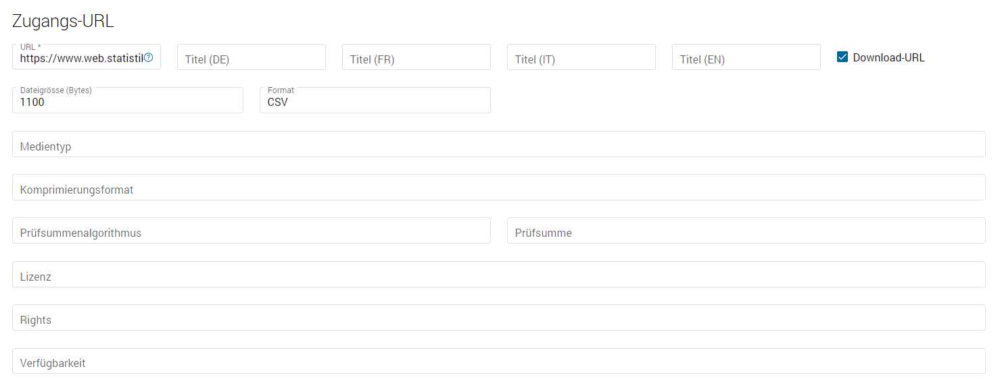

Im Feld **Lizenz** müssen Sie die Nutzungsbedingung des Datensatzes gemäss den `Nutzungsbedingungen von opendata.swiss <https://opendata.swiss/de/terms-of-use>`__ angeben.
Diese stehen Ihnen in der Dropdown-Liste zur Auswahl. Wählen Sie den zutreffenden, mit «Opendata» gekennzeichneten Menüpunkt aus. Die Felder **Rights** und **Verfügbarkeit** werden nicht auf opendata.swiss angezeigt. 
Weitere Informationen zu den Feldern finden Sie im  `Handbuch von I14Y <https://i14y-ch.github.io/handbook/de/6_anhang/eingabefelder/>`__. 

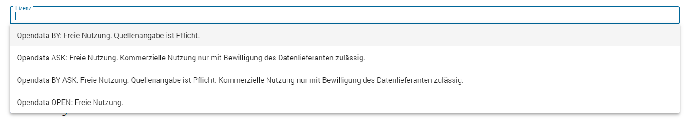

Abdeckung
^^^^^^^^^^
Die Distribution kann nach Zeitraum gekennzeichnet werden. Geben Sie hierzu im Kalender das Datum «Von» und «Bis» ein.  

Im Feld **Zeitliche Auflösung** kann der Mindestzeitraum erfasst werden, der in der Distribution aufgelöst werden kann. Handelt es sich bei dem Datensatz um eine Zeitreihe, sollte dies dem Abstand zwischen den Elementen der Reihe entsprechen. 
Bei anderen Arten von Datensätzen gibt diese Eigenschaft in der Regel die kleinste zeitliche Differenz zwischen den Elementen im Datensatz an. 
Bevorzugt wird eine einheitliche Notation gemäss `https://www.w3.org/TR/xmlschema11-2/#duration <https://www.w3.org/TR/xmlschema11-2/#duration>`__, z.B.: P1D (Auflösung 1 Tag), P1M (ein Monat), P1Y (ein Jahr).

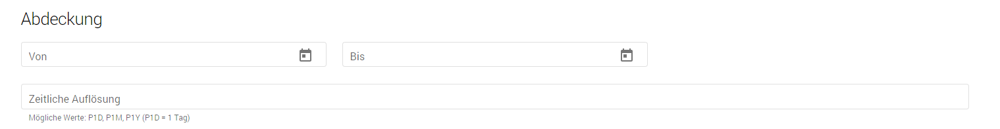

Konform zu
^^^^^^^^^^^
Im Feld **Konform zu** werden technische Spezifikationen zur entsprechenden Distribution erfasst. 
Setzen Sie dazu einen Link auf das entsprechende Dokument, z.B. auf die Beschreibung eines Standards bei eCH. 

Dokumente
^^^^^^^^^^
Im Feld **Dokumente** können Sie weitere Dokumente eintragen, die in direktem Zusammenhang mit der entsprechenden Distribution stehen, z.B. einen Link zu einem wissenschaftlichen Artikel, einer Anleitung oder einem Hintergrundtext. 

.. container:: important

    Wichtig: Bitte berücksichtigen Sie bei der Publikation von Distributionen die `«OGD-Richtlinien» <https://handbook.opendata.swiss/de/content/glossar/bibliothek/ogd-richtlinien.html>`__.

Beschreibung der Distribution beenden und weitere hinzufügen 
^^^^^^^^^^^^^^^^^^^^^^^^^^^^^^^^^^^^^^^^^^^^^^^^^^^^^^^^^^^^^^^^
Sie haben nun Ihre erste Distribution erstellt und können entweder über die Schaltfläche **Speichern und schliessen** die Distribution speichern. 
Weitere Distributionen können Sie über die Schaltfläche **Erstellen** hinzufügen. Das Hinzufügen weiterer Distributionen ist jederzeit möglich. 

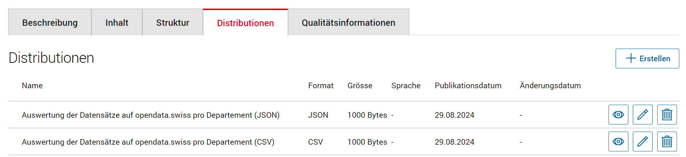

.. _manuell-vorschau-pruefen:

Datensatz prüfen und veröffentlichen
-------------------------------------

Schauen Sie sich die Beschreibung des Datensatzes und seiner Distributionen in der Detailansicht an: Wenn alle Felder wie erwartet ausgefüllt sind, können Sie Ihren Datensatz veröffentlichen. 

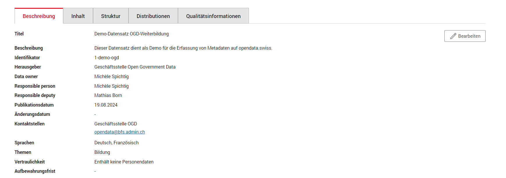

| 

Ändern des Status
^^^^^^^^^^^^^^^^^^^

.. container:: important

    Wichtig: Die folgende Beschreibung gilt für Personen in der Rolle Local Data Steward. 
    Wenn das Setzen des Registrierungsstatus nicht möglich ist, kontaktieren Sie eine Person in der Rolle Local Data Steward Ihrer Organisation.
    Informationen zu den Rollen finden Sie `hier <https://i14y-ch.github.io/handbook/de/2_rollen_prozesse/rollen/>`__. 

In der Detailansicht sehen Sie den Status Ihrer Beschreibung. Der aktuelle Status ist **Initial**. 
Sie müssen diesen Status ändern, indem Sie auf die Schaltfläche **Registrierungsstatus vorschlagen** klicken und die Option **Kandidat** auswählen.

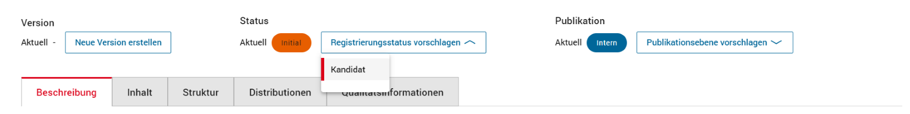

Danach kann der Eintrag auf **Registriert** gesetzt werden. Schlagen Sie nun die Publikation auf I14Y vor, 
indem Sie den Kanal von **Intern** auf **I14Y** umstellen. Die Interoperabilitätsstelle wird die Metadaten prüfen und dann freischalten.
Bei Problemen oder Verzögerungen kontaktieren Sie die `Interoperabilitätsstelle <Mailto: i14y@bfs.admin.ch>`__.

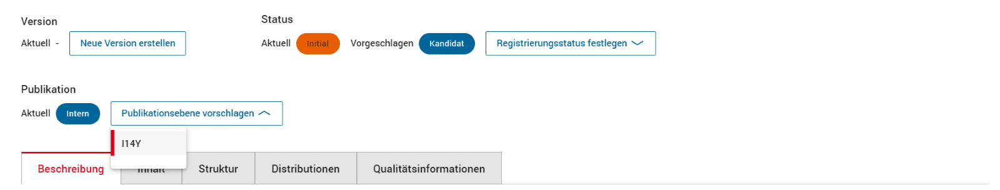

| 

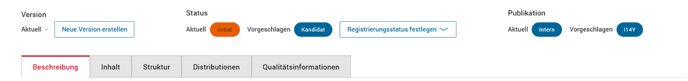

Bitte informieren Sie `uns <Mailto: opendata@bfs.admin.ch>`__, wenn die Datensätze zur Begutachtung bereit sind. 
Wir werden Ihre Datensätze dann überprüfen. 
Bitte beachten Sie, dass die Datensätze während der Begutachtungsphase nicht bearbeitet werden können.   

Informationen zum Arbeitsablauf finden Sie im `Handbuch von I14Y <https://i14y-ch.github.io/handbook/de/2_rollen_prozesse/arbeitsablauf/>`__. 

.. _manuell-datensatz-veroeffentlichen:

Datensatz veröffentlichen
---------------------------

Ob der Datensatz auf I14Y veröffentlicht wurde, erkennen Sie rechts oben am Status der Publikation. Dieser wird als **Aktuell I14Y** angezeigt.
Nun kann der Datensatz von opendata.swiss geharvested werden. Bitte geben Sie dem  `Team der Geschäftsstelle OGD <Mailto: opendata@bfs.admin.ch>`__ Bescheid, wenn Ihre Datensätze für die Erstpublikation auf opendata.swiss bereit sind.
  
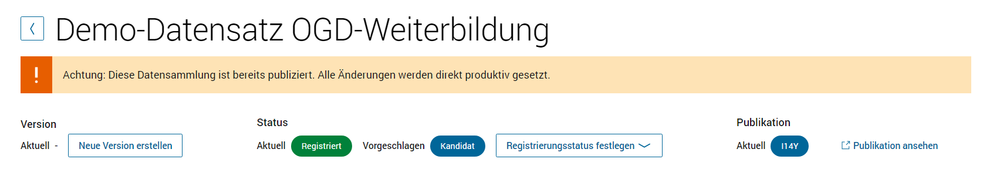

.. _manuell-datensatz-frontend:

Datensatz im Frontend prüfen
-----------------------------

Sobald Ihr Datensatz auf I14Y publiziert und von opendata.swiss geharvested wurde, kann er auch im Frontend von  `opendata.swiss <https://opendata.swiss/de/>`__ angesehen werden. 
Wenn Sie Ihre Datensätze zum ersten Mal auf opendata.swiss publizieren, haben Sie die Möglichkeit, diese zuerst in der Abnahmeumgebung aufzuschalten und zu begutachten.
Besprechen Sie mit dem `Team der Geschäftsstelle OGD <Mailto: opendata@bfs.admin.ch>`__, ob die Datensätze direkt auf der Produktionsumgebung oder zuerst auf der Abnahmeumgebung aufgeschaltet werden. 
Sie finden Ihre Datensätze unter Ihrer `Organisation auf opendata.swiss <https://opendata.swiss/de/organization>`__.

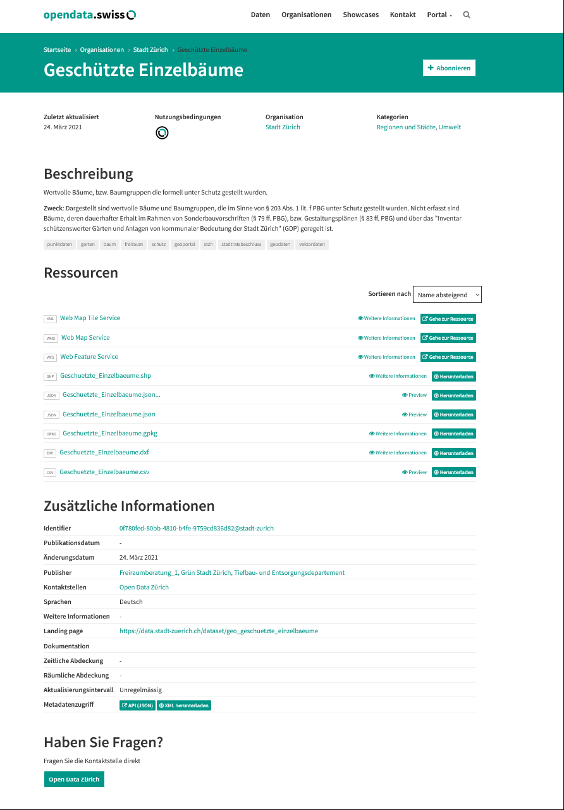

.. container:: support

   Support

Sie haben eine Frage zum manuellen Erfassen Ihres Datasets?
`Schreiben Sie uns <mailto:opendata@bfs.admin.ch>`__
und wir helfen Ihnen gerne weiter.

.. _manuell-mehr-zum-thema:

.. container:: materialien

    Mehr zum Thema

- :doc:`DCAT-AP-CH (Link, englisch) <../../glossar/bibliothek/dcat-ap-ch>` – Beschreibung des aktuell von opendata.swiss genutzten Datenstandards DCAT-AP-CH

