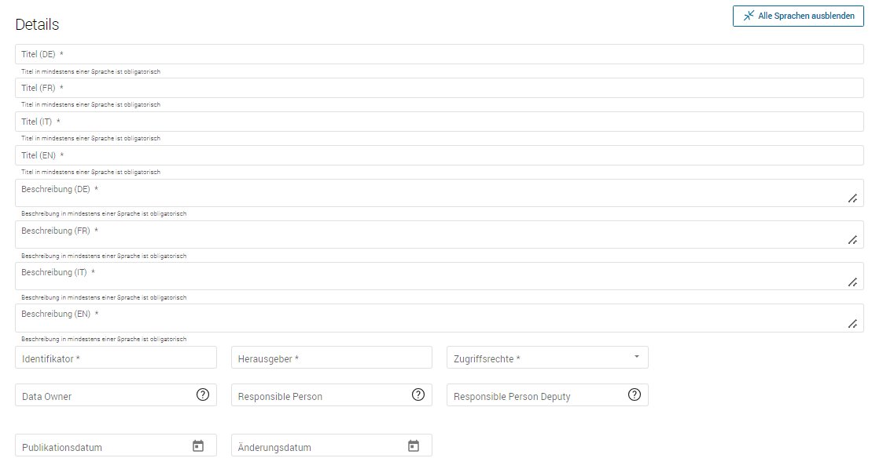

.. container:: custom-breadcrumbs

   - :fa:`home` :doc:`Handbuch <../../../index>` :fa:`chevron-right`
   - :doc:`Publizieren <../publizieren>` :fa:`chevron-right`
   - :doc:`Publikationsvariante <../publikationsvariante>` :fa:`chevron-right`
   - Manuell erfassen

**************************
Metadaten manuell erfassen
**************************

Wie erfasse ich Metadaten manuell im Webformular?
=================================================

.. container:: Intro

    Bei der manuellen Datenerfassung tragen Sie
    Ihre Metadaten selbst im :term:`Input-Bereich <Input-Bereich>` von `i14y.admin.ch <https://input.i14y.admin.ch/>`__ ein.
    Voraussetzung dafür ist, dass Ihre Organisation mitsamt
    Benutzerinnen und Benutzern registriert ist. Fall Ihre Organisation noch kein Konto auf I14Y oder auf opendata.swiss hat, 
    melden Sie sich bei der  `Geschäftsstelle OGD <mailto:opendata@bfs.admin.ch>`__. Eine Anleitung für die
    Kontenverwaltung finden Sie  `hier <https://i14y-ch.github.io/handbook/de/2_rollen_prozesse/kontenverwaltung/>`__. Bitte teilen Sie uns die E-Mail-Adresse,
    mit der Sie sich registriert haben, sowie die erforderlichen Informationen zu Ihrer Organisation mit.

    Wie Sie :term:`Datensätze <Dataset>` über das Webinterface beschreiben, erklären wir Ihnen hier Schritt für Schritt. 

Die Schritte auf einen Blick
----------------------------

- :ref:`Datensatz erstellen <manuell-datensatz-erstellen>`
- :ref:`Metadaten eingeben <manuell-metadaten-eingeben>`
- :ref:`Distributionen hinzufügen <manuell-resource-hinzufuegen>`
- :ref:`Datensatz weiter bearbeiten <manuell-dataset-aktionen>`
- :ref:`Datensatz prüfen <manuell-vorschau-pruefen>`
- :ref:`Datensatz veröffentlichen <manuell-datensatz-veroeffentlichen>`
- :ref:`Datensatz im Frontend prüfen <manuell-datensatz-frontend>`
- :ref:`Veröffentlichung in der Produktionsumgebung <manuell_go_live>`

.. admonition:: Gut zu wissen

    Sollten Sie zum ersten Mal Datensätze publizieren, führen wir Sie durch den Prozess
    und unterstützen Sie dabei, die korrekte Übermittlung und Darstellung
    Ihrer Daten sicherzustellen.
    Kontaktieren Sie uns, um einen
    `Termin für die Einführung zur Publikation auf opendata.swiss <mailto:opendata@bfs.admin.ch>`__
    zu vereinbaren.

Alle Schritte im Detail
=======================

.. _manuell-datensatz-erstellen:

Beschreibung eines Datensatzes erstellen
-----------------------------------------

Um Metadaten zu einem Datensatz zu erfassen, müssen Sie sich in den :term:`Input-Bereich <Input-Bereich>` von I14Y einloggen.
Falls Ihnen mehrere Rollen zugewiesen sind, wählen Sie bitte das für Sie zutreffende Profil für die Publikation und Pflege von OGD aus.

Sie befinden sich nun im Input-Bereich. Hier sehen Sie drei Kacheln, über die Sie zu den verschiedenen Arbeitsbereichen gelangen: 
«Katalog pflegen», «Konzepte pflegen» und «I14Y-Interoperabilitätsplattform». 
Unterhalb dieser Kacheln finden Sie die Kachel «Meine Daten». Dort werden Aufgaben aufgelistet, die Sie betreffen.

Um einen Datensatz in ihrem Katalog zu erfassen, klicken Sie in der Kachel **«Meine Daten»** auf **«Dataset»**.

.. figure:: ../../../_static/images/publizieren/manuelle-datenerfassung/benutzer-uebersicht-kacheln-de.png
   :alt: Benutzerübersicht im Input-Bereich von I14Y. Zu sehen sind sechs Kacheln.

Sie gelangen nun in den Arbeitsbereich **«I14Y-Metadatenkatalog»**. Hier sehen Sie eine Liste der Datensätze Ihrer Organisation/Herausgeber sowie alle öffentlich publizierten Einträge anderer Organisationen. Diese Liste ist entsprechend leer, wenn Ihre Organisation zum ersten Mal publiziert. 
Für jeden Datensatz werden der Titel, Identifikator, Herausgeber, Typ, Status und die Publikation angezeigt. 

.. _manuell-metadaten-eingeben:

Metadaten eingeben
-------------------

.. container:: important

    Wichtig: Gewisse Metadatenfelder im Input-Bereich von I14Y sind für die Veröffentlichung von OGD nicht erforderlich.
    Die entsprechenden Felder müssen nicht ausgefüllt werden. Es wird jedoch empfohlen, die Felder zu nutzen, damit die Beschreibung, die auch auf I14Y zu finden ist, möglichst vollständig ist. 
    Zudem können viele dieser Felder für das organisationsinterne Datenmanagement hilfreich sein.    

.. collapse:: Infobox: Metadatenstandard DCAT-AP CH 

   Auf dem Portal opendata.swiss und auf der Interoperabilitätsplattform I14Y werden Datensammlungen 
   gemäss den Vorgaben des DCAT-Standards in der aktuell gültigen Version mit dem Applikationsprofil für die Schweiz beschrieben `(DCAT-AP CH 2.0)  <https://dcat-ap.ch/>`__. 
   Die I14Y bietet einige optionale Zusatzfelder an, die im aktuellen DCAT-Standard nicht vorgesehen sind. Damit lassen sich die Datenangebote noch detaillierter beschreiben. 
   Darüber hinaus können in I14Y auch die Struktur sowie die einzelnen Datenkonzepte beschrieben werden. 

   DCAT-AP ist ein Anwendungsprofil des Data Catalog Vocabulary (DCAT) und dient zur Beschreibung der in Datenportalen verzeichneten Daten. 
   Es richtet sich insbesondere an die Betreiber von Open-Data-Portalen und deren Datenpublizierende. 
   Die Schweizerische Ableitung DCAT-AP-CH wird seit 2016 von opendata.swiss verwendet. 
   Diese wird kontinuierlich im Rahmen der `eCH Fachgruppe OGD   <https://www.ech.ch/de/der-verein/fachgruppen/open_government_data>`__ weiterentwickelt.

| 

Klicken Sie nun auf die Schaltfläche **«Erstellen»**. Es öffnet sich ein Dropdown-Menü mit drei verschiedenen Auswahlmöglichkeiten. 
Für die Beschreibung eines Datensatzes wählen Sie die Option **«Neue Datensammlung erfassen»**.
    
.. figure:: ../../../_static/images/publizieren/manuelle-datenerfassung/dataset-erfassen-de.png
   :alt: Abbildung Dropdown mit Schaltfläche neue Datensammlung erfassen

Um sicherzustellen, dass der Datensatz gefunden und wiederverwendet werden kann, werden verschiedene Metadaten zum Datensatz erfasst und auf I14Y sowie opendata.swiss veröffentlicht. Metadatenfelder, die mit einem Stern * gekennzeichnet sind, müssen ausgefüllt werden. Bitte beachten Sie: 
Je mehr Informationen Sie in den Metadaten angeben, desto leichter wird der Datensatz gefunden und desto besser kann er wiederverwendet werden.

.. collapse:: Infobox: Warum Metadaten wichtig sind und was es dabei zu beachten gilt

   Auf dem Portal opendata.swiss und auf der Interoperabilitätsplattform I14Y werden Datensammlungen 
   gemäss den Vorgaben des DCAT-Standards in der aktuell gültigen Version mit dem Applikationsprofil für die Schweiz beschrieben `(DCAT-AP CH 2.0)  <https://dcat-ap.ch/>`__. 
   Die I14Y bietet einige optionale Zusatzfelder an, die im aktuellen DCAT-Standard nicht vorgesehen sind. Damit lassen sich die Datenangebote noch detaillierter beschreiben. 
   Darüber hinaus können in I14Y auch die Struktur sowie die einzelnen Datenkonzepte beschrieben werden. 

| 

Details
^^^^^^^^
Bitte geben Sie im **Feld «Titel (EN) (DE) (FR) (IT)»** und im **Feld «Beschreibung (EN) (DE) (FR) (IT)»** einen **aussagekräftigen Titel** und eine **Beschreibung** Ihres Datensatzes an.
Für die **Bundesstellen** sind diese Angaben in **zwei Landessprachen obligatorisch**. Für alle **anderen Organisationen** ist **mindestens eine Landessprache** erforderlich - wünschenswert wären allerdings alle vier Sprachen.
Eine Beschreibung auf Englisch erleichtert das Auffinden Ihres Datensatzes auf dem
:term:`europäischen Datenportal <Europäisches Datenportal>`.

Im Feld **Identifikatior** geben Sie den Identifikator des Datensatzes ein. Sie können dafür die ID aus Ihrem Quellsystem verwenden oder eine beliebige ID definieren. 
Bitte beachten Sie, dass der Datensatz-Identifikator innerhalb der Datensätze Ihrer Organisation eindeutig sein muss. 
Es wird empfohlen, die ID aus dem Quellsystem des Herausgebers zu verwenden. Sie kann die folgenden Zeichen ``A-Za-z``, ``0-9``, ``-`` und ``_`` enthalten. 
Im Feld **Herausgeber** erscheint als Dropdown Ihre Organisation in der Auswahlliste. 
Wählen Sie unter **Zugriffsrechte**  die Option «Öffentlich» für die OGD-Datensätze. 
Die folgenden Felder **Data Owner**, **Responsible Person** und **Responsible Person Deputy** werden auf opendata.swiss nicht angezeigt, sind jedoch für das interne Datenmanagement wichtig. 
Informationen zu den **Rollen** finden Sie `hier  <https://i14y-ch.github.io/handbook/de/2_rollen_prozesse/rollen/>`__.
Das Feld **Publikationsdatum** muss ausgefüllt werden. Es handelt sich um das Datum der ersten Publikation im Quellsystem dieses Datensatzes. Ist dieses nicht bekannt, ist das Datum der geplanten Erstpublikation auf opendata.swiss / I14Y zu verwenden.
Im Feld **Änderungsdatum** wird nach der Publikation das Datum der letzten Aktualisierung oder Änderung des Datensatzes angegeben.

.. figure:: ../../../_static/images/publizieren/manuelle-datenerfassung/dataset-details-identifikator-de.png
   :alt: Ausschnitt aus Details Identifikator bis Änderungsdatum

.. container:: important

    Wichtig: Verändern Sie den Identifikator nicht mehr, nachdem der Datensatz
    publiziert ist. Ansonsten können Ihre Daten nicht mehr eindeutig zugeordnet werden. 

Kontaktstellen
^^^^^^^^^^^^^^^
In diesem Bereich können Sie die Kontaktstelle hinterlegen, die bei Fragen zum vorliegenden Datensatz zuständig ist. 
Für die Publikation auf opendata.swiss muss mindestens das Feld **Organisation** in zwei Landessprachen (Bund) oder in mindestens einer Sprache (Andere) ausgefüllt sowie eine E-Mailadresse hinterlegt werden. Wenn Sie weitere Kontakstellen hinzufügen möchten, können Sie dies über die Schaltfläche **+ Neue Kontaktstelle** tun.  

.. figure:: ../../../_static/images/publizieren/manuelle-datenerfassung/dataset-kontaktstellen-de.png
   :alt: Felder zum Beschreiben der Kontaktstelle

Sprachen
^^^^^^^^^
Dieses Feld zeigt an, in welchen Sprachen der Datensatz verfügbar ist. 
Zur Auswahl stehen die Sprachen Deutsch, Französisch, Italienisch, Rätoromanisch (wird auf opendata.swiss nicht angezeigt) und Englisch. 
Ist der Datensatz sprachunabhängig, lassen Sie das Feld leer. 

.. figure:: ../../../_static/images/publizieren/manuelle-datenerfassung/dataset-sprachen-de.png
   :alt: Felder zum Ankreuzen der Sprache

Katalog und Themen
^^^^^^^^^^^^^^^^^^^
Im Feld **Kataloge und Themen** geben Sie den Themenbereich Ihres Datensatzes an. In einem ersten Schritt wählen Sie aus der Liste der Themen von I14Y. Damit Sie Ihren Datensatz auf opendata.swiss publizieren können, müssen Sie ihn zuerst speichern. 
Klicken Sie dazu auf die Schaltfläche **Speichern und schliessen**, die im unteren Rand des Webformulars eingeblendet wird. 

.. figure:: ../../../_static/images/publizieren/manuelle-datenerfassung/dataset-katalog-themen-speichern.png
   :alt: Auswahl des Themenbereichs von I14Y und Schaltfläche speichern und schliessen

Zum Hinzufügen des Opendata-Katalogs öffnen Sie die Beschreibung Ihres Datensatzes indem Sie auf die Schaltfläche **Bearbeiten** klicken. Gehen Sie nun wieder zum Bereich **Kataloge und Themen**.
Klicken Sie nun auf die Schaltfläche **Katalog verknüpfen**. Der Opendata-Katalog Ihrer Organisation (*Opendata + Name der Organisation*) erscheint. Wählen Sie diesen aus.  

.. figure:: ../../../_static/images/publizieren/manuelle-datenerfassung/dataset-katalog-verknuepfen-de.png
   :alt: Auswahl des Opendata-Katalogs über die Schaltfläche Katalog verknüpfen

Im Bereich **Kataloge und Themen** erscheint nun ein weiteres Feld mit Ihrem Opendata-Katalog. Klicken Sie auf das Dropdown-Menü und wählen Sie den entsprechenden Bereich aus der Liste der Opendata-Themen. 
Es handelt sich dabei um die EU-Themenliste, die im Standard DCAT-AP CH Version 2.0.0 definiert ist. Die hier ausgewählten Bereiche werden auf opendata.swiss angezeigt. 
Die Themenvokabulare von I14Y und opendata.swiss unterscheiden sich in einigen Punkten sowie in der Anzahl der Auswahlmöglichkeiten. 
Kategorisierung und Anzahl der Bereiche sind daher nicht deckungsgleich.   

Ihr Datensatz wurde jetzt erfolgreich mit Ihrem Opendata-Katalog verknüpft, so dass der Datensatz auf opendata.swiss angezeigt wird.

Schutzbedarf
^^^^^^^^^^^^^
Die Felder im Bereich **Schutzbedarf** sind für die Publikation auf I14Y relevant. 
Informationen zum Ausfüllen dieser Felder finden Sie im `Handbuch von I14Y <https://i14y-ch.github.io/handbook/de/6_anhang/eingabefelder/>`__. 

.. figure:: ../../../_static/images/publizieren/manuelle-datenerfassung/dataset-schutzbedarf-de.png
   :alt: Ansicht der Felder im Bereich Schutzbedarf

Schlüsselwörter
^^^^^^^^^^^^^^^^
.. collapse:: Infobox: Warum Schlüsselwörter wichtig sind und was es dabei zu beachten gilt

   Damit der Datensatz besser auffindbar wird, können Schlüsselwörter hinterlegt werden. 
   Diese werden auch als Filtermöglichkeit verwendet, um die Auswahl der Datensätze thematisch einzugrenzen. 
   Es ist sinnvoll, Synonyme oder allgemeine Begriffe zu hinterlegen. 
   Dieses Feld sollte insbesondere für jene Begriffe genutzt werden, die in der `Termdat-Datenbank des Bundes <https://www.termdat.bk.admin.ch/search>`__ verzeichnet sind. 
   Hier finden Sie zudem auch die Begriffe in den Landessprachen sowie in Englisch. 
   Mögliche Schlüsselwörter können Sie aus Ihren Metadaten oder Ihrem Quellsystem ermitteln. 
   Sie können auch aus den am häufigsten verwendeten Schlüsselwörtern auf opendata.swiss auswählen.
 
| 

Geben Sie die Schlüsselwörter in die entsprechenden Sprachfelder ein und klicken Sie anschliessend auf das Symbol mit dem Häkchen. 
Fügen Sie weitere Schlüsselwörter hinzu, indem Sie auf das Plus-Symbol klicken. Der Schlüsselwort-Eintrag wird dadurch direkt gespeichert; ein Klick auf den Speichern-Knopf unten ist nicht nötig. 
Um Schlüsselwörter zu löschen, wählen Sie das Papierkorb—Symbol. 
Vergessen Sie nicht, die entsprechende Zeile zu markieren.   

Landing page
^^^^^^^^^^^^
Tragen Sie hier den Link zu der Webseite Ihrer Organisation ein, auf der weitere Informationen zu dem betreffenden Datenangebot zu finden sind oder über die die Originaldaten abgerufen werden können. 

.. figure:: ../../../_static/images/publizieren/manuelle-datenerfassung/dataset-landingpage-de.png
   :alt: Eingabefeld von «Landing Page»

Räumliche Abdeckung
^^^^^^^^^^^^^^^^^^^^
Das Feld **Räumliche Abdeckung** beschreibt das geographische Gebiet, das von den Daten abgedeckt wird. Einige Beispiele: “Schweiz”, “Kanton Solothurn”, “Aarau”. Zurzeit kann Freitext eingegeben werden. 
Für Gebiete, die in den folgenden Vokabularen enthalten sind, müssen die entsprechenden Begriffe verwendet werden:
`VOCAB-EU-CONTINENT <http://publications.europa.eu/resource/authority/continent>`__, `VOCAB-EU-COUNTRY <https://publications.europa.eu/resource/authority/country>`__,
`VOCAB-EU-PLACE <https://publications.europa.eu/resource/authority/place>`__, `GEONAMES <http://sws.geonames.org/>`__. 
Das Feld **GeoIV ID** wird nicht auf opendata.swiss angezeigt. Informationen zu diesem Feld finden Sie im `Handbuch von I14Y <https://i14y-ch.github.io/handbook/de/6_anhang/eingabefelder/>`__:

.. figure:: ../../../_static/images/publizieren/manuelle-datenerfassung/dataset-raumliche-abdeckung-de.png
   :alt: Eingabefelder räumliche Abdeckung und GeoIV-ID

Zeitliche Abdeckung
^^^^^^^^^^^^^^^^^^^^
Im Feld **Zeitliche Abdeckung** können Sie den Zeitraum angeben, den der Datensatz umfasst. Wählen Sie dazu im Kalender das Datum «Von» und «Bis». 
Im Feld **Frequenz** können Sie aus der Dropdown-Liste die Häufigkeit auswählen, mit der der Datensatz aktualisiert wird. 

.. figure:: ../../../_static/images/publizieren/manuelle-datenerfassung/dataset-zeitliche-abdeckung-de.png
   :alt: Eingabefelder zeitliche Abdeckung und Frequenz

Konform zu
^^^^^^^^^^^
Im Feld «Konform zu» werden technische Spezifikationen erfasst. 
Setzen Sie dazu einen Link auf das entsprechende Dokument, z.B. auf die Beschreibung eines Standards bei eCH. 

Dokumente
^^^^^^^^^^
Im Feld **Dokumente** können Sie weitere Dokumente eintragen, die in direktem Zusammenhang mit Ihrem Angebot stehen, z.B. einen Link zu einem wissenschaftlichen Artikel, einer Anleitung oder einem Hintergrundtext.

.. figure:: ../../../_static/images/publizieren/manuelle-datenerfassung/dataset-dokumente-de.png
   :alt: Eingabefeld Dokumente

Verweis auf verwandte Datensätze
^^^^^^^^^^^^^^^^^^^^^^^^^^^^^^^^^^
Im Feld **Qualifizierte Beziehung** können Sie aus allen auf opendata.swiss verfügbaren Datensätzen diejenigen auswählen, die einen thematischen Bezug zu Ihrem aktuellen Datensatz haben. 
Dadurch können Datennutzende über Ihren Datensatz auf andere Datensätze aufmerksam gemacht werden, die für sie von Interesse sein könnten. 
Wählen Sie in der Dropdown-Liste «Hatte Rolle» die Option «Verwandt».  

.. figure:: ../../../_static/images/publizieren/manuelle-datenerfassung/dataset-qualifizierte-beziehung-de.png
   :alt: Eingabefeld qualifizierte Beziehung

Im Feld **URL** geben Sie den **Perma-Link des Datensatzes** an, auf den Sie verlinken möchten. 
Es ist wichtig, dass Sie den Perma-Link des Datensatzes angeben.  
Gehen Sie dazu auf die Seite des Datensatzes auf https://opendata.swiss, den Sie verlinken möchten. 
Unter **Zusätzliche Informationen** finden Sie das Feld **Identifier**. Bewegen Sie die Maus über den Identifier (im Beispiel «lustat-grwahlen-lu@lustat», klicken Sie mit der rechten Maustaste und wählen Sie die Option «Link kopieren». 
Geben Sie diesen im Eingabefeld «URL» ein. Der Perma-Link hat die Form ``[https://opendata.swiss/perma/lustat-grwahlen-lu@lustat]``. 
Im Pfad der URL sehen Sie ``perma`` gefolgt vom entsprechenden ``Identifier`` des Datensatzes.  

.. figure:: ../../../_static/images/publizieren/manuelle-datenerfassung/dataset-zusatzliche-info-de.png
   :alt: Permalink des Datensatzes im Feld Identifier im Bereich zusätzliche Informationen auf opendata.swiss 

Sie können nun die Eingabe der Metadatenfelder speichern und schliessen. 
Der nächste Schritt besteht darin, dem Datensatz mindestens eine Distribution hinzuzufügen. 

Beschreibung der Distribution erstellen
^^^^^^^^^^^^^^^^^^^^^^^^^^^^^^^^^^^^^^^^^
Wenn Sie die Eingabe der Metadaten für Ihren Datensatz abgeschlossen haben, müssen Sie als Nächstes eine oder mehrere Distributionen zu Ihrem Datensatz hinzufügen. 
Speichern Sie die Metadaten des Datensatzes, wählen Sie den Reiter **Distributionen** und klicken Sie auf die Schaltfläche **Erstellen**, um zum Webformular für die Beschreibung der Distribution zu gelangen.

.. figure:: ../../../_static/images/publizieren/manuelle-datenerfassung/dataset-distribution-de.png
   :alt: Reiter Distribution

Details zur Distribution
^^^^^^^^^^^^^^^^^^^^^^^^^
Die Erfassung einer Distribution funktioniert ähnlich wie die beim Datensatz: Wählen Sie einen geeigneten Identifikator aus Ihrem Quellsystem aus, geben Sie Titel und Beschreibung ein. 
Für die Sprachversionen gelten die gleichen Regeln wie beim Datensatz: Alle Bundesstellen müssen die Angaben mindestens auf Deutsch und Französisch eingeben – wünschenswert wären allerdings alle vier Sprachen. 
Andere Organisationen müssen Titel und Beschreibung in mindestens einer Sprache eingeben. Falls die Distribution sprachunabhängig ist, wählen Sie unter dem Feld **Sprache** keine Sprache aus. 
Auch hier ist im Pflichtfeld **Publikationsdatum** das Veröffentlichungsdatum der Distribution anzugeben. 

.. figure:: ../../../_static/images/publizieren/manuelle-datenerfassung/distribution-details-de.png
   :alt: Eingabefelder für die Beschreibung der Distribution im Bereich Details

.. container:: important

    Wichtig: Jedes Dataset muss mindestens 1 Ressource haben.

.. collapse:: Infobox: Was ist eine Distribution

   Eine «Distribution» ist eine spezifische Darstellung des Datensatzes. 
   Ein Datensatz kann in mehreren Serialisierungen vorliegen, die sich vielerlei Hinsicht unterscheiden können, z. B. hinsichtlich der natürlichen Sprache, des Medientyps oder des Formats, der schematischen Organisation, der zeitlichen und räumlichen Auflösung, des Detaillierungsgrads oder der Profile (die eines oder alle der oben genannten Merkmale enthalten können). 

| 

Zugangs-URL
^^^^^^^^^^^^^
Für jede Distribution müssen Sie unter **Zugangs-URL** eine URL angeben, über welche auf die Distribution zugegriffen werden kann. Falls sich hinter der URL ein direkter Download verbirgt, muss die URL auch als **Download-URL** eingetragen werden. 
Klicken Sie hierzu auf das Kästchen bei **Download-URL**. Optional kann die **Grösse** der Distribution in Bytes angegeben werden. Unter **Format** wählen Sie das Format Ihrer Distribution.
Bei Bedarf kann der Medientyp (früher MIME-Typ) spezifiziert werden. Die Felder **Komprimierungsformat**, **Prüfsummenalgorithmus**, und **Prüfsumme** werden derzeit nicht auf opendata.swiss angezeigt.
Weitere Informationen zu diesen Feldern finden Sie `Handbuch von I14Y <https://i14y-ch.github.io/handbook/de/6_anhang/eingabefelder/>`__.

.. figure:: ../../../_static/images/publizieren/manuelle-datenerfassung/distribution-zugangs-url-de.png
   :alt: Eingabefelder im ereich Zugangs-URL

Im Feld **Lizenz** müssen Sie die Nutzungsbedingung des Datensatzes gemäss den Nutzungsbedingungen von opendata.swiss angeben.
Diese stehen Ihnen in der Dropdown-Liste zur Auswahl. Wählen Sie den zutreffenden, mit «opendata» gekennzeichneten Menüpunkt aus. Die Felder **Rights** und **Verfügbarkeit** werden nicht auf opendata.swiss angezeigt. 
Weitere Informationen zu den Feldern finden Sie im  `Handbuch von I14Y <https://i14y-ch.github.io/handbook/de/6_anhang/eingabefelder/>`__. 

Sichtbarkeit
^^^^^^^^^^^^^

.. figure:: ../../../_static/images/publizieren/manuelle-datenerfassung/dataset-veroeffentlichen.png
   :alt: Eingabefeld «Sichtbarkeit» im Webformular

Dieses Feld dient zur :ref:`Veröffentlichung Ihres Datasets <manuell-datensatz-veroeffentlichen>`.
In der Dropdown-Auswahl können Sie die Sichtbarkeit des Datasets auf dem Frontend einstellen.
Die Voreinstellung für die «Sichtbarkeit» ist
«Entwurf». Lassen Sie diese Voreinstellung zunächst so. Sie bedeutet, dass Ihr Dataset noch
nicht öffentlich sichtbar ist. Sobald sie dieses auf dem Frontend sichtbar machen wollen,
wählen Sie in der Dropdown-Auswahl die Option “public” aus.

Dataset-Informationen
^^^^^^^^^^^^^^^^^^^^^^^^

.. figure:: ../../../_static/images/publizieren/manuelle-datenerfassung/dataset-beschreibung.png
   :alt: Eingabefeld «Beschreibung» im Webformular

Daten
^^^^^

.. figure:: ../../../_static/images/publizieren/manuelle-datenerfassung/dataset-zeitangaben.png
   :alt: Eingabefeld zur «Aktualisierung» im Webformular

Hier gilt es, das Pflichtfeld «Publikationsdatum» auszufüllen. Damit ist das Datum
der ersten Publikation im Quellsystem dieses Datasets gemeint.
Falls dies nicht bekannt ist, verwenden Sie das Datum der geplanten ersten
Publikation auf opendata.swiss. Beim Datum der letzten Änderung («Änderungsdatum»)
können Sie nach der Publikation kommunizieren, wann die letzte Änderung
(Aktualisierung, Korrektur etc.) am Dataset vorgenommen worden ist.
Weiter sollen Sie hier das Intervall, in dem Aktualisierungen
vorgenommen werden («Aktualisierungsintervall») und den Zeitraum, den das Dataset
umfasst («Zeitliche Abdeckung»), angeben.

Publisher-Informationen
^^^^^^^^^^^^^^^^^^^^^^^

.. figure:: ../../../_static/images/publizieren/manuelle-datenerfassung/dataset-publishers-kontakte.png
   :alt: Eingabefeld «Publisher» im Webformular

Hier müssen Sie Angaben zur datenpublizierenden Organisation eingeben.
Im Pflichtfeld «Publisher» geben Sie die für das Dataset verantwortliche Organisation an.
Dies können auch mehrere Organisationen sein,
jedoch keine Personen.
Im Pflichtfeld «Kontaktstellen» muss mindestens eine
Kontaktstelle angegeben werden, die von den Datennutzenden bei Rückfragen
kontaktiert werden darf.

Sprachen
^^^^^^^^

Falls Ihre Ressourcen in unterschiedlichen Sprachen vorliegen, können Sie diese hier angeben.
Liegen Ihre Ressourcen sprachunabhängig vor, kann das Eingabefeld hier leer gelassen werden.

Weitere Informationen
^^^^^^^^^^^^^^^^^^^^^^^

.. figure:: ../../../_static/images/publizieren/manuelle-datenerfassung/dataset-weitere-informationen-landing-page.png
   :alt: Eingabefeld «Weitere Informationen» im Webformular

Mit «Landing Page»
ist die Website gemeint, auf der die Daten ursprünglich publiziert wurden,
falls diese vorhanden ist.
Unter «Beziehungen» tragen Sie bitte in das Textfeld «legal_basis» ein und geben im
Feld «Url» den Link auf die gesetzliche Grundlage, die für die Publikation dieses Datasets vorgesehen ist, an.
Wenn dies für Ihre Daten nicht relevant ist, lassen Sie das Feld leer.

Verwandte Datasets
^^^^^^^^^^^^^^^^^^^^

.. figure:: ../../../_static/images/publizieren/manuelle-datenerfassung/dataset-verwandte-datasets.png
   :alt: Eingabefeld von «verwandten Datasets» im Webformular

Unter «Verwandte Datensätze»
können Sie aus allen verfügbaren Datasets auf opendata.swiss jene mit
thematischem Bezug zu Ihrem aktuellen Dataset auswählen. Damit
signalisieren Sie den Datennutzenden, dass weitere thematisch interessante Datasets existieren.

Kategorien auswählen
^^^^^^^^^^^^^^^^^^^^^^^^^

.. figure:: ../../../_static/images/publizieren/manuelle-datenerfassung/dataset-kategorien.png
   :alt: Eingabefeld von «Kategorien» im Webformular

Unter «Kategorien» können Sie eine oder mehrere thematische Kategorien
auswählen, denen das Dataset zugeordnet werden kann.

.. _manuell-resource-hinzufuegen:

Ressourcen hinzufügen
-----------------------

Wenn Sie mit der Eingabe der Metadaten für Ihr Dataset
fertig sind, müssen Sie Ihrem Dataset als nächstes eine oder mehrere Ressourcen
hinzufügen. Klicken Sie auf den Button «Als nächstes: Distribution hinzufügen», um in das Webformular für
die Ressourcen zu gelangen.

.. figure:: ../../../_static/images/publizieren/manuelle-datenerfassung/dataset-speichern.png
   :alt: Ressourcen hinzufügen

.. figure:: ../../../_static/images/publizieren/manuelle-datenerfassung/resource-anlegen.png
   :alt: Abschnitt «Ressource» im Webformular

Eine «Ressource» ist eine spezifische Repräsentierung.
Dies können unterschiedliche Bereitstellungsformen eines Datasets
sein (media-type or format), unterschiedliche Zeitreihen
oder auch unterschiedliche Aggregationsstufen.
Das Erfassen einer
Ressource funktioniert ähnlich wie zuvor beim gesamten Dataset: Wählen Sie einen geeigneten
Identifier aus Ihrem Quellsystem aus,
legen Sie Titel und Beschreibung fest. Für die Sprachversionen
gelten die gleichen Regeln wie bei Datasets: Alle Bundesstellen
müssen die Angaben mindestens auf Deutsch und Französisch eingeben –
wünschenswert wären allerdings alle vier Sprachen. Weitere Organisationen sollen Titel und Beschreibung
in mindestens einer Sprache eingeben.
Falls die Ressource sprachunabhängig ist, wählen Sie unter «Sprache»
keine Sprache aus.
Auch hier müssen Sie unter dem Pflichtfeld «Erstellt»
das Datum der Veröffentlichung der Ressource angeben.

.. container:: important

    Wichtig: Jedes Dataset muss mindestens 1 Ressource haben.

.. figure:: ../../../_static/images/publizieren/manuelle-datenerfassung/resource-urls-nutzungsrechte-format.png
   :alt: Eingabefelder für Ressourcen im Webformular

Für jede Ressource müssen Sie unter «Zugangs-URL» eine URL angeben,
über welche auf die Ressource
zugegriffen werden kann. Falls sich hinter der URL ein Download verbirgt,
muss die URL auch im Feld «Download-URL» eingetragen werden. Ebenfalls
optional kann die «Grösse» der Ressource in Bytes angegeben werden.
Unter «Format» wählen Sie das Format Ihrer Ressource.

.. container:: important

    Wichtig: `Unter «Nutzungsbedingungen» müssen
    Sie eine der Bedingungen auswählen, die auf opendata.swiss vorgesehen sind <https://opendata.swiss/de/terms-of-use>`__.

.. container:: important

    Wichtig: Bitte berücksichtigen Sie bei der Publikation von Ressourcen die
    :doc:`«OGD-Richtlinien» <../../glossar/bibliothek/ogd-richtlinien>`.

Sie haben jetzt Ihre erste Ressource angelegt und können entweder mit dem Button «Beenden»
Ihr Dataset und Ihre Ressource abspeichern oder Sie können mit dem Button
«Speichern & weitere hinzufügen» mit dem Hinzufügen von Ressourcen fortfahren.

.. figure:: ../../../_static/images/publizieren/manuelle-datenerfassung/resource-aktionen.png
   :alt: Mögliche Aktionen nach der Anlage der ersten Ressource im Webformular

.. _manuell-dataset-aktionen:

Dataset weiterbearbeiten
--------------------------------

Das Hinzufügen weiterer Ressourcen ist auch nach dem Anlegen Ihres Datasets noch möglich.

Gehen Sie dazu zur Detailansicht Ihres Datasets im Backend der Abnahmeumgebung und klicken Sie auf
«Bearbeiten» und anschliessend auf «Ressourcen»:

.. figure:: ../../../_static/images/publizieren/manuelle-datenerfassung/resource-hinzufuegen.png
   :alt: Mögliche Aktionen nach der Anlage des Datasets

.. _manuell-vorschau-pruefen:

Dataset prüfen
-----------------

Sehen Sie sich Ihr Dataset in der Detailansicht an: Sind alle Felder so ausgefüllt,
wie Sie es erwarten, können Sie Ihr Dataset :ref:`veröffentlichen <manuell-datensatz-veroeffentlichen>`.

.. figure:: ../../../_static/images/publizieren/dataset/dataset-detailansicht.png
   :alt: Detailansicht eines Datasets im CKAN Backend

.. _manuell-datensatz-veroeffentlichen:

Dataset veröffentlichen
---------------------------

In der Detailansicht wird Ihnen ganz oben rechts der Status Ihres Datasets angezeigt:
«Entwurf» bedeutet, Sie bearbeiten die Metadaten des Datasets noch weiter. In diesem
Zustand ist Ihr Dataset im Frontend der Abnahmeumgebung
noch nicht sichtbar. Der Status
«Veröffentlicht» gibt an, dass das Dataset in der Abnahmeumgebung publiziert ist.

.. figure:: ../../../_static/images/publizieren/dataset/dataset-titel-entwurf.png
   :alt: Dataset Titel in dem das Dataset als Entwurf markiert ist

Gehen Sie dazu zurück zu «Bearbeiten», «Metadaten bearbeiten» und scrollen Sie
bis zum Feld «Sichtbarkeit». Sie können Ihr Dataset sofort veröffentlichen, indem Sie den
Status von «Entwurf» auf «Veröffentlicht» ändern. Alternativ können Sie eine zukünftige
Veröffentlichung planen, indem Sie im darunterliegenden Feld einen
Veröffentlichungstermin in der Zukunft festlegen.

.. figure:: ../../../_static/images/publizieren/dataset/dataset-veroeffentlichen.png
   :alt: Dataset im Frontend veroeffentlichen

.. container:: important

    Wichtig: Vergessen Sie nicht nach der Änderung auf «Aktualisieren» zu klicken.

.. _manuell-datensatz-frontend:

Dataset im Frontend prüfen
-----------------------------

Sobald Ihr Dataset veröffentlicht ist, kann es auch im Frontend der Abnahmeumgebung angesehen werden.
Bitte beachten Sie, dass die Aktualisierung der Daten bis zu 60 Minuten dauern kann.
Sie gelangen zu der Datenansicht Ihres Datasets im Frontend,
indem Sie ``ckan`` aus der URL Ihres Datasets entfernen:

.. figure:: ../../../_static/images/publizieren/dataset/ckan-backend-url.png
   :alt: CKAN URL eines Datasets

.. figure:: ../../../_static/images/publizieren/dataset/frontend-url.png
   :alt: Frontend URL eines publizierten Datasets

Bitte prüfen Sie hier Ihre Daten nochmals:

.. container:: bildunterschrift

   Beispielansicht eines publizierten Datasets

.. figure:: ../../../_static/images/publizieren/resource-frontend.png
   :alt: Beispielansicht einer publizierten Ressource

.. container:: bildunterschrift

   Beispielansicht einer publizierten Ressource

.. _manuell_go_live:

Veröffentlichung in der Produktionsumgebung
---------------------------------------------

Sollten Sie zum ersten Mal Daten publizieren, muss Ihr Dataset
von der :term:`Abnahmeumgebung <Abnahmeumgebung>` noch auf die
:term:`Produktionsumgebung <Produktionsumgebung>` übertragen werden.
Dies übernehmen wir für Sie,
`geben Sie uns einfach per E-Mail Bescheid <mailto:opendata@bfs.admin.ch>`__.

.. container:: support

   Support

Sie haben eine Frage zum manuellen Erfassen Ihres Datasets?
`Schreiben Sie uns <mailto:opendata@bfs.admin.ch>`__
und wir helfen Ihnen gerne weiter.

.. _manuell-mehr-zum-thema:

.. container:: materialien

    Mehr zum Thema

- :doc:`DCAT-AP-CH (Link, englisch) <../../glossar/bibliothek/dcat-ap-ch>` – Beschreibung des aktuell von opendata.swiss genutzten Datenstandards DCAT-AP-CH
- :download:`Veröffentlichung eines Datasets terminieren <../../../_static/screencasts/schedule-dataset.gif>`- In diesem Screencast zeigen wir Ihnen, wie Sie die Veröffentlichung Ihres Datasets terminieren können
- :download:`Dataset aktualisieren <../../../_static/screencasts/update-dataset.gif>`- In diesem Screencast zeigen wir Ihnen das Aktualisieren Ihres Datasets
- :download:`Ressource hinzufügen <../../../_static/screencasts/add-resource.gif>`- In diesem Screencast zeigen wir Ihnen, wie Sie Ihrem Dataset eine Ressource hinzufügen können
- :download:`Ressource aktualisieren <../../../_static/screencasts/update-resource.gif>`- In diesem Screencast zeigen wir Ihnen, wie Sie bei Ihrem Dataset eine Ressource aktualisieren können
