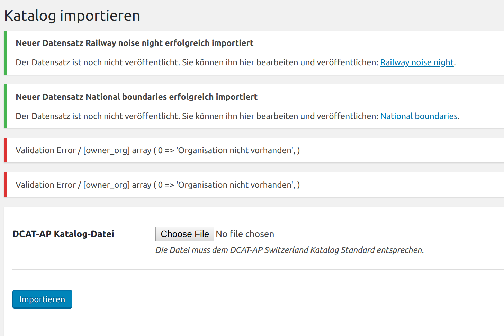
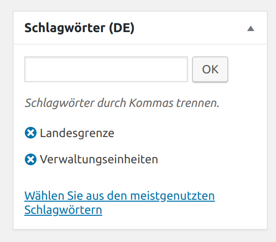
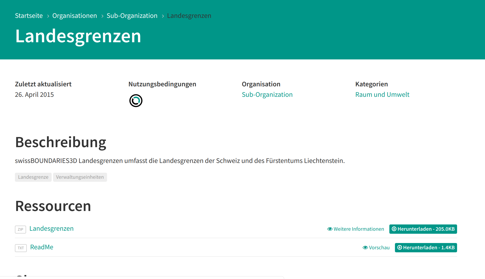

.. container:: custom-breadcrumbs

   - :fa:`home` :doc:`Handbuch <../../../index>` :fa:`chevron-right`
   - :doc:`Publizieren <../publizieren>` :fa:`chevron-right`
   - :doc:`Publikationsvariante <../publikationsvariante>` :fa:`chevron-right`
   - XML-Import

*****************************
Metadaten als XML importieren
*****************************

Wie importiere ich meine Metadaten als XML-Datei?
=================================================

.. container:: Intro

    Wenn Sie mehr als 5 Datasets importieren möchten, die regelmässig aktualisiert
    werden müssen, empfehlen wir die Variante Import als XML-Datei.
    Voraussetzung dafür ist, dass
    :doc:`Ihre Organisation mitsamt Benutzerinnen und Benutzern registriert ist <../erstpublizierende/kontakt-bfs>`.
    Dies erfolgt in Absprache mit der
    :term:`Geschäftsstelle OGD <Geschäftsstelle Open Government Data (OGD)>`.
    Wir zeigen Ihnen
    hier Schritt für Schritt, wie das funktioniert.

Die Schritte auf einen Blick
----------------------------

- :ref:`Datenkatalog importieren <xml_datenkatalog_hochladen>`
- :ref:`Dataset prüfen <xml_datensaetze_pruefen>`
- :ref:`Schlagwörter kontrollieren <xml_schlagworte_pruefen>`
- :ref:`Vorschau des Datasets prüfen <xml_datensaetze_ansehen>`
- :ref:`Dataset veröffentlichen <xml_datensaetze_veroeffentlichen>`

.. admonition:: Gut zu wissen

    Sollten Sie zum ersten Mal Daten publizieren, führen wir Sie
    durch den Prozess und unterstützen Sie dabei, die korrekte Übermittlung
    und Darstellung Ihrer Daten sicherzustellen, unabhängig von der Publikationsvariante.

Alle Schritte im Detail
=======================

.. _xml_datenkatalog_hochladen:

Datenkatalog importieren
------------------------

.. figure:: ../../../_static/images/publizieren/xml-hochladen-upload.png
   :alt: xml hochladen

Loggen Sie sich im Backend von opendata.swiss ein. Handelt es sich
um eine Erstpublikation oder möchten Sie eine neue oder
besonders komplexe Veröffentlichung testweise durchführen,
ist die :term:`Abnahmeumgebung <Abnahmeumgebung>` dafür die richtige Wahl.
Handelt es um eine wiederholte Publikation und Sie möchten
Ihre Datasets direkt veröffentlichen,
können Sie sich in die :term:`Produktionsumgebung <Produktionsumgebung>`
einloggen. Klicken Sie dann auf das Feld «Datensatz importieren».
In der Upload-Maske können Sie einen Datenkatalog als
XML-Datei von Ihrem PC auswählen und hochladen.

.. container:: important

    Wichtig: Der Datenkatalog muss im
    Format :doc:`DCAT-AP-CH <../../glossar/bibliothek/dcat-ap-ch>` vorliegen.

.. _xml_datensaetze_pruefen:

Datensets prüfen
----------------

Ihre Datasets werden Ihnen nach erfolgreichem Import
direkt angezeigt (grüne Erfolgsmeldung). Sie erscheinen
ausserdem auch unter «Alle Datensätze». Sollte sich noch ein Fehler im
Dataset befinden, wird Ihnen dies bereits hier angezeigt (rote Error-Meldung).
Allfällige Fehler können Sie entweder im Dataset selbst oder
direkt in Ihrem Datenkatalog korrigieren und diesen
anschliessend noch einmal neu hochladen.

Fehlermeldung
-------------

Bei allfälligen Fehlern erscheint eine Fehlermeldung, der Status ist rot.
Bitte korrigieren Sie die markierten Felder. Sobald Sie alle Fehler
behoben haben, stellt der Status auf grün. Nun können Sie Ihr Dataset publizieren.

.. figure:: ../../../_static/images/publizieren/xml-hochladen-dataset-nok.png
   :alt: xml hochladen

.. figure:: ../../../_static/images/publizieren/xml-hochladen-dataset-ok.png
   :alt: xml hochladen

.. _xml_schlagworte_pruefen:

Schlagwörter kontrollieren
--------------------------

Beim Import als XML-Datei werden automatisch Schlagwörter für
Ihr Dataset ausgewählt. Sie müssen diese nur noch kontrollieren.

.. _xml_datensaetze_ansehen:

Vorschau des Datasets prüfen
----------------------------

.. figure:: ../../../_static/images/publizieren/xml-hochladen-dataset-preview.png
   :alt: xml hochladen

Nachdem Sie alle Fehler korrigiert und Schlagwörter überprüft haben,
können Sie sich eine Vorschau Ihres Datasets anzeigen lassen. Dafür klicken
Sie oben in der Menüleiste auf «Datensatz anzeigen». Sie sehen
Ihr Dataset nun so, wie es im Frontend erscheint – egal, ob Sie
sich in der :term:`Abnahmeumgebung <Abnahmeumgebung>` oder
:term:`Produktionsumgebung <Produktionsumgebung>` befinden.
Sieht alles so aus wie in unserer Beispielansicht,
kann das Dataset veröffentlicht werden.

.. _xml_datensaetze_veroeffentlichen:

Dataset veröffentlichen
-----------------------

Im Bearbeitungsmodus wird Ihnen ganz oben rechts der Status
Ihres Datasets angezeigt: «Entwurf» bedeutet, Sie bearbeiten
die Metadaten des Datasets noch weiter. In diesem Zustand ist
Ihr Dataset im Frontend der Abnahmeumgebung mit dem Vermerk «privat»
und einem Schlosssymbol markiert. «Veröffentlicht» gibt an,
dass das Dataset in der Abnahmeumgebung publiziert ist.

In der Produktionsumgebung haben Sie hier Sie ausserdem die Möglichkeit,
die Veröffentlichung Ihres Datasets zu terminieren.
Unter «Veröffentlichung planen» können Sie die Datums- und Zeitangabe nutzen,
um eine Publikation in der Zukunft festzulegen und bestätigen
dies mit einem Klick auf «Planen». Die Veröffentlichung lässt
sich verlässlich auf ein bestimmtes Datum planen, die Festlegung
der Uhrzeit kann um ± eine Stunde von der effektiven Publikation abweichen.

Sollten Sie zum ersten Mal Daten publizieren, muss Ihr Dataset
von der Abnahmeumgebung noch auf die Produktionsumgebung übertragen werden.
Dies übernehmen wir für Sie,
geben Sie uns einfach per E-Mail Bescheid `<mailto:opendata(at)bfs.admin.ch>`__.

.. container:: important

    Wichtig: Vergessen Sie nicht nach jeder Änderung von bereits
    publizierten Daten auf «Aktualisieren» zu klicken.

.. container:: bildunterschrift

   Beispielansicht eines publizierten Datasets

.. container:: support

   Support

Sie haben eine Frage zum Import Ihres Datasets als XML?
`Schreiben Sie uns <mailto:opendata(at)bfs.admin.ch>`__
und wir helfen Ihnen gerne weiter.

.. container:: materialien

    Mehr zum Thema

- :doc:`DCAT-AP-CH (Link, englisch) <../../glossar/bibliothek/dcat-ap-ch>` – Beschreibung des aktuell von opendata.swiss genutzte Datenstandards DCAT-AP-CH
