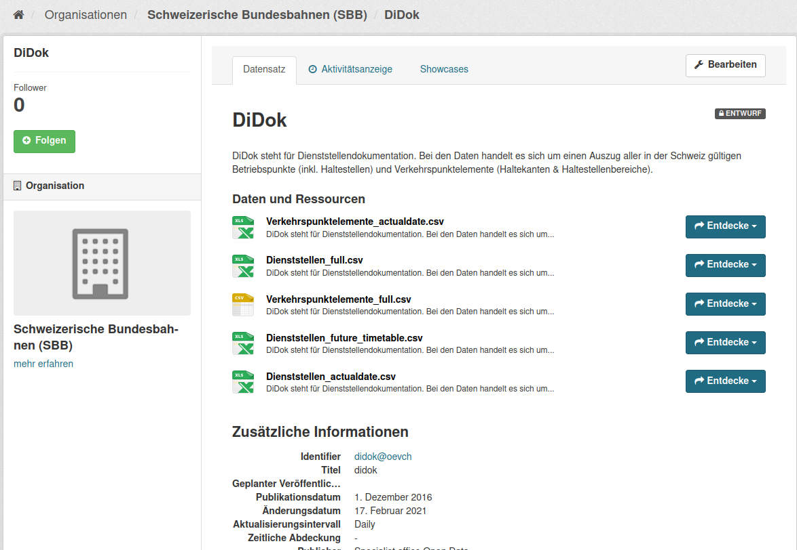
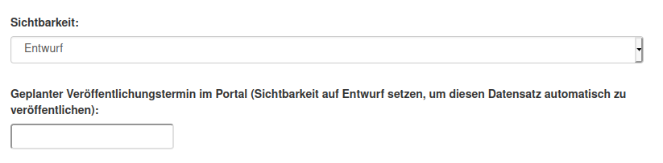
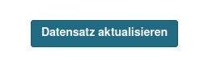
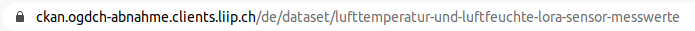

.. container:: custom-breadcrumbs

   - :fa:`home` :doc:`Handbuch <../../../index>` :fa:`chevron-right`
   - :doc:`Publizieren <../publizieren>` :fa:`chevron-right`
   - :doc:`Publikationsvariante <../publikationsvariante>` :fa:`chevron-right`
   - XML-Import

*****************************
Metadaten als XML importieren
*****************************

Wie importiere ich meine Metadaten als XML-Datei?
=================================================

.. container:: Intro

    Wenn Sie mehr als 5 Datasets importieren möchten, die regelmässig aktualisiert
    werden müssen, empfehlen wir die Variante Import als XML-Datei.
    Voraussetzung dafür ist, dass
    :doc:`Ihre Organisation mitsamt Benutzerinnen und Benutzern registriert ist <../erstpublizierende/kontakt-bfs>`.
    Dies erfolgt in Absprache mit der
    :term:`Geschäftsstelle OGD <Geschäftsstelle Open Government Data (OGD)>`.
    Wir zeigen Ihnen
    hier Schritt für Schritt, wie das funktioniert.

Die Schritte auf einen Blick
----------------------------

- :ref:`Datenkatalog importieren <xml_datenkatalog_hochladen>`
- :ref:`Datasets prüfen <xml_datensaetze_pruefen>`
- :ref:`Dataset veröffentlichen <xml_datensaetze_veroeffentlichen>`
- :ref:`Datensets im Frontend prüfen <xml_datensaetze_im_frontend>`
- :ref:`Veröffentlichung in der Produktionsumgebung <xml_go_live>`

.. admonition:: Gut zu wissen

    Sollten Sie zum ersten Mal Daten publizieren, führen wir Sie
    durch den Prozess und unterstützen Sie dabei, die korrekte Übermittlung
    und Darstellung Ihrer Daten sicherzustellen, unabhängig von der Publikationsvariante.

Alle Schritte im Detail
=======================

.. _xml_datenkatalog_hochladen:

Datenkatalog importieren
------------------------

Loggen Sie sich im Backend von opendata.swiss ein. Handelt es sich
um eine Erstpublikation oder möchten Sie eine neue oder
besonders komplexe Veröffentlichung testweise durchführen,
ist die :term:`Abnahmeumgebung <Abnahmeumgebung>` dafür die richtige Wahl.
Handelt es um eine wiederholte Publikation und Sie möchten
Ihre Datasets direkt veröffentlichen,
können Sie sich in die :term:`Produktionsumgebung <Produktionsumgebung>`
einloggen.

Gehen Sie zu Ihrer Organisation.

Klicken Sie dann auf das Feld «Add Datasets from XML».

In der Upload-Maske können Sie einen Datenkatalog als
XML-Datei von Ihrem PC auswählen und hochladen.

Mit  «Submit» wird der Upload gestartet.

.. container:: important

    Wichtig: Der Datenkatalog muss im
    Format :doc:`DCAT-AP-CH <../../glossar/bibliothek/dcat-ap-ch>` vorliegen.

Ihre Datasets werden Ihnen nach erfolgreichem Import
als «Entwurf» gespeichert und in der Liste der Datasets für Ihre Organization mit
aufgelistet.

.. figure:: ../../../_static/images/publizieren/xml-upload/dataset-entwurf.png
   :alt: unveröffentlichter Datensatz im Backend von opendata.swiss

Bei allfälligen Fehlern erscheint eine rote Fehlermeldung
nach dem Hochladen des Datenkatalogs.

Korrieren Sie Ihren Datenkatalog und laden Sie diesen
anschliessend erneut hoch.

.. _xml_datensaetze_pruefen:

Datensets prüfen
-----------------

Ihre Datasets sind jetzt hochgeladen, aber noch nicht veröffentlicht.
Finden Sie Ihre Datasets mit der Facettensuche nach «Entwurf»:

Gehen Sie in die Detailansicht Ihres Datasets: Sind alle Felder so besetzt,
wie Sie es erwarten, können Sie Ihr Dataset veröffentlichen.

.. _xml_datensaetze_veroeffentlichen:

Datenset veröffentlichen
---------------------------

Vor der Veröffentlichung ist Ihr Dataset in der
Abnahmeumgebung mit dem Vermerk «privat» und einem Schlosssymbol markiert. Nach der Veröffentlichung
verschwindet dieses Symbol und Ihr Dataset ist dann auch im Frontend der Abnahmeumgebung sichtbar.

.. figure:: ../../../_static/images/publizieren/dataset/dataset-titel-entwurf.png
   :alt: Dataset Titel in dem das Dataset als Entwurf markiert ist

Um Ihr Dataset zu veröffentlichen müssen Sie in den Bearbeitungsmodus wechseln.
Klicken Sie dazu auf «Bearbeiten».

Scrollen Sie zu dem Feld «Sichtbarkeit»: Es ist auf «Entwurf eingestellt»

Sie können Ihr Dataset sofort veröffentlichen indem Sie dan Status auf "Veröffentlicht"
ändern. Oder sie können eine zukünftige Veröffentlichung terminieren, indem Sie im Feld darunter
einen geplanten Veröffentlichungstermin in der Zukunft eintragen

Die Veröffentlichung lässt sich verlässlich auf ein bestimmtes Datum planen, die Festlegung
der Uhrzeit kann um ± eine Stunde von der effektiven Publikation abweichen.

.. container:: important

    Wichtig: Vergessen Sie nicht nach der Änderung auf «Aktualisieren» zu klicken.

.. _xml_datensaetze_im_frontend:

Datensets im Frontend prüfen
-----------------------------

Sobald Ihre Datasets veröffenlicht ist, können sie auch im Frontend der Abnahmeumgebung angesehen werden.
Sie gelangen zu der Datenansicht Ihres Datasets im Frontend,
imdem Sie in die Detailansicht Ihres Datasets gehen und `ckan` aus dem Url Ihres Datasets entfernen:

.. figure:: ../../../_static/images/publizieren/dataset/frontend-url.png
   :alt: Beispielansicht eines publizierten Datasets

Bitte prüfen Sie Ihre Daten auch hier nochmal:

.. figure:: ../../../_static/images/publizieren/dataset/dataset-frontend.png
   :alt: Beispielansicht eines publizierten Datasets

.. container:: bildunterschrift

   Beispielansicht eines publizierten Datasets

.. _xml_go_live:

Veröffentlichung in der Produktionsumgebung
---------------------------------------------

Sollten Sie zum ersten Mal Daten publizieren, muss Ihr Dataset
von der Abnahmeumgebung noch auf die Produktionsumgebung übertragen werden.
Dies übernehmen wir für Sie,
geben Sie uns einfach per E-Mail Bescheid `<mailto:opendata@bfs.admin.ch>`__.

.. container:: support

   Support

Sie haben eine Frage zum Import Ihres Datasets als XML?
`Schreiben Sie uns <mailto:opendata@bfs.admin.ch>`__
und wir helfen Ihnen gerne weiter.

.. container:: materialien

    Mehr zum Thema

- :doc:`DCAT-AP-CH (Link, englisch) <../../glossar/bibliothek/dcat-ap-ch>` – Beschreibung des aktuell von opendata.swiss genutzte Datenstandards DCAT-AP-CH
- :download:`Screencast zum Importieren der Metadaten als XML-Datei <../../../_static/screencasts/xml-import.gif>` - In diesem Screencast zeigen wir Ihnen den Import eines Datenkatalogs
- :download:`Veröffentlichung eines Datasets terminieren <../../../_static/screencasts/schedule-dataset.gif>`- In diesem Screencast zeigen wir Ihnen, wie Sie die Veröffentlichung Ihres Datasets terminieren können
