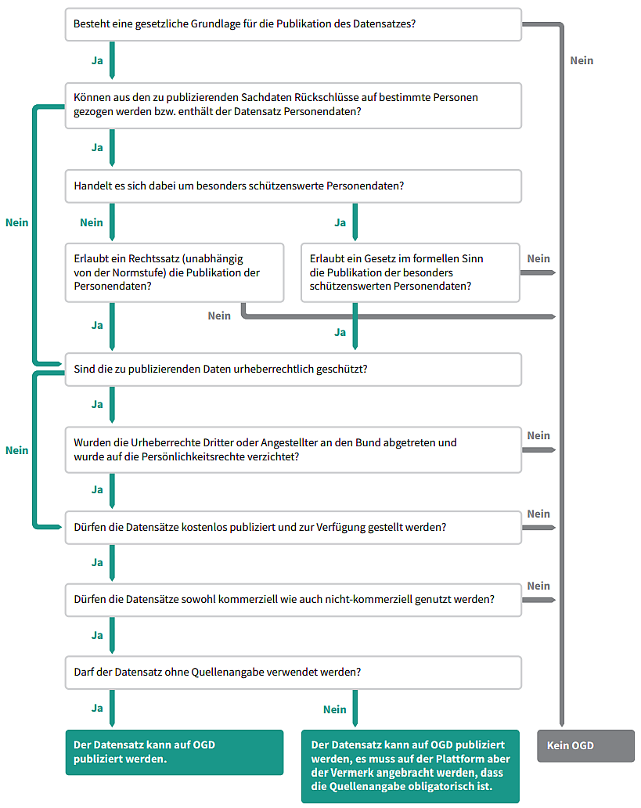

.. container:: custom-breadcrumbs

   - :fa:`home` :doc:`Handbuch <../../../index>` :fa:`chevron-right`
   - :doc:`Vorbereiten <../vorbereiten>` :fa:`chevron-right`
   - :doc:`Dataset <../dataset>` :fa:`chevron-right`
   - Rechtliche Anforderungen prüfen

*******************************
Rechtliche Anforderungen prüfen
*******************************

Wie identifiziere ich die passende Nutzungsbedingung für meine Datasets?
========================================================================

.. container:: Intro

    Um Ihre Daten zu Open Data zu machen, müssen Sie für diese ein offene
    Nutzungsbedingung anwenden. In diesem Schritt stellen Sie sicher,
    dass Sie Ihr ausgewähltes Dataset rechtlich als OGD publizieren dürfen
    und somit eine offene Nutzungsbedingung angewendet wird. Wir begleiten
    Sie bei der Auswahl der richtigen Nutzungsbedingung.

1. Rechtliche Grundlage
-----------------------

Das folgende Prüfschema zeigt auf, welche Prüfschritte von Ihnen vorzunehmen sind,
um sicherzustellen, dass das Dataset als OGD publiziert werden darf.
Es liegt in Ihrer Verantwortung, dass legitime Schutzinteressen, wie
beispielsweise Datenschutz oder der Schutz privater Geschäftsgeheimnisse,
gewährleistet sind.

Nähere Erläuterungen zu den einzelnen Fragen finden Sie in unserer
begleitenden
`Arbeitshilfe <https://www.bfs.admin.ch/bfs/de/home/dienstleistungen/ogd/dokumentation.assetdetail.11147071.html>`__.

.. container:: support

   Support

Sie können eine Frage nicht klar beantworten? Werfen Sie einen Blick
in unsere `Arbeitshilfe für Behörden zur Publikation von Daten als OGD <https://www.bfs.admin.ch/bfs/de/home/dienstleistungen/ogd/dokumentation.assetdetail.11147071.html>`__.
Falls Sie immer noch nicht weiterwissen,
`schreiben Sie uns <mailto:opendata(at)bfs.admin.ch>`__.

.. container:: content-divider

   Content-Divider

2. Auswahl der Nutzungsbedingungen
----------------------------------

Für alle Daten auf opendata.swiss müssen offene Nutzungsbedingungen ausgewählt
werden, die in Form von Symbolen dargestellt sind. Die Auswahl der richtigen
Nutzungsbedingung erfolgt aufgrund der gesetzlichen Grundlage. Folgende Varianten
sind möglich, die den Datennutzenden angezeigt werden:

.. container:: usageconditions

    .. figure:: ../../../_static/images/vorbereiten/terms_open.png
        :alt: Freie Nutzung
        :height: 50px

    Freie Nutzung

    - Sie dürfen diesen Datensatz für nicht kommerzielle Zwecke nutzen.
    - Sie dürfen diesen Datensatz für kommerzielle Zwecke nutzen.
    - Eine Quellenangabe wird empfohlen (Autor, Titel und Link zum Datensatz).

    .. figure:: ../../../_static/images/vorbereiten/terms_by.png
        :alt: Freie Nutzung. Quellenangabe ist Pflicht.
        :height: 50px

    Freie Nutzung. Quellenangabe ist Pflicht.

    - Sie dürfen diesen Datensatz für nicht kommerzielle Zwecke nutzen.
    - Sie dürfen diesen Datensatz für kommerzielle Zwecke nutzen.
    - Eine Quellenangabe ist Pflicht (Autor, Titel und Link zum Datensatz).

    .. figure:: ../../../_static/images/vorbereiten/terms_ask.png
        :alt: Freie Nutzung. Kommerzielle Nutzung nur mit Bewilligung des Datenlieferanten zulässig.
        :height: 50px

    Freie Nutzung. Kommerzielle Nutzung nur mit Bewilligung des Datenlieferanten zulässig.

    - Sie dürfen diesen Datensatz für nicht kommerzielle Zwecke nutzen.
    - Sie dürfen diesen Datensatz für kommerzielle Zwecke nutzen, sofern Sie eine entsprechende Bewilligung beim Datenlieferanten eingeholt haben.
    - Eine Quellenangabe wird empfohlen (Autor, Titel und Link zum Datensatz).

    .. figure:: ../../../_static/images/vorbereiten/terms_by-ask.png
        :alt: Freie Nutzung. Quellenangabe ist Pflicht. Kommerzielle Nutzung nur mit Bewilligung des Datenlieferanten zulässig.
        :height: 50px

    Freie Nutzung. Quellenangabe ist Pflicht. Kommerzielle Nutzung nur mit Bewilligung des Datenlieferanten zulässig.

    - Sie dürfen diesen Datensatz für nicht kommerzielle Zwecke nutzen.
    - Sie dürfen diesen Datensatz für kommerzielle Zwecke nutzen, sofern Sie eine entsprechende Bewilligung beim Datenlieferanten eingeholt haben.
    - Eine Quellenangabe ist Pflicht (Autor, Titel und Link zum Datensatz).

Bestimmend für die Auswahl der Nutzungsbedingung ist die gesetzliche
Grundlage ((Link to: Rechtliche Anforderungen prüfen)).
Die zwei einzigen, möglichen Einschränkungen sind 1) die Pflicht zur Quellenangabe und
2) die Pflicht zum Einholen einer Bewilligung für eine kommerzielle Nutzung.
Schreibt die gesetzliche Grundlage eine oder beide Einschränkungen vor, müssen
sie mittels der Nutzungsbedingung kommuniziert werden.

Notieren Sie sich die richtige Nutzungsbedingung für die Publikation
Ihres Datasets auf opendata.swiss. Dieses Attribut wird später in den Metadaten eingegeben.

.. container:: support

   Support

Sie sind sich unsicher, ob Sie die richtige Nutzungsbedingung ausgewählt haben?
`Sprechen Sie mit uns darüber <mailto:opendata(at)bfs.admin.ch>`__.

.. container:: materialien

   Mehr zum Thema

- `Arbeitshilfe für Behörden zur Publikation von Daten als OGD (pdf) <https://www.bfs.admin.ch/bfs/de/home/dienstleistungen/ogd/dokumentation.assetdetail.11147071.html>`__ – Das Dokument erklärt sämtliche Fragen des rechtlichen Checks und trägt so zur Entscheidungsfindung bei.
- `Nutzungsbedingungen (Link) <https://opendata.swiss/de/terms-of-use>`__ – Die Website fasst sämtliche Nutzungsbedingungen für OGD übersichtlich erklärt zusammen.
- `Rechtliche Rahmenbedingungen zur Publikation von Daten als Open Government Data (OGD) (pdf) <https://www.bfs.admin.ch/bfs/de/home/dienstleistungen/ogd/dokumentation.assetdetail.11147095.html>`__ – Das Dokument erläutert den rechtlichen Rahmen für die Umsetzung der OGD Strategie, erarbeitet von der Arbeitsgruppe Recht OGD.

.. container:: teaser

   :doc:`Nächster Schritt: Technische Anforderungen prüfen <technischer-check>`

Nachdem Sie die richtige Nutzungsbedingung ausgewählt haben, geht es
im zweiten Schritt um die technischen Anforderungen, die die Ihr
Dataset erfüllen muss.
