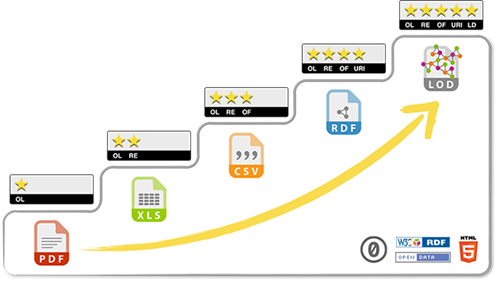

.. container:: custom-breadcrumbs

   - :fa:`home` :doc:`Handbuch <../../../index>` :fa:`chevron-right`
   - :doc:`Vorbereiten <../vorbereiten>` :fa:`chevron-right`
   - :doc:`Dataset <../dataset>` :fa:`chevron-right`
   - Technische Anforderungen prüfen

*******************************
Technische Anforderungen prüfen
*******************************

In welchem Format sollte mein Dataset vorliegen?
================================================

.. container:: Intro

    Bei der Publikation als Open Government Data spielt das Format der
    :term:`Ressourcen <Ressource>`, also der physischen Daten,
    eine wesentliche Rolle. Eignet es sich für die Nutzung? Hier finden Sie
    unsere Empfehlungen dazu.

Hintergrund
===========

Ein wichtiges Ziel von opendata.swiss ist es, alle Daten in maschinenlesbaren
und offenen Formaten zur Verfügung zu stellen. Wir orientieren uns dafür am
:doc:`5-Sterne-Modell von Tim Berners-Lee <../../glossar/bibliothek/linked-open-data>`
und streben eine Umsetzung in der Kategorie 3 Sterne an. Basis-Anforderung ist die
Stufe 2 Sterne. Konkret heisst das zum Beispiel für tabellarische Daten,
dass sie als CSV-Dateien zur Verfügung gestellt werden sollten, da diese für
Programmierer einfacher zu verarbeiten sind als Excel-Sheets. Ist dies nicht möglich,
können die Daten auch als XLS-Dateien angeboten werden, wobei ihre Maschinenlesbarkeit
garantiert werden muss.

Formate
=======

Die datenpublizierende Organisation entscheidet letztendlich, in welchem Format
die Daten publiziert werden. Dabei sind allerdings folgende Vorgaben und
Empfehlungen zu berücksichtigen:

- Wir ermutigen die Datenpublizierende offene und nicht proprietäre Formate zu
  wählen. --> Siehe Stufe 3-Sterne des
  `«5-Sterne-Modell für Offene Daten (Open Data)» <https://5stardata.info>`__
- Als minimale Anforderungen gilt, dass die Daten in einem strukturierten,
  maschinenlesbaren Format vorliegen. --> Siehe Stufe 2-Sterne des
  `«5-Sterne-Modell für Offene Daten (Open Data)» <https://5stardata.info>`__
- Wir empfehlen die Publikation der Daten mittels API. Damit wird ein flexibles
  und vereinfachtes Management der Publikation sichergestellt.
- Die Publikation von Linked Open Data, soll bei Daten, die als Basis- oder
  zentrale Register bezeichnet werden können, besonders geprüft werden. Bei dieser Art von Publikation werden gemeinsam verwendete Datenmodellen bzw. Ontologien verwendet, um Daten über Organisationsgrenzen hinweg miteinander zu verknüpfen. Datennutzende und Datenpublizierende können dabei von wichtigen Netzwerkeffekten profitieren.

Hier finden Sie eine :doc:`Liste der Formate <../../glossar/bibliothek/formate-ressourcen>`,
die von opendata.swiss aktuell unterstützt werden. Sollten Sie Ihr Dateiformat nicht
in dieser Liste finden,
`nehmen Sie gerne mit uns Kontakt auf <mailto:opendata@bfs.admin.ch>`__.
`Gerne unterstützen wir Sie dabei, das richtige Format zu wählen <mailto:opendata@bfs.admin.ch>`__.
Dies gilt auch, wenn Sie einen Datenservice anbieten, zum Beispiel
eine API-Schnittstelle, und nicht wissen, wie Sie diesen
auf Datasets abbilden können.
`Kontaktieren Sie uns <mailto:opendata@bfs.admin.ch>`__.

Weitere technische Anforderungen
--------------------------------

- **Möglichst roh:** Die publizierten Daten sind, wo nötig, anonymisiert und mit
  grundlegenden Metadaten ergänzt. Es sollen keine bereits aggregierten,
  ausgewerteten und verarbeiteten Daten publiziert werden,
  ausser wenn dies aus Datenschutzgründen oder anderen Schutzgründen notwendig ist.
- **Vollständig:** Es werden nur vollständige Daten publiziert: Die
  Publikation von Auszügen («Snippets» oder «Previews») entspricht
  nicht den OGD-Vorgaben.
- **Aktuell:** Die Datasets sollen der Öffentlichkeit innerhalb eines
  angemessenen Zeitraums möglichst aktuell zur Verfügung stehen.
  Sie werden veröffentlicht, sobald sie erhoben und zusammengestellt wurden.
  Daten, die in Echtzeit vorliegen, werden möglichst über eine
  Programmierschnittstelle (API) abgerufen.
- **Kontextualisiert:** Die publizierten Daten sind ausreichend «kontextualisiert» zu
  publizieren, sprich sie sind ausreichend beschrieben, um die Wiederverwendung,
  insbesondere durch Verwaltungsexterne, zu ermöglichen. Dafür werden die
  grundlegenden Metadaten (siehe vor allem
  :doc:`DCAT-AP-CH Standard <../../glossar/bibliothek/dcat-ap-ch>`),
  sowie auch Formeln und Erklärungen zur Berechnung der
  Daten möglichst in maschinenlesbarer Form mit den Daten publiziert.
- **Uneingeschränkter Zugang:** Die publizierten Daten sind möglichst
  einfach und barrierefrei zugänglich zu machen. Allfällige physische oder
  technische Barrieren sind zu vermeiden. Einzige Ausnahme ist das
  Einholen einer Bewilligung zur
  Kommerziellen Nutzung (siehe Nutzungsbedingungen mit Einschränkung «Ask»).
- **Diskriminierungsfreier Zugang:** Die publizierten Daten sind leicht
  und diskriminierungsfrei zugänglich: Jede Person soll zu jeder Zeit auf die
  Daten zugreifen können, ohne sich identifizieren oder eine
  Rechtfertigung für ihr Handeln abgeben zu müssen. Einzige Ausnahme ist das
  Einholen einer Bewilligung zur Kommerziellen
  Nutzung (siehe Nutzungsbedingungen mit Einschränkung «Ask»).
- **Leicht auffindbar:** Daten werden auf opendata.swiss referenziert und so
  bereitgestellt, dass sie von weiteren Suchmaschinen optimal indexiert werden können
- **In einem Klick erreichbar:** Daten werden so referenziert, so dass die
  Verlinkung direkt zu den Daten führt («One-click to data»).
- **Massentauglich:** Die Daten müssen mittels Massenabfragen («Bulk Download») abrufbar sein.
- **Eindeutig identifizierbar:** Unterschiedlichen Versionen sollen mittels
  einheitlicher Identifikatoren identifizierbar sein.

Best Practices
^^^^^^^^^^^^^^

Unter den folgenden Links sind verschiedene Best-Practices zur Publikation von
OGD definiert.

- `https://www.w3.org/2013/share-psi/bp <https://www.w3.org/2013/share-psi/bp>`__
- `Opendatahandbook.org <http://opendatahandbook.org/>`_
- `https://www.europeandataportal.eu/de/providing-data/goldbook <https://www.europeandataportal.eu/de/providing-data/goldbook>`__

.. container:: support

   Support

Sie haben noch Fragen zu Formaten und den weiteren technischen Anforderungen?
`Schreiben Sie uns <mailto:opendata@bfs.admin.ch>`__.

.. container:: materialien

   Mehr zum Thema

- :doc:`Linked Open Data <../../glossar/bibliothek/linked-open-data>` – Eine Einführung in das Thema Linked Open Data
- :doc:`Standard-Formate für Ressourcen <../../glossar/bibliothek/formate-ressourcen>` für Ressourcen dokumentiert alle gängigen Formate und enthält Links zu Ihren Definitionen.

.. container:: teaser

   :doc:`Nächster Schritt: Organisatorische Anforderungen prüfen <organisatorischer-check>`

Neben rechtlichen und technischen Anforderungen, müssen Sie sicherstellen, dass auch
organisatorische oder prozessbedingte Anforderungen erfüllt sind.
Nur so können Sie eine nachhaltige und effiziente Publikation der
Daten auch in Zukunft gewährleisten.
