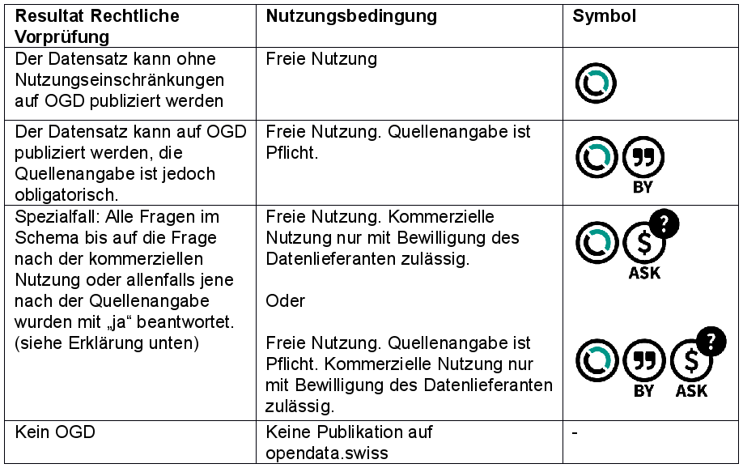

.. container:: custom-breadcrumbs

   - :fa:`home` :doc:`Handbuch <../../../index>` :fa:`chevron-right`
   - :doc:`Vorbereiten <../vorbereiten>` :fa:`chevron-right`
   - :doc:`Datensatz <../datensatz>` :fa:`chevron-right`
   - Rechtliche Nutzung

*************************
Rechtliche Nutzung prüfen
*************************

Wie finde ich die richtige Nutzungsbedingung für meinen Datensatz?
==================================================================

.. container:: Intro

    In diesem Schritt stellen wir sicher, dass Sie Ihren
    ausgewählten Datensatz rechtlich als OGD publizieren dürfen
    und helfen Ihnen bei der Auswahl der richtigen Nutzungsbedingung.

1. Rechtlicher Check
--------------------
Der folgende Test hilft Ihnen, die rechtlichen Rahmenbedingungen
für Ihren Datensatz zu klären. Beantworten Sie die Fragen und
erhalten Sie eine direkte Einschätzung. Nähere Erläuterungen zu den
einzelnen Fragen finden Sie in unserer begleitenden
:bfs-m7-arbeitshilfe-behoerden-publikation-ogd:`Arbeitshilfe <>`.

.. figure:: ../../../_static/images/vorbereiten/chart-arbeitshilfe-publikation-de.png
   :alt: Schema Arbeitshilfe-Publikation

.. container:: support

   Support

Sie können eine Frage nicht klar beantworten? Werfen Sie einen
Blick in unsere :bfs-m7-arbeitshilfe-behoerden-publikation-ogd:`Arbeitshilfe <>`.
Falls Sie immer noch nicht weiter wissen, :email-to-bfs:`schreiben Sie uns <>`.

.. container:: content-divider

   Content-Divider

2. Auswahl der Nutzungsbedingungen
----------------------------------
Alle Daten auf opendata.swiss unterliegen Nutzungsbedingungen,
die in Form von Symbolen dargestellt werden. Aus dem Ergebnis
des rechtlichen Checks ergibt sich die Nutzungsbedingung für
Ihren Datensatz. Die folgende Tabelle hilft Ihnen dabei die
Nutzungsrechte für Ihren Datensatz zu bestimmen:

Notieren Sie sich die Nutzungsrechte für Ihren Datensatz.
Diese benötigen Sie später im Publikationsprozess, wenn Sie
die Metadaten Ihrer Datensätze erfassen möchten.

.. container:: support

   Support

Sie sind sich unsicher, ob Sie die richtige Nutzungsbedingung
ausgewählt haben? :email-to-bfs:`Sprechen Sie mit uns darüber <>`.

.. container:: materialien

   Mehr zum Thema

- :bfs-m7-arbeitshilfe-behoerden-publikation-ogd:`Arbeitshilfe für Behörden zur Publikation von Daten als OGD (pdf) <>` – Das Dokument erläutert sämtliche Fragen des rechtlichen Checks und trägt so zur Entscheidungsfindung bei.
- :bfs-m1-rechtliche-rahmenbedingungen:`Rechtliche Rahmenbedingungen zur Publikation von Daten als Open Government Data (OGD) (pdf) <>` – Das Dokument erläutert den rechtlichen Rahmen für die Umsetzung der OGD Strategie, erarbeitet von der Arbeitsgruppe Recht OGD.
- :opendata-swiss-terms-of-use:`Nutzungsbedingungen (Link) <>` – Die Website fasst sämtliche Nutzungsbedingungen für OGD übersichtlich erklärt zusammen.

.. container:: teaser

   Nächster Schritt: Technische Anforderungen prüfen

Nachdem Sie die richtige Nutzungsbedingung ausgewählt haben,
geht es im zweiten Schritt um die technischen Anforderungen, die die Ihr
Datensatz erfüllen muss.

  - :doc:`Zweiter Schritt: Technische Anforderungen prüfen <technischer-check>`

