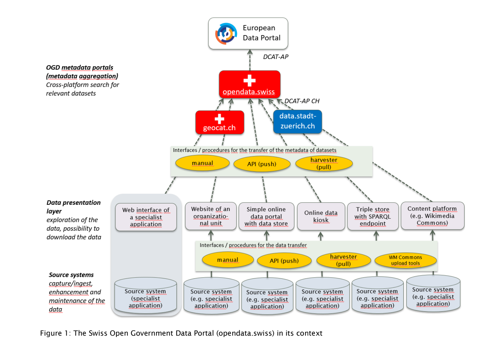

.. container:: custom-breadcrumbs

   - :fa:`home` :doc:`Handbuch <../../../index>` :fa:`chevron-right`
   - :doc:`Vorbereiten <../vorbereiten>` :fa:`chevron-right`
   - :doc:`Erst-Publizierende <../erstpublizierende>` :fa:`chevron-right`
   - Opendata.swiss verstehen

************************
opendata.swiss verstehen
************************

Was muss ich über das Portal und die Prozesse wissen?
=====================================================

.. container:: Intro

    Bevor Sie zum ersten Mal Daten veröffentlichen,
    möchten wir Sie in die wesentlichen Mechanismen von von
    opendata.swiss einführen.

Weshalb muss ich Daten auf opendata.swiss publizieren?
------------------------------------------------------
Lorem Ipsum Ab 2020 gilt für Behördendaten :term:`"open by default“ <open by default>`.
Die Daten werden nun die Daten proaktiv von den Behörden
herausgegeben, falls der öffentlichen Datennutzung rechtlich
nichts im Wege steht. Die Hoffnung ist, dadurch einen Mehrwert
für die Bevölkerung zu generieren, der sich am Ende in
zusätzlichen Steuereinnahmen niederschlägt.

Wie funktioniert opendata.swiss?
--------------------------------
Lorem Ipsum Opendata.swiss ist ein Aggregationsportal.
Das heisst, die Verantwortung für Ihre Daten tragen Sie selbst.
Im Einzelnen bedeutet das für Sie: Die Erstveröffentlichung
Ihrer Daten muss an einer anderen Stelle erfolgen. Sie
geben nur Ihre Metadaten (die Beschreibung Ihrer
Daten an opendata.swiss weiter, damit Ihre Daten nach der
Veröffentlichung auch schweiz weit gefunden werden können.
Nach der Veröffentlichung der Daten müssen Sie diese selbst
regelmässig aktualisieren (siehe Daten updaten), sowie der
Datenutzern bei Fragen zur Verfügung stehen
(siehe Auskunft zu Daten geben).

.. admonition:: Gut zu wissen

    **Hosting Varianten**
    Lorem Ipsum Hosting müssen Sie übernehmen. Es gibt zwei Möglichkeiten:
    Selbst hosten oder bei einem Anbieter. Lorem Ipsum Dolor.
    Hosting müssen Sie übernehmen. Es gibt zwei Möglichkeiten:
    Selbst hosten oder bei einem Anbieter. Hosting müssen Sie übernehmen.
    Es gibt zwei Möglichkeiten: Selbst hosten oder bei einem Anbieter.

Was ist Open Government Data?
-----------------------------
Lorem Ipsum Open Government Data (OGD) ist eine weltweite
Bewegung, an der auch Schweizer Behörden partizipieren.

.. container:: materialien

   Mehr zum Thema

- :bfs-m4-bericht-datenbestaende-bund:`Bericht über Datenbestände des Bundes (pdf) <>` – Das Dokument liefert einen ersten Überblick über die Daten beim Bund, zeigt Schwierigkeiten auf und schlägt Varianten für das weitere Vorgehen vor (Stand 2015).

.. container:: teaser

   Geeignete Daten in meiner Organisation identifizieren

Im nächsten Schritt geben wir Ihnen Hilfestellung, um Daten in Ihrem Unternehmen
zu identifizieren, die sich für die Veröffentlichung auf opendata.swiss eignen.

    - :doc:`Weiter zu Bestand prüfen <bestand-pruefen>`
